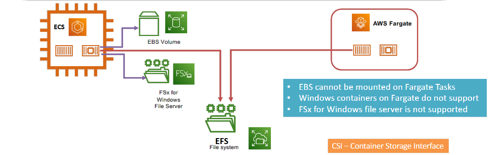

---
tags:
  - aws
  - aws/service
  - aws/domain/containers
  - aws/topic/ecs
aliases:
  - "ECS Task Volume"
---

# 📦 **ECS Task Volume**

  

---

## ECS with EFS

- Both **Fargate** and **EC2** support **Elastic File System (EFS)** for persistent storage.

## ECS with FSx

- Windows-based applications can use **FSx for Windows File Server** (EC2 launch type only).
---

## Related Notes
- [[aws-services/6.containers/2.ecs/|Index]] - folder map
- [[aws-services/6.containers/2.ecs/5.1.ecs-task-iam-role|Task IAM Roles in Amazon ECS]] - previous lesson
- [[aws-services/4.storage/2.1.efs/2.1.efs|Amazon Elastic File System EFS]] - mentions EFS
- [[aws-services/6.containers/2.ecs/1.1.ecs|Amazon ECS Elastic Container Service]] - mentions ECS

---
