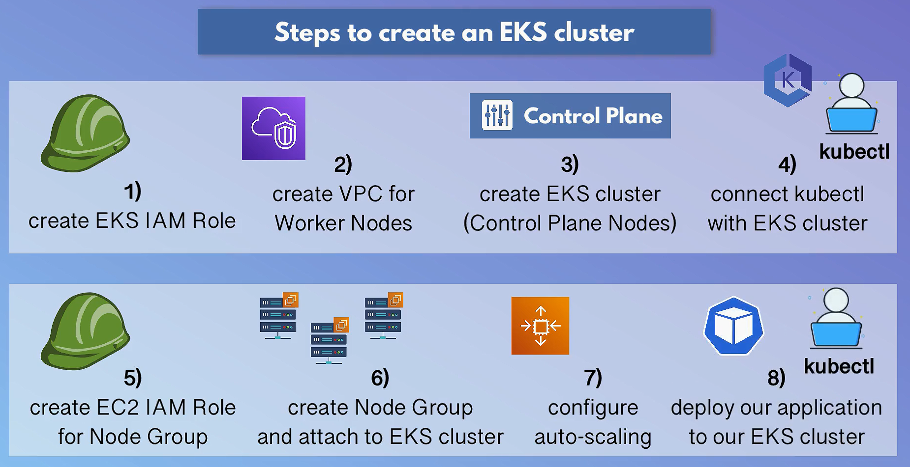
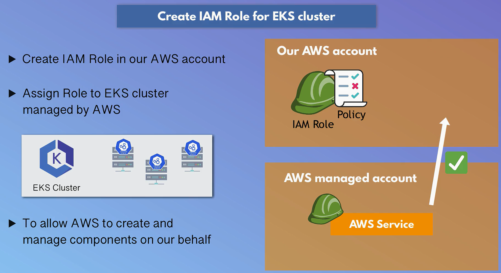
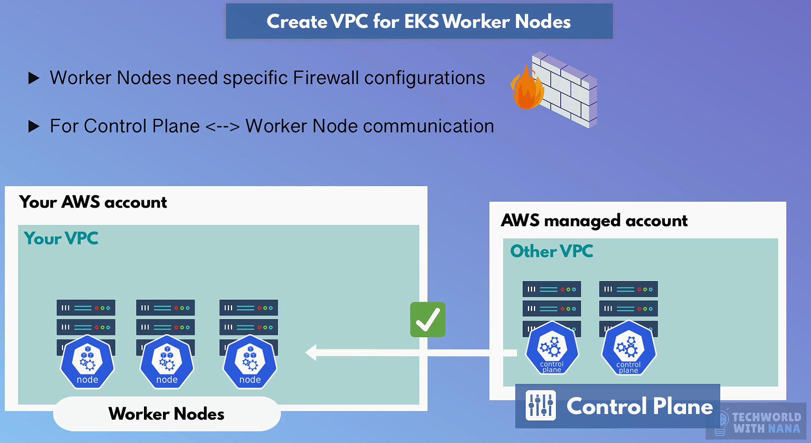
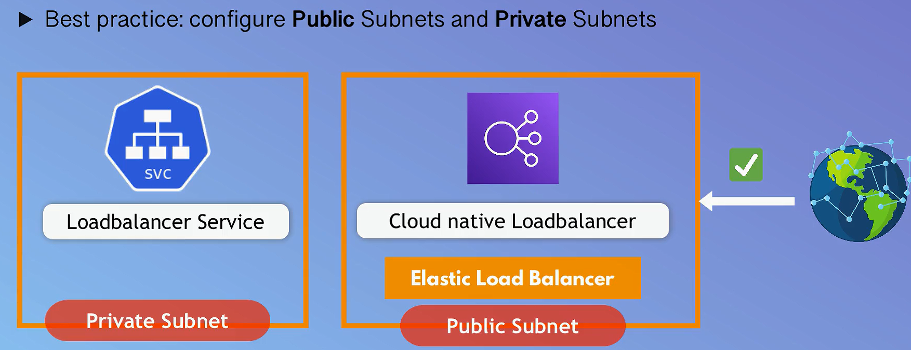
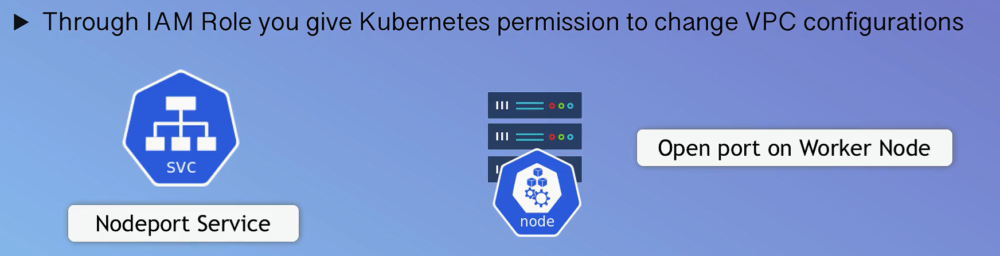
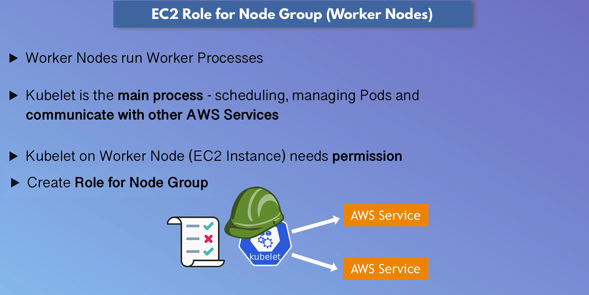
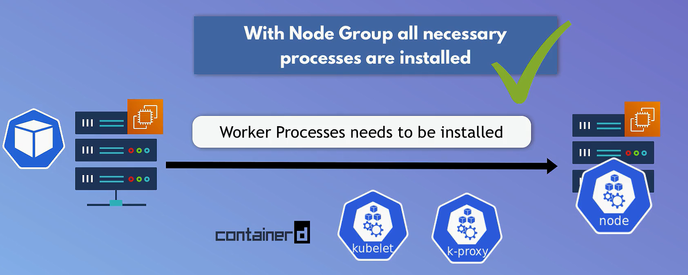

---
tags:
  - aws
  - aws/service
  - aws/domain/containers
  - aws/topic/eks
aliases:
  - "Amazon EKS with EC2 Launch Type"
  - "Setup EKS With EC2 Launch Type"
---

# ☸️ **Amazon EKS with EC2 Launch Type**

> Fully managed Kubernetes on AWS — with self-managed EC2 worker nodes for full control, flexibility, and scalability.

<div style="text-align: center;">
  
</div>

---

## 🧱 **EKS Core Architecture: Who Manages What?**

| Component            | Managed By | Description                                     |
| -------------------- | ---------- | ----------------------------------------------- |
| **Control Plane**    | AWS        | API Server, etcd, Scheduler, Controller Manager |
| **Worker Nodes**     | You        | EC2 instances that run your workloads           |
| **Networking & IAM** | You        | VPC, subnets, security groups, IAM roles        |
| **K8s Resources**    | You        | Deployments, Services, ConfigMaps, Secrets, PVs |

---

### 🔧 **Control Plane (Managed by AWS)**

- 🧭 **API Server**: Gateway to the cluster — receives requests via `kubectl`.
- 📚 **etcd**: Highly available key-value store for all cluster data.
- 📦 **Scheduler**: Assigns Pods to available Nodes based on resources.
- 🛠 **Controller Manager**: Maintains desired state (e.g., replicas, endpoints).

---

### 🧑‍💼 **Worker Nodes (EC2) & Infrastructure (Managed by You)**

- 🚀 **EC2 Instances**: Your containers run on EC2 nodes you configure.
- 🔄 **Node Group Maintenance**: You patch, update, and scale EC2 worker nodes.
- 📈 **Autoscaling (Optional)**: Use Cluster Autoscaler to dynamically adjust node count.

---

## 💸 **Cost Breakdown**

| Cost Component    | Description                                      |
| ----------------- | ------------------------------------------------ |
| **Control Plane** | Fixed hourly fee (per cluster).                  |
| **Worker Nodes**  | Billed per EC2 instance usage.                   |
| **Extras**        | EBS volumes, data transfer, load balancers, etc. |

---

## 🎯 **When to Use EC2 Launch Type**

- You want **maximum control** over compute and node configuration.
- You plan to use **custom AMIs** or install agents/tools at OS level.
- You need access to **GPUs, specific EC2 types**, or burstable compute.
- You already use **Kubernetes** and prefer EC2’s flexibility over Fargate’s abstraction.

---

## 🛠️ **Step-by-Step: EKS Setup with EC2 Nodes**

<div style="text-align: center;">
  
</div>

---

## ✅ **Prerequisites**

- 🔐 AWS account with IAM permissions
- 💻 Installed: `kubectl`, `aws-cli`, `aws-iam-authenticator`
- 🌐 VPC networking knowledge (subnets, routes, SGs)

---

## 1️⃣ **Create IAM Role for EKS Cluster**

<div style="text-align: center;">
    
</div>

- Go to [IAM Console](https://console.aws.amazon.com/iam/)

- ➕ Create Role → Select **EKS – Cluster**

- Attach policies:

  - `AmazonEKSClusterPolicy`
  - `AmazonEKSServicePolicy`

- Name it `eksClusterRole`

---

## 2️⃣ **Provision VPC using CloudFormation**

### 📦 Use AWS-provided template

<div style="text-align: center;">
  
</div>
<div style="text-align: center;">
  
</div>
<div style="text-align: center;">
  
</div>

1. Go to [CloudFormation Console](https://console.aws.amazon.com/cloudformation/)

2. Create Stack → **With new resources**

3. Enter Template URL:

   ```ini
   https://amazon-eks.s3.us-west-2.amazonaws.com/cloudformation/2020-06-10/amazon-eks-vpc-sample.yaml
   ```

4. Name your stack (e.g., `eks-vpc-stack`)

5. Click **Create Stack** and wait for it to finish.

---

## 3️⃣ **Create the EKS Cluster**

1. Go to [EKS Console](https://console.aws.amazon.com/eks)
2. Add Cluster → **Create**
3. Fill:

   - Name
   - Kubernetes version
   - Role ARN (select `eksClusterRole`)

4. Networking:

   - Select the VPC and subnets from CloudFormation
   - Choose security groups

5. Cluster endpoint access: **Public**, **Private**, or **Both**
6. Review and Create

⏳ Wait for the cluster creation to complete (\~10 mins)

---

## 4️⃣ **Configure kubectl for EKS**

```bash
aws eks --region <region> update-kubeconfig --name <cluster-name>
kubectl get nodes
```

✅ Replace `<region>` (e.g., `us-east-1`) and `<cluster-name>` accordingly.

---

## 5️⃣ **Create EC2 Node Group**

<div style="text-align: center;">
  
</div>
<div style="text-align: center;">
  
</div>

1. EKS Console → Your Cluster → **Compute** → **Add Node Group**
2. Set:

   - Name: e.g., `eks-nodegroup-1`
   - IAM Role: attach:

     - `AmazonEKSWorkerNodePolicy`
     - `AmazonEKS_CNI_Policy`
     - `AmazonEC2ContainerRegistryReadOnly`

3. Configure:

   - Instance Type (e.g., `t3.medium`)
   - Subnets
   - Desired / Min / Max nodes

4. Review and Create

---

## ⚙️ **Optional Configurations (Recommended)**

### 📈 Cluster Autoscaler

```bash
kubectl apply -f https://github.com/kubernetes/autoscaler/releases/download/cluster-autoscaler-<version>/cluster-autoscaler-autodiscover.yaml
```

Replace `<version>` with latest.

---

### 🌐 ALB Ingress Controller

```bash
kubectl apply -f https://raw.githubusercontent.com/kubernetes-sigs/aws-alb-ingress-controller/main/docs/examples/alb-ingress-controller.yaml
```

Prefer **AWS Load Balancer Controller** in production.

---

### 💾 Persistent Storage (EBS)

- Define `PersistentVolume` with `gp2` or `gp3`
- Use `PersistentVolumeClaim`
- Mount in pod spec

---

## 🧠 Summary

| Feature               | Value                                       |
| --------------------- | ------------------------------------------- |
| Managed Control Plane | ✅ Yes                                      |
| Worker Node Type      | EC2                                         |
| Deep AWS Integration  | IAM, VPC, CloudWatch, EBS, ALB              |
| Use Case Fit          | Custom compute, full control, scalable apps |
| Storage Support       | EBS, EFS, CSI Drivers                       |

---

📘 **Next Steps**:

- Monitor with **CloudWatch Container Insights**
- Add **EFS CSI driver** for shared file systems
- Use **IRSA** (IAM Roles for Service Accounts) for secure access
---

## Related Notes
- [[aws-services/6.containers/3.eks/1.2.eks-deployment-options|EKS-D vs. EKS-A vs. EKS]] - previous lesson
- [[aws-services/6.containers/3.eks/2.2.setup-eks-worker-nodes-auto-scale|Configure AutoScaling for Amazon EKS with EC2 Nodes]] - next lesson
- [[aws-services/1.management-governance/1.cloudformation/1.1.cfn|AWS CloudFormation]] - mentions CloudFormation
- [[aws-services/2.security/1.1.iam/1.fundmmentals/1.1.aws-account|AWS Account Your Gateway to the AWS Cloud]] - mentions AWS Account
- [[aws-services/6.containers/3.eks/1.1.eks|Amazon EKS Simplifying Kubernetes on AWS]] - mentions EKS
- [[aws-services/5.compute/2.ebs/1.1.ebs|Amazon EBS Elastic Block Store Scalable Persistent Storage for EC2]] - mentions EBS
- [[aws-services/4.storage/2.1.efs/2.1.efs|Amazon Elastic File System EFS]] - mentions EFS
- [[aws-services/2.security/1.1.iam/1.fundmmentals/1.2.iam|AWS Identity and Access Management IAM]] - mentions IAM

---
