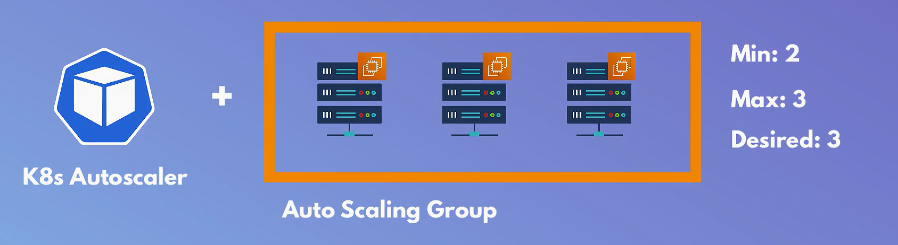
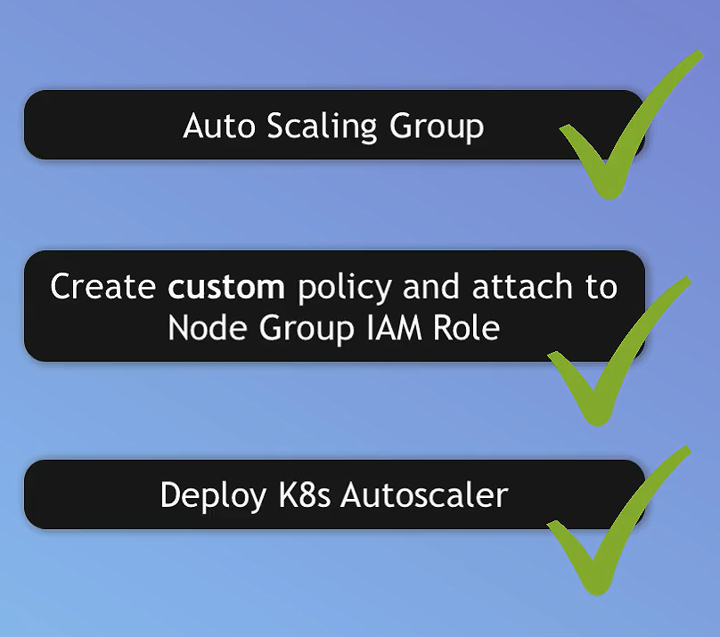

---
tags:
  - aws
  - aws/service
  - aws/domain/containers
  - aws/topic/eks
aliases:
  - "Configure AutoScaling for Amazon EKS with EC2 Nodes"
  - "Setup EKS Worker Nodes Auto Scale"
---

# 📈 **Configure AutoScaling for Amazon EKS with EC2 Nodes**

> Automatically scale the number of EC2 worker nodes in your EKS cluster based on actual workload demands using the Kubernetes **Cluster Autoscaler**.

<div style="text-align: center;">
  
</div>

---

## 🧠 Why Use Cluster Autoscaler?

EKS **does not automatically scale** your EC2 worker nodes. Kubernetes Cluster Autoscaler helps by:

- 🧮 Adding EC2 nodes when there aren’t enough resources for Pods.
- 🗑 Removing underutilized nodes to save costs.
- ✅ Working with **EKS-managed Auto Scaling Groups** (ASGs) behind your node group.

---

## ✅ **Prerequisites**

| Requirement                   | Description                                                    |
| ----------------------------- | -------------------------------------------------------------- |
| **EKS Cluster**               | Already created via EKS Console or CLI                         |
| **Node Group (EC2)**          | Managed node group automatically creates an Auto Scaling Group |
| **IAM Role with Permissions** | Your worker nodes need specific autoscaling permissions        |
| **kubectl & aws-cli**         | Installed and configured on your machine                       |

---

## 🔧 Step-by-Step Configuration

<div style="text-align: center;">
  
</div>

---

### 1️⃣ **Understand Your Auto Scaling Group**

When you create an EKS EC2 node group, AWS automatically creates a corresponding **Auto Scaling Group (ASG)**.

You don’t need to manually create the ASG — just reference it in the autoscaler deployment.

---

### 2️⃣ **Create IAM Policy for Cluster Autoscaler**

1. Go to the [IAM Console](https://console.aws.amazon.com/iam/)
2. Navigate to **Policies** → **Create policy**
3. Switch to the **JSON** tab and paste:

   ```json
   {
     "Version": "2012-10-17",
     "Statement": [
       {
         "Effect": "Allow",
         "Action": [
           "autoscaling:DescribeAutoScalingGroups",
           "autoscaling:DescribeAutoScalingInstances",
           "autoscaling:DescribeLaunchConfigurations",
           "autoscaling:DescribeTags",
           "autoscaling:SetDesiredCapacity",
           "autoscaling:TerminateInstanceInAutoScalingGroup",
           "ec2:DescribeLaunchTemplateVersions"
         ],
         "Resource": "*"
       }
     ]
   }
   ```

4. Click **Next → Next → Review**, name it `EKSClusterAutoscalerPolicy`, and **Create policy**

---

### 3️⃣ **Attach Policy to EC2 Node IAM Role**

1. Back in **IAM Console** → Go to **Roles**
2. Find the role used by your EC2 worker nodes (e.g., `eksctl-...-NodeInstanceRole-...`)
3. Click **Attach policies**
4. Search and attach `EKSClusterAutoscalerPolicy`

---

### 4️⃣ **Deploy Cluster Autoscaler to the Cluster**

#### 🔽 Download the official deployment manifest

```bash
curl -O https://raw.githubusercontent.com/kubernetes/autoscaler/master/cluster-autoscaler/cloudprovider/aws/examples/cluster-autoscaler-one-asg.yaml
```

---

#### 📝 Edit the Manifest File

- Replace `YOUR CLUSTER NAME` in:

  ```yaml
  - --cluster-name=YOUR-CLUSTER-NAME
  ```

- Optional: Add region

  ```yaml
  - --aws-region=us-east-1
  ```

> 💡 You can also match `nodeSelector` and `tolerations` to your specific node group labels.

---

#### 🚀 Apply the Autoscaler Deployment

```bash
kubectl apply -f cluster-autoscaler-one-asg.yaml
```

---

### 5️⃣ **Grant IAM Role to Autoscaler Pod via IRSA**

Patch the autoscaler service account with the IAM role of your **EC2 node group**:

```bash
kubectl annotate serviceaccount cluster-autoscaler \
-n kube-system "eks.amazonaws.com/role-arn=arn:aws:iam::<ACCOUNT_ID>:role/<NODE-IAM-ROLE>"
```

🔁 Replace:

- `<ACCOUNT_ID>` → your AWS account ID
- `<NODE-IAM-ROLE>` → IAM role attached to node instances

---

### 6️⃣ **(Optional) Update Autoscaler Image**

```bash
kubectl set image deployment/cluster-autoscaler \
-n kube-system cluster-autoscaler=k8s.gcr.io/cluster-autoscaler:v1.21.0
```

📌 Use the version matching your Kubernetes cluster version:

- E.g., for K8s 1.27 → use `cluster-autoscaler:v1.27.x`

---

### 7️⃣ **Verify Autoscaler Deployment**

Check if pods are running:

```bash
kubectl get pods -n kube-system -l "app.kubernetes.io/name=cluster-autoscaler"
```

Tail the logs to confirm autoscaling behavior:

```bash
kubectl logs -f deployment/cluster-autoscaler -n kube-system
```

---

## 🛠 Additional Tips

### 🔍 Debugging

If pods are unscheduled and nodes aren’t scaling, check:

```bash
kubectl describe deployment cluster-autoscaler -n kube-system
```

---

### 📊 Metrics Server (Optional)

To scale based on custom CPU/memory metrics (for HPA), install the Kubernetes Metrics Server:

```bash
kubectl apply -f https://github.com/kubernetes-sigs/metrics-server/releases/latest/download/components.yaml
```

---

## ✅ Summary

| Step                       | Purpose                                         |
| -------------------------- | ----------------------------------------------- |
| Create IAM policy          | Grants required Auto Scaling + EC2 permissions  |
| Attach policy to EC2 role  | Allows node group to adjust scale               |
| Deploy autoscaler          | Adds autoscaler Pod to your EKS cluster         |
| Annotate service account   | Binds IAM role to autoscaler Pod (via IRSA)     |
| Monitor via logs & scaling | Ensure autoscaler is working based on workloads |
---

## Related Notes
- [[aws-services/6.containers/3.eks/2.1.setup-eks-with-ec2-launch-type|Amazon EKS with EC2 Launch Type]] - previous lesson
- [[aws-services/6.containers/3.eks/3.setup-eks-with-fargate-launch-type|Amazon EKS with Fargate Serverless Kubernetes Simplified]] - next lesson
- [[aws-services/2.security/1.1.iam/1.fundmmentals/1.1.aws-account|AWS Account Your Gateway to the AWS Cloud]] - mentions AWS Account
- [[aws-services/2.security/1.1.iam/1.fundmmentals/3.iam-policy|IAM Policies in AWS Control Access with Precision]] - mentions IAM Policy
- [[aws-services/6.containers/3.eks/1.1.eks|Amazon EKS Simplifying Kubernetes on AWS]] - mentions EKS
- [[aws-services/2.security/1.1.iam/1.fundmmentals/1.2.iam|AWS Identity and Access Management IAM]] - mentions IAM

---
