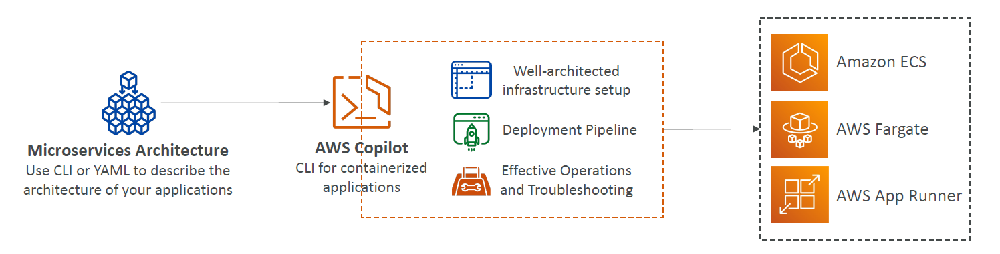

# ⚙️🛳️ **What Is AWS Copilot?**

> **AWS Copilot** is a **CLI tool** that helps you **build, deploy, and manage** production-ready **containerized applications** — without needing to manually configure all the underlying AWS infrastructure.

---

<div style="text-align: center;">
    
</div>

---

## 🧠 Think of it like this

You write your app in a Docker container...

Instead of setting up:

- ECS or App Runner manually
- VPC, subnets, load balancers
- IAM roles, ECR, CodePipeline, etc.

👉 **You just run `copilot init`**, and Copilot does the heavy lifting!

---

## 🚀 What Can You Do With AWS Copilot?

| Feature                  | What It Does                                                               |
| ------------------------ | -------------------------------------------------------------------------- |
| 🛠️ `copilot init`        | Initializes a new app & builds container                                   |
| 📦 Builds & Pushes Image | Pushes your container image to **Amazon ECR**                              |
| 🌐 Provisions Infra      | Creates **VPC**, **Load Balancer**, **IAM Roles**, **ECS (Fargate)**, etc. |
| 📡 Deploys Automatically | Uses **CodePipeline** to automate deployments across environments          |
| 🧪 Multiple Environments | Easily deploy to **dev**, **staging**, and **prod** using isolated infra   |
| 🩺 Health & Logs         | View **logs**, check **health status**, and **troubleshoot** with CLI      |
| 🎯 App Runner Support    | Can also deploy to **App Runner** for simpler use cases                    |

---

## 🧪 Example Workflow

```bash
copilot init
copilot env init --name dev
copilot deploy --env dev
```

That’s it! Copilot creates:

- ✅ ECR repo
- ✅ ECS Cluster (Fargate)
- ✅ VPC & subnets
- ✅ Application Load Balancer
- ✅ IAM roles & permissions
- ✅ CI/CD pipeline

---

## 🔧 Use Cases

| Use Case                | Why Use Copilot?                        |
| ----------------------- | --------------------------------------- |
| 🧪 Devs new to AWS      | Avoid complex infrastructure setup      |
| 🚀 Fast deployments     | From code to prod in minutes            |
| 🔁 CI/CD automation     | Built-in CodePipeline support           |
| 📦 Microservices on ECS | Easy multi-service deployment           |
| 🌍 Multi-env management | Deploy to dev, staging, and prod easily |

---

## ✅ Summary for Exam & Practice

| Concept                | What to Remember                      |
| ---------------------- | ------------------------------------- |
| CLI tool               | Not a GUI or service — it's a CLI     |
| For containerized apps | Focused on ECS (Fargate) & App Runner |
| Infra auto-provisioned | You don’t write YAML/CloudFormation   |
| CI/CD included         | Uses CodePipeline behind the scenes   |
| Multi-env support      | Deploy to dev/prod/staging with ease  |
