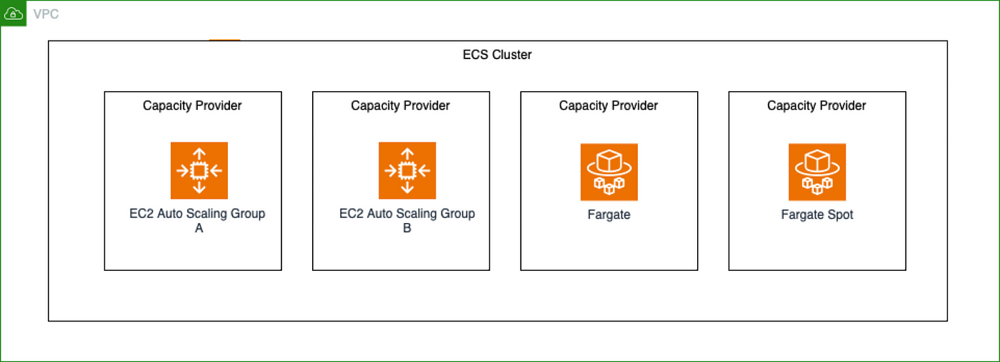
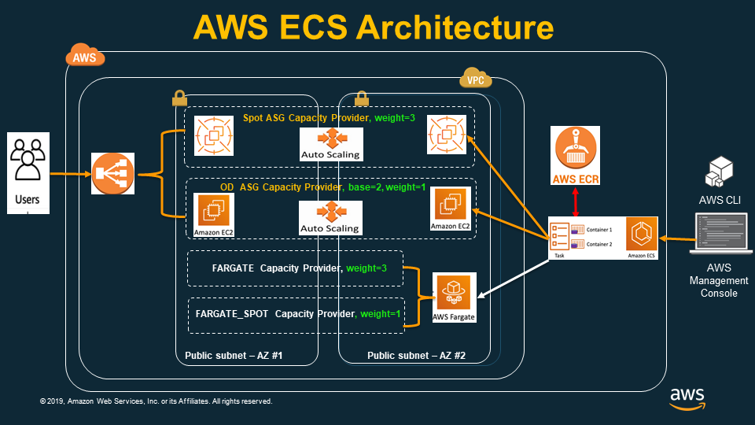
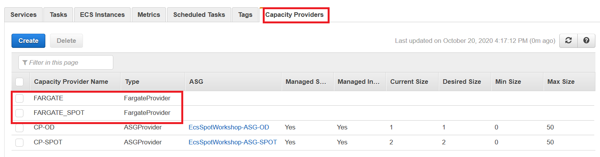
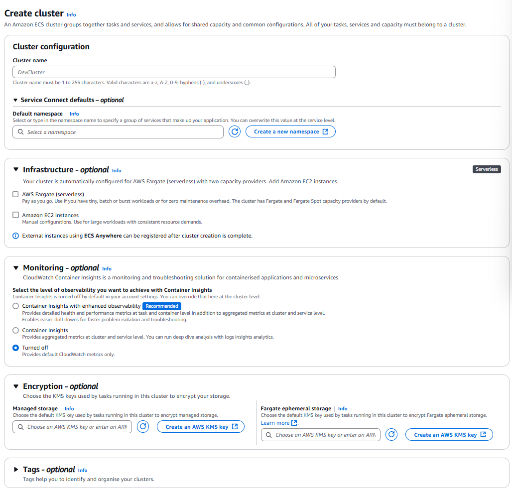
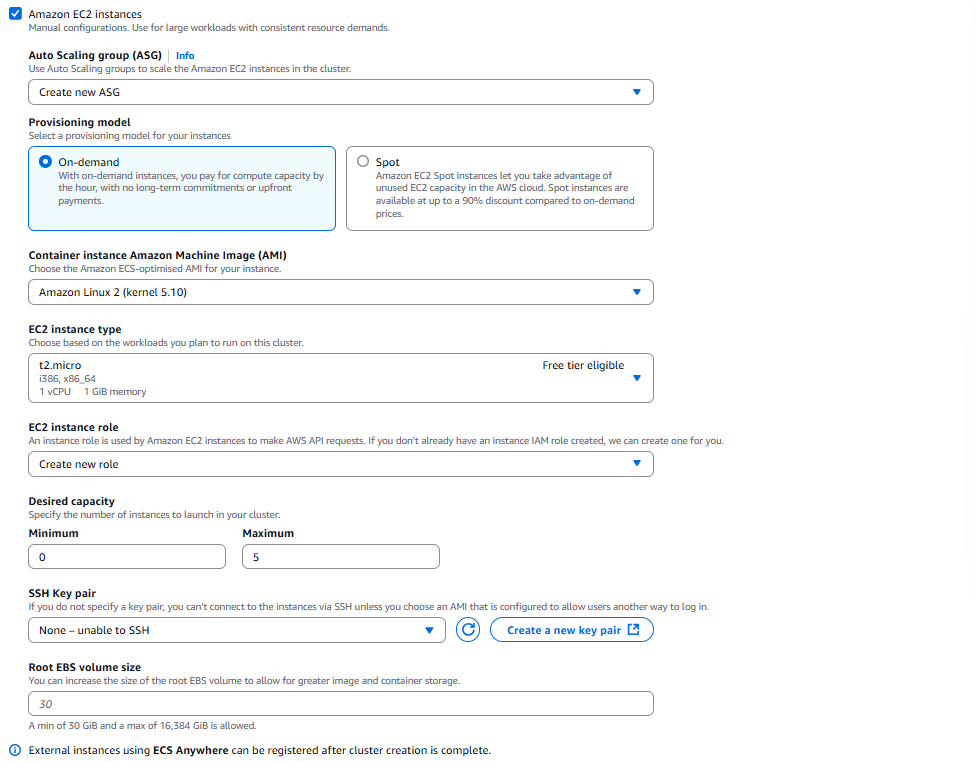
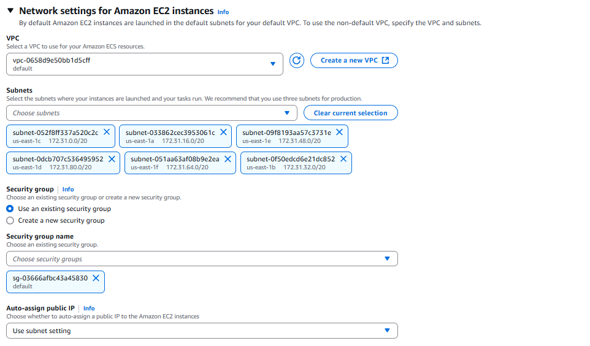

# 🚀 **Amazon ECS Clusters – Launch & Manage Containers at Scale**

> A cluster is the heart of Amazon ECS. It groups compute resources (Fargate or EC2) where your containers run — giving you flexible, scalable, and cost-efficient deployment options.

---

<div style="text-align: center;">
  
</div>

---

<div style="text-align: center;">
    
</div>

---

## 📚 **What Is an ECS Cluster?**

An **ECS Cluster** is a **logical grouping of compute resources** — EC2 or Fargate — that ECS uses to run tasks and services. You can:

- Run tasks on **Fargate** (serverless)
- Run tasks on **EC2** (self-managed instances)
- Or use a **hybrid cluster** (mixed compute types)

---

## 🏗️ **ECS Cluster Types**

### 1️⃣ **Fargate-Only Cluster**

> ⚡ _Serverless, simplified compute_

- 🚫 No EC2 to manage
- ✅ Each task gets its own ENI via `awsvpc` mode
- ✅ Ideal for microservices, API services, or bursty workloads

---

### 2️⃣ **EC2-Only Cluster**

> 🛠 _Full control over infrastructure_

- 🧑‍🔧 You provision/manage EC2 and Auto Scaling groups
- Supports `bridge`, `host`, and `awsvpc` networking
- Ideal for **specialized hardware**, GPU, or custom AMI use cases

---

### 3️⃣ **Mixed Cluster (Fargate + EC2)**

> ♻️ _Flexible and cost-aware deployment_

- ✅ Combine Fargate + EC2 using **Capacity Providers**
- Use EC2 for base load, Fargate for burst
- Perfect for **gradual migrations** or **cost optimization**

---

## ⚙️ **Capacity Providers**

> **Capacity Providers** allow ECS to decide how and where tasks are placed (Fargate or EC2), and enable features like Spot and auto scaling.

---

<div style="text-align: center;">
  
</div>

---

| Provider       | Description                                     |
| -------------- | ----------------------------------------------- |
| `FARGATE`      | Standard Fargate serverless tasks               |
| `FARGATE_SPOT` | Cheaper serverless compute (may be interrupted) |
| `EC2`          | Self-managed EC2 capacity via ASGs              |

---

### 🔁 **Example Capacity Provider Strategy**

```json
[
  {
    "capacityProvider": "FARGATE",
    "weight": 1
  },
  {
    "capacityProvider": "FARGATE_SPOT",
    "weight": 1
  }
]
```

> ⚠️ **Note**: A capacity strategy can include **Fargate or EC2**, but not **both types at the same time** in a single service.

---

## 🧱 **Creating an ECS Cluster**

### 🔧 **Fargate Cluster Setup**

1. Go to [ECS Console](https://console.aws.amazon.com/ecs/v2)
2. **Clusters → Create Cluster**
3. Name your cluster
4. Under **Infrastructure**, choose **AWS Fargate (serverless)**
5. Configure VPC, monitoring, and tags
6. ✅ Click **Create**

<div style="text-align: center;">
  
</div>

---

### 🖥️ **EC2 Cluster Setup**

1. ECS Console → **Clusters → Create Cluster**
2. Set a **Cluster name**
3. Select **Amazon EC2 instances**
4. Configure **Auto Scaling Group**:

   - ECS-optimized **AMI**
   - EC2 **instance type** (e.g., `t3.medium`)
   - SSH **key pair**
   - **Min/Max capacity**

5. Define networking: VPC, subnets, security groups
6. Optional: enable **monitoring**, add **tags**
7. ✅ Click **Create**

<div style="text-align: center;">
  
</div>

<div style="text-align: center;">
  
</div>

---

## 🔄 **Switching Between Fargate and EC2**

To migrate a service from EC2 to Fargate or vice versa:

1. ✍️ **Edit the Task Definition**:

   - Change `requiresCompatibilities` from `EC2` → `FARGATE` (or vice versa)

2. 🔁 **Update the Service**:

   - Use the new task definition revision
   - Adjust the **Capacity Provider Strategy**

3. 🚀 **Deploy**

   - Apply changes → ECS redeploys tasks with the new launch type

> ✅ Ensure your task definition uses **compatible networking** (`awsvpc`) and **resource values** supported by Fargate (e.g., vCPU & memory).

---

## 🔗 **Service Connect**

**Service Connect** improves **service discovery and communication** inside ECS clusters.

- 🔍 Use short service names (DNS-style lookup)
- 📡 Automates traffic routing and port discovery
- 🔗 Supports communication **across VPCs and clusters**

> 🎯 Ideal for **microservices architectures**

---

## 📊 **Monitoring & Observability**

### 🔎 **Container Insights**

- View metrics like CPU, memory, disk I/O, and network usage
- Integrates with **CloudWatch dashboards**

### 📈 **Enhanced Observability**

- Helps you trace, troubleshoot, and optimize container performance

> ✅ Best practice: **Enable Container Insights** when creating the cluster.

---

## 🔐 **Security Best Practices**

| Layer      | Best Practice                                     |
| ---------- | ------------------------------------------------- |
| IAM Roles  | Use **IAM roles for tasks** (scoped permissions)  |
| Networking | Use **Security Groups** and **VPC isolation**     |
| Encryption | Use **AWS KMS** for encrypting logs, data at rest |
| Compliance | Enable **FIPS** mode if required                  |

---

## 🧠 **Best Practices Recap**

### ✅ Use **Fargate** for

- Serverless, short-lived, or bursty workloads
- Teams that want **zero infrastructure management**

### 🖥 Use **EC2** for

- Stateful services, GPU workloads, custom AMIs
- Cases where you need **host-level access or tuning**

### ♻️ Use **Mixed Mode** for

- Running baseline on EC2, scaling burst traffic on Fargate
- Cost optimization using **Fargate Spot** or **EC2 Spot**

---

## 📘 **Helpful References**

- 🔗 [ECS Cluster Types](https://docs.aws.amazon.com/AmazonECS/latest/developerguide/clusters.html)
- 🔗 [Fargate Cluster Creation](https://docs.aws.amazon.com/AmazonECS/latest/developerguide/create-cluster-console-v2.html)
- 🔗 [EC2 Cluster Creation](https://docs.aws.amazon.com/AmazonECS/latest/developerguide/create-ec2-cluster-console-v2.html)
- 🔗 [ECS Capacity Providers](https://docs.aws.amazon.com/AmazonECS/latest/developerguide/fargate-capacity-providers.html)
- 🔗 [Service Connect](https://docs.aws.amazon.com/AmazonECS/latest/developerguide/interconnecting-services.html)
- 🔗 [Monitoring ECS Best Practices](https://docs.aws.amazon.com/AmazonECS/latest/developerguide/ecs-best-practices.html)
