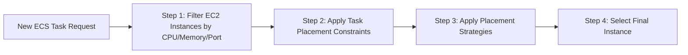

# 🎯 **Amazon ECS – Task Placement (EC2 Launch Type Only)**

> In **Amazon ECS (EC2 launch type)**, task placement determines **which EC2 instance** in your cluster should run the task — based on **available resources, constraints, and strategies**.
>
> 🧠 **Fargate launch type does not use Task Placement Strategies or Constraints.**

---

## 🧭 Why Task Placement Matters

When running ECS tasks using EC2 instances, AWS needs to:

- ✅ Choose an instance that meets **CPU/memory/port** requirements
- ✅ Obey placement rules (e.g., no two tasks on the same instance)
- ✅ Optimize cost, performance, or fault-tolerance

---

## ⚙️ ECS Task Placement Process



---

## 🧠 **Task Placement Strategies** (Best-Effort Rules)

Tell ECS **how to prioritize placement** across matching EC2 instances.

| Strategy       | Description                                                                                            |
| -------------- | ------------------------------------------------------------------------------------------------------ |
| 🧮 **Binpack** | Place tasks on instances with **least available CPU/memory** — packs tasks tightly to **reduce costs** |
| 🎲 **Random**  | Place tasks **randomly** across available instances                                                    |
| ⚖️ **Spread**  | Place tasks **evenly** based on a field like: `instanceId` or `attribute:ecs.availability-zone`        |
| 🔧 **Mix**     | You can **combine multiple strategies** (e.g., spread + binpack) for custom behavior                   |

### 📌 Example: Spread by AZ

```json
"placementStrategy": [
  { "type": "spread", "field": "attribute:ecs.availability-zone" },
  { "type": "binpack", "field": "cpu" }
]
```

---

## 🔐 **Task Placement Constraints**

Let you **filter EC2 instances** that tasks can run on.

| Constraint            | Description                                                     |
| --------------------- | --------------------------------------------------------------- |
| 🧍‍♂️ `distinctInstance` | Each task must run on a **different EC2 instance**              |
| 🧠 `memberOf`         | Use **cluster query language** to match EC2 instance attributes |

> Example: `"memberOf": "attribute:ecs.instance-type =~ t3.*"` → only place on t3 family

---

## 📄 Full Example (Strategy + Constraint)

```json
{
  "placementConstraints": [
    {
      "type": "memberOf",
      "expression": "attribute:ecs.instance-type =~ t3.*"
    }
  ],
  "placementStrategy": [
    {
      "type": "spread",
      "field": "attribute:ecs.availability-zone"
    },
    {
      "type": "binpack",
      "field": "memory"
    }
  ]
}
```

> 🔍 This will **spread tasks across AZs**, but within each AZ, **pack tightly based on memory** — and only on `t3.*` instances.

---

## 💡 When Is This Used?

- ✅ When you want to **control fault-tolerance** (e.g., `spread`)
- ✅ When you want **cost-optimization** (e.g., `binpack`)
- ✅ When using **custom EC2 instance attributes** (e.g., GPU, RAM class)
- ✅ When you want **one task per host** (e.g., `distinctInstance`)

---

## ✅ Best Practices

| Goal                          | What to Use               |
| ----------------------------- | ------------------------- |
| 💰 Lower cost                 | `binpack` (tight packing) |
| 🛡️ High availability          | `spread` across AZ/host   |
| 🎲 Load distribution          | `random` or `spread`      |
| 🔐 Specific EC2 instance type | `memberOf` constraint     |
| 💡 One task per instance      | `distinctInstance`        |

---

## 📝 Exam & Interview Summary

| Concept                    | Key Point                                    |
| -------------------------- | -------------------------------------------- |
| EC2-only feature           | Not supported with Fargate                   |
| Strategy = How to place    | Spread, Binpack, Random                      |
| Constraint = Where allowed | `distinctInstance`, `memberOf`               |
| Order of evaluation        | CPU/memory → constraints → strategy          |
| Best-effort logic          | If no strategy fits, fallback selection used |
