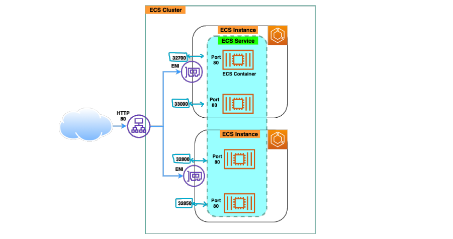
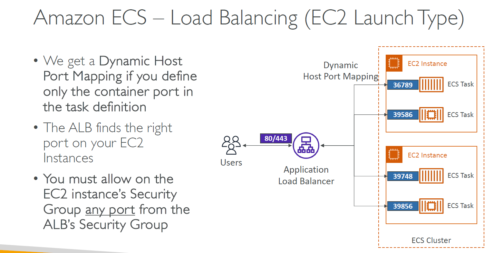
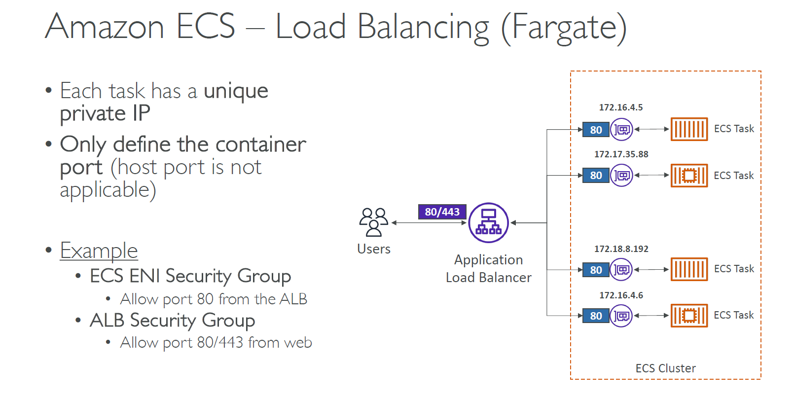

# 🌐🚦 **Amazon ECS Service with Elastic Load Balancing (ELB)**

> **Amazon ECS** integrates seamlessly with **Elastic Load Balancers (ALB / NLB)** to automatically route traffic to healthy containers running as ECS tasks — enabling **scalability, high availability, and dynamic traffic management**.

  

---

## 🧠 **Why Load Balancer with ECS?**

- ✅ Distribute traffic across **ECS tasks**
- ✅ Keep traffic flowing to only **healthy containers**
- ✅ Support **dynamic scaling** — traffic distribution adapts as tasks scale in/out
- ✅ Enable **zero-downtime deployments** with traffic shifting

---

## 📦 **How Load Balancing Works with ECS**

| ECS Launch Type | Traffic Routing Method        | Load Balancer Registers By     | Security Group Note                     |
| --------------- | ----------------------------- | ------------------------------ | --------------------------------------- |
| **EC2**         | **Dynamic Host Port Mapping** | EC2 instance ID + dynamic port | ALB must allow dynamic ports on EC2 SG  |
| **Fargate**     | **ENI Private IPs**           | Task's private IP address      | ALB SG → Task ENI SG (port 80/443 only) |

---

## 🔄 **Dynamic Host Port Mapping (EC2 Mode)**

> 🔧 Used when **multiple tasks run on the same EC2** using the **same container port**

---

  

---

### ⚙️ How It Works

1. **In Task Definition**: Only specify the **container port** (e.g., 80) — leave host port blank.
2. **ECS Agent** dynamically allocates a host port (e.g., 32768+) on EC2.
3. **ALB Target Group** registers the instance + dynamic port.
4. **ALB Listener** forwards requests to correct host\:port mapping.

### 🔐 Security Groups

- **EC2 SG** → Must allow **all ephemeral ports** from ALB SG
- **ALB SG** → Allow ports 80/443 from the internet (or internal sources)

---

## 🛰️ **Fargate Load Balancing (No Host Ports)**

> Fargate assigns each task a **unique private IP** and registers it directly with the Load Balancer

---

  

---

### ⚙️ How It Works

1. Define **container port** only (e.g., 80) — no host port.
2. ECS automatically registers each task's **private IP** into the ALB Target Group.
3. ALB routes directly to **task IPs** using ENIs.

### 🔐 Security Groups

- **Task ENI SG** → Allow port 80 from ALB SG
- **ALB SG** → Allow inbound 80/443 from users

---

## 🛠️ **Step-by-Step: Configuring ECS with ELB**

### 1️⃣ Create Load Balancer (ALB or NLB)

- Use **ALB** for HTTP/HTTPS with advanced rules
- Use **NLB** for TCP-level load balancing (low latency)

### 2️⃣ Create Target Group

- **Target Type:**

  - `IP` → for Fargate
  - `Instance` → for EC2

- Attach **Health Check Path** (e.g., `/health`)

### 3️⃣ Configure ECS Service to Use the Load Balancer

- In the ECS Service definition:

  - Attach the **target group**
  - Choose the container and port for registration
  - Enable **service discovery** if needed

### 4️⃣ Enable Health Checks

- ELB will automatically remove unhealthy tasks from rotation
- ECS will **replace unhealthy tasks** to maintain desired count

---

## 📝 Exam Tips & Real-Life Insights

| Concept                                       | Tip                                               |
| --------------------------------------------- | ------------------------------------------------- |
| ECS w/ EC2 uses **Dynamic Ports**             | ALB must find correct port per task               |
| ECS w/ Fargate uses **Task IPs**              | Target group must be set to IP type               |
| Security groups matter!                       | Always configure correct SG between ALB and tasks |
| ALB can register **same instance many times** | via different ports per task                      |
| Use **listeners & rules**                     | to route traffic per path (e.g., `/api`, `/app`)  |
