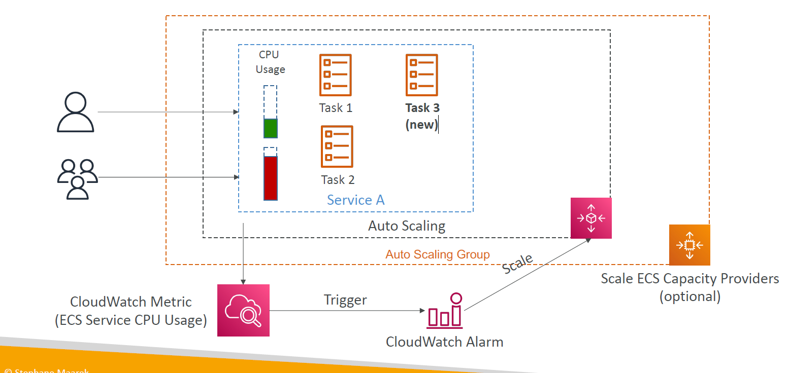
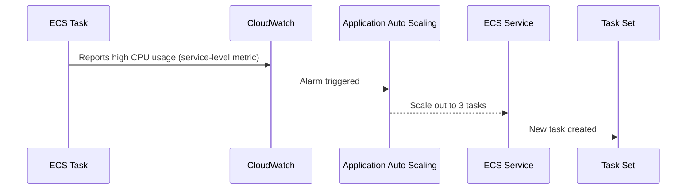
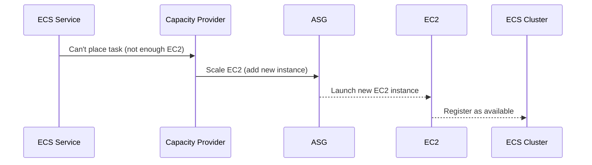

# ⚖️ **Amazon ECS Auto Scaling – Tasks vs EC2 Instances**

> Automatically scale your container **tasks** (service level) and **infrastructure** (EC2 level) independently – or together. Know the difference, master both.

---

  

---

## 🧠 **What Is ECS Auto Scaling?**

Amazon ECS supports **two independent scaling layers**:

| Layer                       | Scales What?                    | Powered By                   | Works With           |
| --------------------------- | ------------------------------- | ---------------------------- | -------------------- |
| 🔧 **Service Auto Scaling** | Number of **running ECS tasks** | AWS Application Auto Scaling | Fargate or EC2       |
| 🏗️ **EC2 Auto Scaling**     | Number of **EC2 instances**     | EC2 Auto Scaling Groups      | EC2 launch type only |

> ✅ **Fargate** users don’t need EC2 Auto Scaling — it's managed automatically.

---

## 🧩 **ECS Service Auto Scaling**

> 🧵 _Scale tasks automatically based on CPU, memory, or request load._

### 📈 Supported Metrics

- 🧠 **CPU Utilization** (`ECSServiceAverageCPUUtilization`)
- 🧠 **Memory Utilization** (`ECSServiceAverageMemoryUtilization`)
- 🌐 **ALB Request Count per Target**
- 🕓 **Scheduled Scaling** (scale on schedule)
- 🎯 **Target Tracking** (maintain a specific target utilization)
- 🔺 **Step Scaling** (scale based on alarm thresholds)

---

---

## 🏗️ **EC2 Auto Scaling (ASG)**

> ⚙️ _Scale your EC2 capacity to meet the needs of your ECS tasks._

This applies **only if you're using EC2 launch type**.

### 🎯 Trigger Conditions

- 📊 EC2 instance **CPU/Memory usage**
- 📦 Insufficient ECS cluster capacity (tracked by ECS **Capacity Providers**)

---

## 🔍 **Fargate vs EC2 Scaling Comparison**

| Feature                       | ECS Service Auto Scaling          | EC2 Auto Scaling                        |
| ----------------------------- | --------------------------------- | --------------------------------------- |
| Scales                        | Number of **tasks**               | Number of **EC2 instances**             |
| Applies To                    | Fargate & EC2                     | EC2 only                                |
| Managed By                    | ECS + Application Auto Scaling    | ASG + Capacity Providers                |
| Metrics Used                  | Task-level (CPU, RAM, ALB)        | Instance-level (CPU, memory)            |
| Complexity                    | ⚡ Easier (especially on Fargate) | 🔧 More control, more config            |
| Required for Fargate?         | ✅ Yes                            | ❌ No                                   |
| Required for EC2 launch type? | ✅ Yes                            | ✅ Yes (to prevent capacity starvation) |

---

## ⚖️ **ECS Service Auto Scaling vs EC2 Auto Scaling Metrics**

### 🎯 **Short Answer:**

- **ECS Service Auto Scaling** → uses **task-level metrics** (e.g., average CPU of running ECS containers/tasks)
- **EC2 Auto Scaling** → uses **EC2 instance-level metrics** (e.g., EC2 CPU utilization, memory pressure)

---

### 🧩 So, Which Metric Belongs to What?

| Metric / Alarm Source                     | Belongs To             | Triggers Scaling of     |
| ----------------------------------------- | ---------------------- | ----------------------- |
| `ECSServiceAverageCPUUtilization`         | **ECS Service**        | ➕/➖ ECS **Tasks**     |
| `ECSServiceAverageMemoryUtilization`      | **ECS Service**        | ➕/➖ ECS **Tasks**     |
| `ALBRequestCountPerTarget` (target group) | **ECS Service**        | ➕/➖ ECS **Tasks**     |
| `CPUUtilization` (on EC2 instance)        | **EC2 Instance / ASG** | ➕/➖ **EC2 Instances** |
| `MemoryUtilization` (on EC2 instance)     | **EC2 Instance / ASG** | ➕/➖ **EC2 Instances** |

---

## 🔄 ECS Scaling Lifecycle (What Triggers What?)

Here’s a **visual sequence** to eliminate confusion:

### 📈 Scenario: Task CPU is high → scale service tasks (not EC2)

> 🧠 This scaling has **nothing to do with EC2 metrics yet**.

---

### ⚠️ But What If There's No Room on EC2 Instances?

If ECS tries to start new tasks but no EC2 instance has enough CPU/RAM:

> 🔁 Now **EC2 Auto Scaling** kicks in — via the **Capacity Provider + ASG pairing**.

---

## 🛠️ **How to Set Up ECS Service Auto Scaling (via Console)**

1. Go to **ECS Console** → Your **Cluster** → Select **Service**
2. Click **Update**
3. Under **Auto Scaling**, enable it
4. Choose:

   - **Target Tracking**: e.g., CPU = 70%
   - OR
   - **Step Scaling**: Based on alarm thresholds
   - OR
   - **Scheduled Scaling**: e.g., weekdays at 8 AM

---

## 🧠 Best Practices

| Best Practice                                     | Why?                                              |
| ------------------------------------------------- | ------------------------------------------------- |
| ✅ Use **Fargate Auto Scaling** when possible     | Simpler setup, faster scaling, no capacity limits |
| ✅ Enable **Service Auto Scaling** always         | Prevent over/under-provisioning                   |
| ✅ Use **Capacity Providers** on EC2              | To scale both tasks and EC2 infra together        |
| ⚠️ **Monitor scaling metrics** closely            | Prevent runaway scaling or missed triggers        |
| 🔁 Test with both **Target** and **Step Scaling** | Choose what fits your app load pattern            |

---

## 🔗 Resources

- [ECS Service Auto Scaling](https://docs.aws.amazon.com/AmazonECS/latest/developerguide/service-auto-scaling.html)
- [Capacity Providers Overview](https://docs.aws.amazon.com/AmazonECS/latest/developerguide/cluster-capacity-providers.html)
- [Target Tracking vs Step Scaling](https://docs.aws.amazon.com/autoscaling/application/userguide/application-auto-scaling-target-tracking.html)
