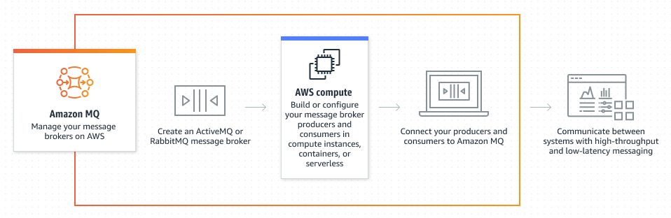

# 📬 **Amazon MQ – Managed Apache ActiveMQ & RabbitMQ in AWS**

> _Run your **existing message broker workloads** in AWS with zero refactoring._

---

<div align="center">
  
</div>

---

## 🔍 **What is Amazon MQ?**

**Amazon MQ** is a **managed message broker service** for **Apache ActiveMQ** and **RabbitMQ** that makes it easy to **migrate traditional message-oriented middleware** to the cloud without rewriting your code.

✅ Use Amazon MQ if you're moving from on-prem systems using protocols like **AMQP**, **MQTT**, **STOMP**, or **OpenWire** — and want a drop-in cloud replacement.

---

## 🚀 **Why Use Amazon MQ?**

| Reason                              | Benefit                                                                    |
| ----------------------------------- | -------------------------------------------------------------------------- |
| 🧳 **Legacy compatibility**         | Keep your **existing code** and **protocols** — no rewrites needed         |
| 🔐 **Secure in your VPC**           | Brokers are **deployed in your VPC**, protected by **security groups**     |
| 🧰 **Fully managed infrastructure** | AWS manages the **patching**, **provisioning**, **HA**, and **monitoring** |
| 🌐 **Protocol support**             | Supports **AMQP, STOMP, MQTT, OpenWire**                                   |
| 💬 **Queue + Topic support**        | Use both **point-to-point** and **publish/subscribe** messaging            |

---

## ⚙️ **How Amazon MQ Works**

Amazon MQ brokers are **not serverless** — they run **on EC2-based infrastructure in your VPC**, giving you **visibility, control, and compatibility**.

### 🧱 Infrastructure Basics

| Layer              | Configuration Location             |
| ------------------ | ---------------------------------- |
| Broker Engine      | Apache ActiveMQ or RabbitMQ        |
| Networking         | Deployed in your **VPC**           |
| Access Control     | IAM + Security Groups              |
| HA Mode (Optional) | Multi-AZ failover (Active/Standby) |
| Monitoring         | Amazon CloudWatch                  |

---

### 🔐 **Security Model**

| Security Feature         | Description                                            |
| ------------------------ | ------------------------------------------------------ |
| **IAM Policies**         | Manage API-level access (e.g., create/delete brokers)  |
| **Security Groups**      | Control broker-level traffic at the network level      |
| **VPC/Subnet Isolation** | Brokers run **privately**, not exposed to the internet |
| **Encryption**           | TLS for in-transit + KMS for at-rest encryption        |

---

## 🧠 **How It's Different from SNS & SQS**

| Feature                | SNS                      | SQS                     | Amazon MQ                       |
| ---------------------- | ------------------------ | ----------------------- | ------------------------------- |
| **Type**               | Serverless pub/sub       | Serverless queueing     | Server-based broker             |
| **Push vs Pull**       | Push (fan-out)           | Pull (polling)          | Flexible: push or pull          |
| **Ordering**           | FIFO (optional)          | FIFO or Standard        | Supported natively              |
| **Protocol Support**   | AWS native only          | AWS native only         | **MQTT, AMQP, STOMP, OpenWire** |
| **Migration Use Case** | New AWS workloads        | Cloud-native decoupling | **Lift-and-shift from legacy**  |
| **Fanout Support**     | Yes (topics + filtering) | No                      | Yes (topics + queues)           |

---

## 📦 **Amazon MQ vs Amazon SQS/SNS**

| Feature/Aspect            | Amazon MQ                       | Amazon SQS/SNS                           |
| ------------------------- | ------------------------------- | ---------------------------------------- |
| **Protocol Support**      | ✅ MQTT, STOMP, AMQP, OpenWire  | ❌ Only AWS-specific APIs                |
| **Managed Broker**        | Yes (server-based in VPC)       | Yes (serverless)                         |
| **Ordering & Durability** | FIFO & persistent queues        | FIFO available (SQS FIFO only)           |
| **Throughput**            | Limited by broker instance size | Virtually unlimited (scales elastically) |
| **Use Case**              | 🧳 Migrate traditional systems  | 🚀 Build modern event-driven apps        |

---

## 💡 **When to Use Amazon MQ**

Choose **Amazon MQ** when:

- ✅ You're migrating legacy applications that rely on ActiveMQ or RabbitMQ
- ✅ You want **protocol support** beyond native AWS APIs (e.g., STOMP, AMQP)
- ✅ Your app uses **durable topics, message acknowledgments**, or **JMS**
- ✅ You need **tight control** over **network placement and access**

---

## 🧪 **Architecture Example**

```plaintext
[Legacy ERP System] ──AMQP──▶ [Amazon MQ Broker in VPC] ──▶ [AWS Consumers]
```

```plaintext
[Producer: MQTT Device]
        ↓
   Amazon MQ (RabbitMQ)
        ↓
[Subscriber: App/Service in EC2 or Lambda]
```

---

## 🏁 **Conclusion**

**Amazon MQ** is a great bridge for enterprises moving to the cloud without breaking existing systems. With full support for **classic messaging protocols**, **VPC-based isolation**, and **managed HA**, it gives you the benefits of AWS without forcing code rewrites.

✅ If you're starting **cloud-native**, use **SQS + SNS**.

✅ If you're **migrating a legacy system**, choose **Amazon MQ**.
