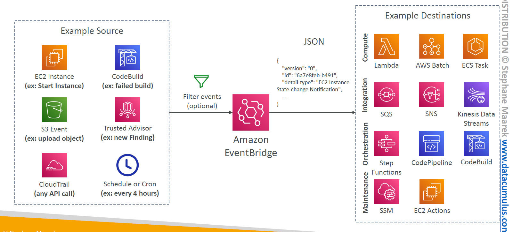
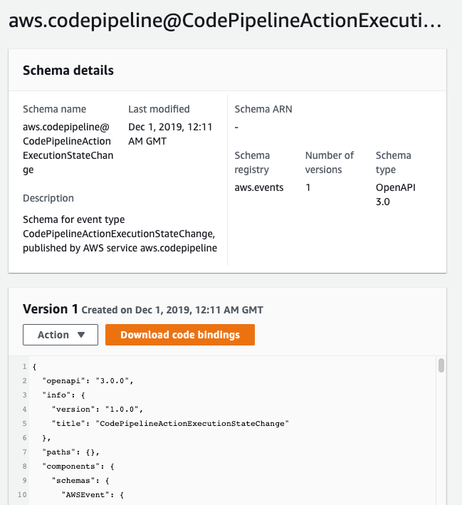

# 🚦 **Amazon EventBridge – Design Scalable Event-Driven Architectures**

> "**Amazon EventBridge** is a **serverless event bus service** that enables you to build event-driven applications by connecting various event sources to targets."  
> It is **the evolution of CloudWatch Events** — but with powerful routing, schema registry, and multi-source support.

---

<div align="center">
  
</div>

---

## 🚦 What Is EventBridge?

> Think of **EventBridge** as a smart traffic cop — it listens for **events** from various sources and **routes** them to the right destinations (targets) based on **rules** you define.

- 📬 Accepts events from **AWS**, **custom apps**, and **SaaS partners**
- 🧠 Makes routing decisions via **pattern-based rules**
- 🚀 Automatically triggers **actions** in AWS (e.g., Lambda, Step Functions)

---

## 🛠️ **Core Components of Amazon EventBridge**

Amazon EventBridge helps connect different services using events. Think of it like a messaging system that delivers updates when something happens! 🚀

---

### 🎫 **Event Bus**

An **event bus** is like a bulletin board where events are posted and sent to the right places. EventBridge has three types:

- 1️⃣ **Default Event Bus** – Automatically receives events from AWS services (e.g., an EC2 instance starts).
- 2️⃣ **Partner Event Bus** – Gets events from third-party applications (e.g., a payment service updates an order).
- 3️⃣ **Custom Event Bus** – Designed for your own apps and workflows (e.g., a shopping cart sends an event when an item is added).

### 📩 **Events**

Events are like digital notifications that carry information. Imagine receiving a message when:

- 💰 A payment succeeds
- 🏗️ An instance starts
- 🔔 A new user signs up

These events are sent as JSON data, containing useful details like the source and event type.

### ⚖️ **Rules**

**Rules** decide what happens to an event. They filter events based on conditions and send them to the right target.

> Example:  
> 👉 A rule can detect a "payment success" event and trigger an email notification.

### 🎯 **Targets**

**Targets** are where events are sent for further processing. EventBridge supports multiple AWS services, such as:

- 🖥️ **Lambda** – Runs code automatically when an event occurs (e.g., update inventory after an order).
- 📢 **SNS** – Sends notifications (e.g., alert a team about a server issue).
- 📦 **SQS** – Queues events for processing later (e.g., handle customer support requests).

> 💡 Amazon EventBridge uses a **push mechanism** to deliver events to targets.

### 📖 **Schema Registry**

The **schema registry** keeps track of event formats so applications can easily understand them. Think of it as a dictionary for events! 📚

> Example:  
> 🔍 If your app expects a "user_signup" event, the schema registry ensures it has the right structure.

---

## 🖼️ How Events Flow

<div align="center">
  
</div>

---

- 🎯 You define **rules** with filtering logic (JSON patterns)
- 📌 Only matching events go to targets
- 📦 Events can be **duplicated to multiple targets**

---

## 🔗 Integration Targets

| Target Service       | Use Case                                     |
| -------------------- | -------------------------------------------- |
| **Lambda**           | Serverless processing / microservice trigger |
| **SQS**              | Queue events for async processing            |
| **SNS**              | Broadcast event to multiple consumers        |
| **Step Functions**   | Trigger complex workflows                    |
| **Kinesis Firehose** | Stream data into S3 / Redshift / Data Lakes  |
| **ECS / Batch**      | Launch containers or batch jobs              |

> 🧠 One event → **multiple targets** for fan-out processing

---

## 🔍 Event Structure Example

```json
{
  "source": "myapp.checkout",
  "detail-type": "OrderPlaced",
  "detail": {
    "orderId": "123",
    "amount": 75.5
  }
}
```

---

## 🧰 Schema Registry (Dev Favorite 💛)

<div align="center">
  
</div>

---

- **Auto-discovers event structure** from apps
- Stores **schemas in central registry**
- Useful with **code generation tools**
- Enables **autocompletion + validation** in IDE

📘 Tools:

- EventBridge Schema Registry Console
- Download SDK bindings for: **Python**, **Java**, **TypeScript**, etc.

---

## 🛡️ Security and Access Control

| Layer             | How It’s Secured                                     |
| ----------------- | ---------------------------------------------------- |
| IAM               | Fine-grained permissions to publish or manage events |
| Resource Policies | Control who can send/receive across accounts         |
| KMS Encryption    | Encrypt event data (if stored/forwarded downstream)  |

---

## 🧪 Real-World Use Cases

| Scenario                       | What Happens                                                    |
| ------------------------------ | --------------------------------------------------------------- |
| 🛒 E-Commerce Checkout         | Event triggers Order → Payment → Notification workflow          |
| 🧾 Invoice App                 | SaaS app (like Stripe) sends payment success → store in Dynamo  |
| ⚙️ DevOps Pipelines            | CodePipeline success triggers auto-deployment via Step Function |
| 👩‍💻 Custom App Error Monitoring | App logs error → EventBridge routes to PagerDuty or Lambda      |
| 🎯 Cross-service Communication | EC2 state change → Rule triggers Auto Scaling / Notify via SNS  |

---

## ✅ Best Practices for EventBridge Architects

### 🛠 Architectural Patterns

| Tip                                  | Why It Matters                                               |
| ------------------------------------ | ------------------------------------------------------------ |
| ✅ Use custom event buses per domain | Avoid noise and separate concerns (e.g., Payments vs Orders) |
| ✅ Use rules with specific filters   | Prevent flooding downstream systems                          |
| ✅ Use schema registry               | Standardizes integration across teams                        |
| ✅ Enable logging on rules           | Monitor delivery failures and match behavior                 |
| ✅ Send DLQ for failed targets       | Avoid lost events (especially SQS/Lambda)                    |

---

### ✨ Optimization Tips

- ⚖️ **Balance payload size** → avoid large event bodies unless needed
- 📤 **Batch delivery** with SQS → for high-throughput processing
- 🔄 **Replay events** via archive → use `StartReplay` (if enabled)
- 🧪 **Test locally** → use EventBridge `PutEvents` to simulate production flows

---

## 📈 Monitoring & Observability

Use **CloudWatch Metrics + Logs** to:

- Monitor event bus delivery metrics
- Debug target failures
- Create alarms for delivery delays or high error rates
- Use **X-Ray** with Lambda for end-to-end tracing

---

## ✅ Summary

| Feature                   | Value                                           |
| ------------------------- | ----------------------------------------------- |
| 🚀 Serverless Event Bus   | No infra, infinite scale                        |
| 🔄 Pattern-Based Routing  | Rules decide which targets get the event        |
| 🧱 Modular Architecture   | Decouple producers and consumers                |
| 📜 Schema Registry        | Discover, catalog, and generate bindings        |
| 🤝 SaaS + AWS Integration | Shopify, Zendesk, Datadog, and 90+ AWS services |
| 🔐 Secure & Auditable     | IAM + resource policy + DLQ + CloudWatch        |
