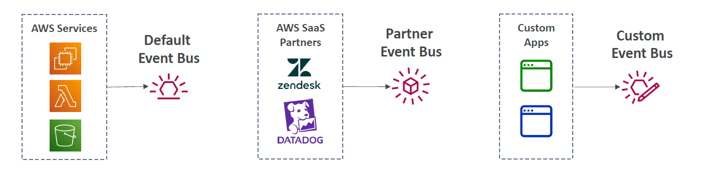
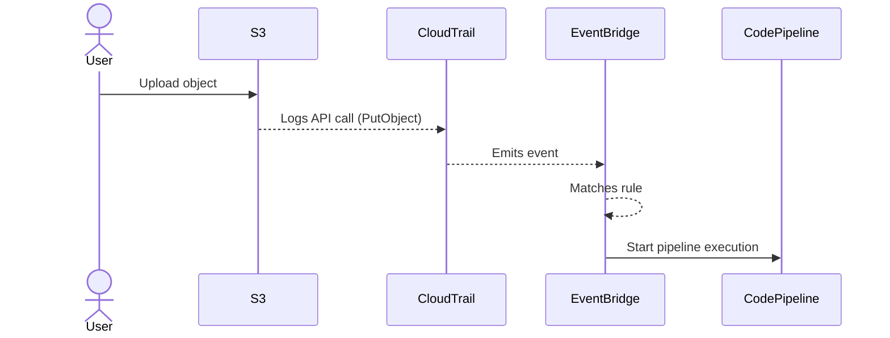

---
tags:
  - aws
  - aws/service
  - aws/domain/application-integration
  - aws/topic/event-bridge
aliases:
  - "AWS EventBridge Integrations Who Sends Events Who Receives Them"
  - "Event Bridge Integrations"
---

# 🚦 AWS EventBridge Integrations: Who Sends Events, Who Receives Them?

> Let's pop the hood on **AWS EventBridge integrations** — who's allowed to send events in, who can receive them out, and how you glue it all together.  
> No mystery. No black box. Just clean architecture and AWS magic you control. ✨

---

## 📥 Who Can **Send Events Into** EventBridge?

> EventBridge is like the **event airport** ✈️. Multiple "airlines" (sources) check in their events — and you choose which ones to route where.

---

<div style="text-align: center;">
    
</div>

---

### 🟢 1. **AWS Services (Native Integration)**

Most AWS services **automatically emit events** to the **default event bus** — no config required.

| AWS Service  | Example Event Type              |
| ------------ | ------------------------------- |
| S3           | Object created (via CloudTrail) |
| EC2          | Instance state change           |
| CodePipeline | Stage execution succeeded       |
| ECS          | Task stopped or failed          |
| Lambda       | Function error or success       |

🧠 These are known as **AWS service events**, and they arrive on the **default event bus**.

---

### 🤝 2. **Partner SaaS Applications**

AWS integrates with **third-party SaaS** tools like:

- Datadog
- Zendesk
- Auth0
- MongoDB Atlas
- PagerDuty

These send events to the **Partner Event Bus**.

| Example Event               | From SaaS |
| --------------------------- | --------- |
| New support ticket          | Zendesk   |
| Alert threshold crossed     | Datadog   |
| User authentication success | Auth0     |

> 🧠 These are **pre-configured via EventBridge integrations** in the AWS Console.

---

### 🧑‍💻 3. **Your Custom Applications**

Your own app or microservices can **send events manually** to EventBridge.

| How to Send | Method                                      |
| ----------- | ------------------------------------------- |
| API         | `PutEvents` API call                        |
| SDK         | e.g., `boto3`, `aws-sdk`                    |
| CLI         | `aws events put-events --entries file.json` |

> ✅ Can send to either the **default bus** or a **custom bus** you create (per domain, service, or team).

---

## 📤 Where Can EventBridge **Send Events To**?

> Once an event **matches a rule**, EventBridge passes it to a **target** like Lambda or Step Functions.

---

### 🎯 Commonly Used Targets

| 🧭 Target Type                   | 🌟 Example Use Case                  |
| -------------------------------- | ------------------------------------ |
| 🔁 **Lambda**                    | Run business logic / transformation  |
| 🧑‍💻 **Step Functions**         | Orchestrate a workflow (e.g., ETL)   |
| 📨 **SNS**                       | Notify subscribers                   |
| 📩 **SQS**                       | Queue for async processing           |
| 🔨 **CodeBuild**                 | Start CI/CD builds                   |
| ⚙️ **CodePipeline**              | Start full deployment pipeline       |
| 📜 **CloudWatch Logs**           | Debug or audit actions               |
| 🧠 **Another Event Bus**         | Cross-account or cross-domain flows  |
| 🌐 **API Destinations (HTTPS)**  | Call webhook or third-party services |
| 💧 **Kinesis (Stream/Firehose)** | Push data to lake/analytics          |

> 🧠 Each rule can target **multiple services**, and you can **transform event data** before it arrives.

---

### 🧠 EventBridge Transformers: Change Payload on the Fly

Example: extract `bucketName` and `objectKey` from S3 PutObject event.

```json
{
  "bucket": <$.detail.requestParameters.bucketName>,
  "objectKey": <$.detail.requestParameters.key>
}
```

> ⚙️ Input Transformers allow **lightweight reshaping** of incoming events before they hit the target.

---

### 🛠️ Example Flow: S3 → EventBridge → CodePipeline

<div align="center">


```mermaid
sequenceDiagram
    actor User
    participant S3
    participant CloudTrail
    participant EventBridge
    participant CodePipeline

    User->>S3: Upload object
    S3-->>CloudTrail: Logs API call (PutObject)
    CloudTrail-->>EventBridge: Emits event
    EventBridge-->>EventBridge: Matches rule
    EventBridge->>CodePipeline: Start pipeline execution
```

</div>

---

## 🔒 Security Considerations

| Component     | Permissions Needed                                                      |
| ------------- | ----------------------------------------------------------------------- |
| Sender App    | `events:PutEvents` to desired bus                                       |
| EventBridge   | IAM role to invoke target (e.g., `codepipeline:StartPipelineExecution`) |
| Cross-Account | Resource policy on the custom event bus                                 |

✅ Always audit using **CloudTrail logs** and enable **dead-letter queues (DLQs)** for failed deliveries.

---

## 🧠 Summary Cheat Sheet

### 📥 Event Sources (Who Can Send?)

| Type              | Destination    | Notes                      |
| ----------------- | -------------- | -------------------------- |
| AWS Services      | Default bus    | Native integration         |
| Your App (Custom) | Any bus        | via `PutEvents`            |
| SaaS Partners     | Partner bus    | Pre-built integrations     |
| Cross-Account     | Custom bus     | Needs permissions          |
| Schedule/Cron     | Internal rules | No external trigger needed |

---

### 📤 Event Targets (Where to Send?)

| Target Type      | Use Case                |
| ---------------- | ----------------------- |
| Lambda           | Serverless compute      |
| Step Functions   | Workflows               |
| SNS/SQS          | Messaging & queuing     |
| CodePipeline     | CI/CD automation        |
| API Destinations | Call HTTP endpoints     |
| Kinesis          | Stream to analytics     |
| CloudWatch Logs  | Logging for audit/debug |

---
---

## Related Notes
- [[aws-services/7.application-integration/event-bridge/|Index]] - folder map
- [[aws-services/7.application-integration/event-bridge/1.2.event_bridge-vs-sns|Comparing Amazon EventBridge and Amazon SNS]] - previous lesson
- [[aws-services/7.application-integration/event-bridge/2.2.integration-with-s3-and-cloud-trail|How AWS EventBridge Works Internally]] - next lesson
- [[aws-services/1.management-governance/3.1.cloud-watch/3.1.cw-logs|Amazon CloudWatch Logs]] - mentions CloudWatch Logs
- [[aws-services/7.application-integration/step-functions/1.step-functions|AWS Step Functions Orchestrate Your Serverless Workflows with Ease]] - mentions Step Functions
- [[aws-daily/aws-architectures/3.1.serverless|Server-Based Architectures vs. Serverless Computing]] - mentions Serverless
-[[1.serverless|The Ultimate Guide to Serverless Computing & Tools]]] - mentions Serverless
-[[1.1.codebuild|How AWS CodeBuild Works Internally]]] - mentions Codebuild
- [[aws-services/11.analytics/firehose/1.1.firehose|Amazon Data Firehose The Pipeline That Never Sleeps]] - mentions Firehose
- [[aws-services/1.management-governance/4.3.config/x.config|AWS Config Track Manage and Secure Your AWS Resources]] - mentions Config
- [[aws-services/7.application-integration/sqs/1.1.sqs|Amazon SQS Mastering Serverless Message Queues]] - mentions SQS
- [[aws-services/7.application-integration/sns/1.sns|Amazon SNS The Clouds Pub/Sub Notification Engine]] - mentions SNS

---
