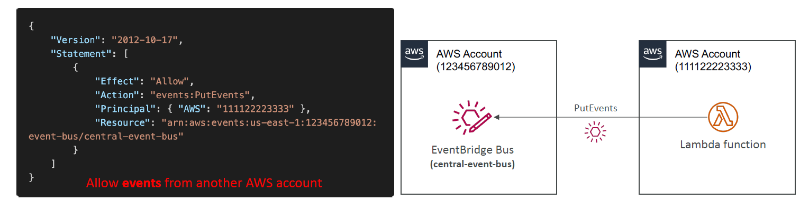
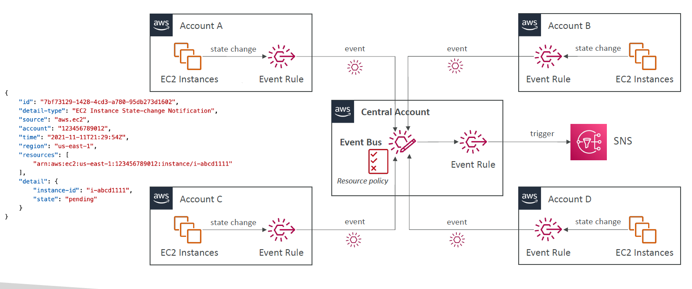

# 💂‍♂️ **Amazon EventBridge Resource Policies**

> Securely control **who can send**, **who can read**, and **how** events are accessed across accounts or services.

---

<div style="text-align: center;">
    
</div>

---

## 🧠 What Is an EventBridge Policy?

An **EventBridge Resource Policy** is an **IAM-like policy** that you attach to an **Event Bus**, allowing you to control **who** can:

- Put events to your event bus
- Receive events
- Use cross-account or service integrations

> It's similar to S3 bucket policies or Lambda resource policies — but for **event buses**.

---

## 🔒 Why Are EventBridge Policies Important?

Because:

- By default, only **your AWS account** can interact with its Event Bus
- But you may need to:

  - Allow **SaaS partners** to publish events to your bus
  - Allow **another AWS account** (e.g., dev → prod) to send events
  - Enable **cross-account event routing**

📌 Without a resource policy → any cross-account or partner integration **will fail** with `AccessDenied`.

---

## 🧱 Policy Components

A resource policy follows a **standard JSON IAM format** with key fields:

| Field       | Purpose                                               |
| ----------- | ----------------------------------------------------- |
| `Effect`    | Allow / Deny                                          |
| `Principal` | Who is allowed to access (AWS account, service, etc.) |
| `Action`    | `events:PutEvents`, `events:PutRule`, etc.            |
| `Resource`  | The ARN of your Event Bus                             |
| `Condition` | Add extra restrictions (e.g., source ARN match)       |

---

## 🔐 Example 1: Allow Another AWS Account to Send Events

```json
{
  "Statement": [
    {
      "Effect": "Allow",
      "Principal": { "AWS": "arn:aws:iam::123456789012:root" },
      "Action": "events:PutEvents",
      "Resource": "arn:aws:events:us-east-1:111122223333:event-bus/my-app-bus"
    }
  ]
}
```

🧠 Account `123456789012` can now send events to your custom event bus `my-app-bus`.

---

## 🔧 Example 2: Only Allow from a Specific Rule or Source (Condition)

```json
{
  "Statement": [
    {
      "Effect": "Allow",
      "Principal": { "Service": "events.amazonaws.com" },
      "Action": "events:PutEvents",
      "Resource": "arn:aws:events:us-east-1:111122223333:event-bus/my-app-bus",
      "Condition": {
        "StringEquals": {
          "aws:SourceArn": "arn:aws:events:us-east-1:123456789012:rule/MyCrossAccountRule"
        }
      }
    }
  ]
}
```

✅ This allows only a specific rule from another account to put events.

---

## 🔁 **EventBridge – Multi-account Aggregation**

<div style="text-align: center;">
    
</div>

## 🧠 How to Add a Policy

You can add or manage EventBridge resource policies using:

### 🧭 AWS Console

1. Go to **EventBridge > Event Buses**
2. Choose your **Custom Event Bus**
3. Click **Permissions**
4. Add/Edit JSON policy

### 💻 AWS CLI

```bash
aws events put-permission \
  --event-bus-name my-app-bus \
  --action "events:PutEvents" \
  --principal "123456789012"
```

### 🛠 CloudFormation Example

```yaml
MyEventBus:
  Type: AWS::Events::EventBus
  Properties:
    Name: my-app-bus

EventBusPolicy:
  Type: AWS::Events::EventBusPolicy
  Properties:
    StatementId: CrossAccountSend
    Action: "events:PutEvents"
    Principal: "123456789012"
    EventBusName: !Ref MyEventBus
```

---

## 🚨 Best Practices

| Recommendation                  | Reason                                                  |
| ------------------------------- | ------------------------------------------------------- |
| ✅ Use condition keys           | Prevent overly broad access (e.g., use `aws:SourceArn`) |
| ✅ Apply least privilege        | Only allow minimal accounts/services to interact        |
| ✅ Use different custom buses   | Separate access domains (e.g., partner, dev, prod)      |
| ✅ Monitor with CloudTrail      | Track who is using your event bus                       |
| 🧪 Test with `PutEvents` in CLI | Ensure cross-account rules work as expected             |
