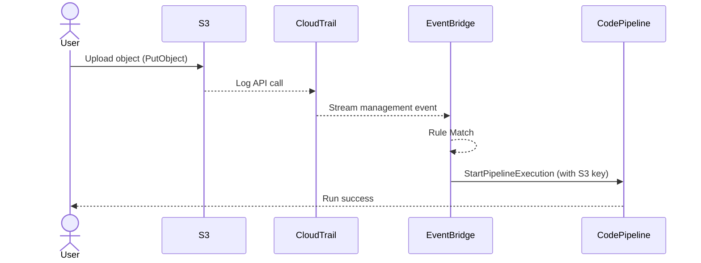

# ☁️ **How AWS EventBridge Works Internally**

> _For Devs & Architects Who Hate Black Boxes and Love Knowing "What Really Happens"_

---

## 🧠 What Is AWS EventBridge _Really_?

> Think of EventBridge as a **cloud-native event router** – it listens to changes, matches them to rules, and sends them to where they matter.

---

> ✅ **Successor of CloudWatch Events**, with added power:

- **No infrastructure to manage**
- **Built-in filtering, transformation, retries, and DLQs**
- **Integrates with AWS Services, SaaS apps, and custom apps**

**You don’t poll it. You don’t provision it.** It **just listens and routes** — in milliseconds.

---

## ⚙️ Internals: How EventBridge Reacts to an S3 Upload

Let’s explore **how AWS services interact behind the scenes** when a file is uploaded to S3 and you want to trigger something like **CodePipeline**.

---

### 🧱 Step-by-Step: EventBridge in Action

#### 1️⃣ Uploading to S3 (`PutObject`)

- User or app uploads a file.
- S3 **does not natively emit to EventBridge** (❌ no direct integration).
- Instead, **CloudTrail** records the `PutObject` API call.

```json
{
  "eventSource": "s3.amazonaws.com",
  "eventName": "PutObject",
  "requestParameters": {
    "bucketName": "my-bucket",
    "key": "myfile.txt"
  }
}
```

🔍 Think of **CloudTrail as a passive API logger** — like a CCTV for AWS APIs.

---

#### 2️⃣ CloudTrail Feeds EventBridge (Silently)

- EventBridge has a **built-in integration** with CloudTrail for **management events**.
- If the event matches, it's **streamed in real-time**.
- You **don’t even need to create a trail**.

✅ CloudTrail → EventBridge is **always on** (for supported events).
⚡ It’s **push-based**, near real-time, and costs nothing extra.

---

#### 3️⃣ EventBridge Rule Matches the Event

You create a rule like:

```json
{
  "source": ["aws.s3"],
  "detail-type": ["AWS API Call via CloudTrail"],
  "detail": {
    "eventName": ["PutObject"],
    "requestParameters": {
      "bucketName": ["my-bucket"]
    }
  }
}
```

🧠 EventBridge:

- Parses each event
- Matches it against rule patterns
- If match ✅ → **forwards event to target**

---

#### 4️⃣ EventBridge Pushes to CodePipeline

- If the rule target is CodePipeline, EventBridge **pushes** a `StartPipelineExecution` request.
- You can inject parameters like S3 key using **input transformers**.

---

## 🧬 Internal Architecture (Mermaid Style)



🧠 **Behind the magic**: No polling, no daemons. **CloudTrail feeds EventBridge → EventBridge routes → target runs**.

---

## 🧪 End-to-End Setup Table

| 🔢 Step | 🛠️ Action                                                    |
| ------- | ------------------------------------------------------------ |
| 1️⃣      | User uploads `file.txt` to S3 bucket                         |
| 2️⃣      | CloudTrail records the `PutObject` API call                  |
| 3️⃣      | EventBridge receives the CloudTrail event (real-time stream) |
| 4️⃣      | EventBridge rule matches `eventName: PutObject`              |
| 5️⃣      | CodePipeline is invoked as a target                          |

---

## 🛡️ Security & Permissions

| Component         | Required Permission                                                    |
| ----------------- | ---------------------------------------------------------------------- |
| **EventBridge**   | Needs `codepipeline:StartPipelineExecution` permission                 |
| **Pipeline Role** | Should allow overrides if sending input artifacts / revision overrides |

### 🔐 Example IAM Permission for EventBridge

```json
{
  "Effect": "Allow",
  "Action": "codepipeline:StartPipelineExecution",
  "Resource": "arn:aws:codepipeline:us-east-1:123456789012:MyPipeline"
}
```

---

## 💡 Key Takeaways for Devs & Cert Exams

| Question                                                | Answer                                                                       |
| ------------------------------------------------------- | ---------------------------------------------------------------------------- |
| Does EventBridge pull or push to targets?               | ✅ **Push** – you define rules and it delivers events to targets immediately |
| Does S3 directly emit events to EventBridge?            | ❌ No – CloudTrail emits management events to EventBridge on S3’s behalf     |
| Does CloudTrail push to SNS or SQS directly?            | ❌ No – only EventBridge or S3/CloudWatch for logging                        |
| Is a trail needed for EventBridge to get S3 API events? | ❌ No – real-time CloudTrail EventStream to EventBridge works without trails |
| Is the flow near-real-time?                             | ✅ Yes – latency is in the range of **a few seconds**                        |

---

## 🎯 Final Thought

AWS EventBridge **isn't a black box** — it’s a **smart router** that silently listens to AWS API changes (via CloudTrail), filters them, and routes them **instantly** to your AWS services like CodePipeline, Lambda, or SQS.
