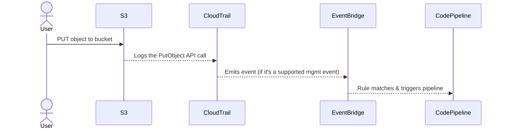
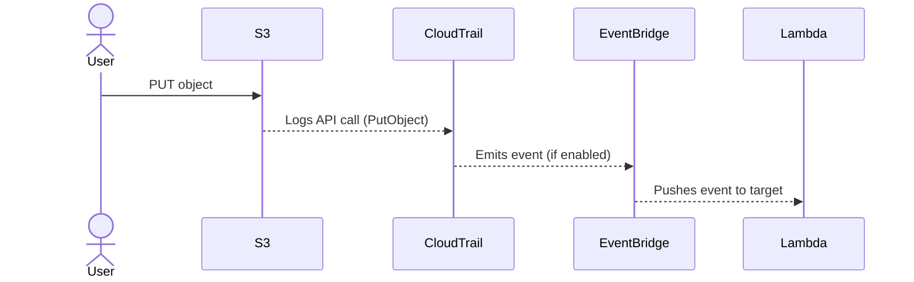

# 🧠 **EventBridge Questions**

## 🧠 Q1: **Why is CloudTrail needed when triggering a pipeline from an S3 object upload?**

### ✅ Short Answer

> **S3 doesn’t natively emit events to EventBridge. Instead, CloudTrail captures API calls like `PutObject` and forwards them to EventBridge.**

---

### 🔍 Full Explanation

- S3 **does not emit native EventBridge events** for `PutObject`.
- But S3 **does emit API-level events** to **CloudTrail**, such as:

  ```json
  {
    "eventSource": "s3.amazonaws.com",
    "eventName": "PutObject"
  }
  ```

- **CloudTrail acts as the bridge** between S3 and EventBridge.

---

### 🎯 Why is this necessary?

- **❌ Without CloudTrail:**

  - S3 **bucket event notifications** support `Lambda`/`SNS`/`SQS` directly, but **`not` EventBridge**
  - No way to "watch" object uploads via EventBridge alone

- **✅ With CloudTrail:**

  - CloudTrail logs `PutObject` → EventBridge rule can match it and forward to CodePipeline

---

## 💸 Q2: **Do I have to pay for CloudTrail? Can I use the free one?**

### 💡 Good News

> You **don’t need to create a custom CloudTrail trail** to get this functionality!

- EventBridge **automatically integrates with the CloudTrail EventStream** for free.
- This is the **"management events" default integration**, and it's free for most AWS services, including S3.

🟢 **So:**

- ✅ You **do not need to create a trail**
- ✅ You **do not pay anything extra** unless you enable full data event logging or advanced features
- ✅ CodePipeline triggers **still work** with the **default CloudTrail-to-EventBridge stream**

---

## 🧠 Q3: **Is EventBridge just a filter for incoming events?**

### ✅ Short Answer

> EventBridge is **more than a filter** — it’s a **serverless event router with pattern matching, transformation, and multiple targets**.

---

### 🧩 Internally, it does

| Capability                | Description                                                                |
| ------------------------- | -------------------------------------------------------------------------- |
| 🔍 **Filtering**          | Match events with rules based on content (`source`, `eventName`, etc.)     |
| 🔁 **Transformation**     | Modify event structure via **input transformer** before passing to targets |
| 🎯 **Routing to targets** | Send matched events to targets like Lambda, Step Functions, CodePipeline   |
| ⏰ **Scheduled events**   | Cron-style scheduled rules                                                 |
| 🧩 **Custom buses**       | You can create your own event buses for microservices separation           |
| 🔐 **Access control**     | IAM & resource-based policies control who can put and consume events       |

So yes — it **does filter** events, but also **transforms, routes, and manages** them.

---

## 🧠 Q4: **Can EventBridge be triggered by something other than CloudTrail?**

### ✅ Absolutely

EventBridge **can receive events from**:

| Source Type                    | Examples                                              |
| ------------------------------ | ----------------------------------------------------- |
| 🔹 **AWS Services (native)**   | CodeBuild, ECS, Auto Scaling, CodePipeline, EC2, etc. |
| 🔸 **CloudTrail-based**        | S3, DynamoDB (via API calls)                          |
| 🔸 **Custom apps**             | Your app emits events via `PutEvents` API             |
| 🔸 **SaaS providers**          | Datadog, Auth0, Zendesk, MongoDB Atlas, etc.          |
| 🔸 **Schedule (cron)**         | Scheduled expressions like `rate(5 minutes)`          |
| 🔸 **Other EventBridge buses** | Events can be routed from one bus to another          |

---

### 🔧 Example

Let’s say you use **Amazon CodeBuild** → it emits **native events** like:

```json
{
  "source": "aws.codebuild",
  "detail-type": "CodeBuild Build State Change",
  "detail": {
    "build-status": "SUCCEEDED",
    "project-name": "MyBuildProject"
  }
}
```

🟡 **No CloudTrail needed. Native integration.**

But for services like **S3**, which don’t emit native EventBridge events, AWS uses CloudTrail as an **intermediary event publisher**.

---

## 🧠 Q5: Does **CloudTrail emit events**?

### ✅ Yes — but **not in the way you might think**

CloudTrail **does not emit events** like a real-time push service.
Instead, it acts like a **log sink** for **API calls** and can optionally **stream those logs to EventBridge**.

Let’s break it down in a human-smart way.

### 💡 What CloudTrail _actually_ does

| Role                                | Description                                                                                                                                                      |
| ----------------------------------- | ---------------------------------------------------------------------------------------------------------------------------------------------------------------- |
| 📜 **Recorder**                     | Captures all **API activity** across your AWS account (e.g., `PutObject`, `StartInstances`) and writes logs to S3 or CloudWatch                                  |
| 📡 **Event Source** for EventBridge | Some of these API actions (called **management events**) are streamed **internally** into EventBridge **in near real-time**, even **without a trail configured** |

---

### 🎯 So is CloudTrail an **event emitter**?

Yes, **in the context of EventBridge**, but:

- 🔸 It doesn’t emit in the traditional sense (e.g., SNS-style push).
- 🔸 It emits **certain management events** via a **built-in stream** to EventBridge.
- 🔸 It doesn’t push to SNS, SQS, or Lambda **directly**.
- 🔸 It’s not designed as a general-purpose event router.

---

### 🤔 Where can CloudTrail **emit to**?

| Target                        | Explanation                                                                |
| ----------------------------- | -------------------------------------------------------------------------- |
| 🔹 **Amazon S3**              | ✅ By default (via trails), logs are written to S3 as JSON files.          |
| 🔸 **Amazon CloudWatch Logs** | ✅ You can forward logs to CloudWatch Log Groups.                          |
| 🔹 **Amazon EventBridge**     | ✅ Certain **management events** are streamed to EventBridge in real time. |
| ❌ **SNS / SQS / Lambda**     | ❌ Not directly — must go through EventBridge or custom logic.             |

---

### 🤖 Internal Flow (S3 Example)

Let’s say you upload a file to an S3 bucket:



🧠 **Key Insight**:  
CloudTrail is **not a messaging service** like SNS. It’s a **logging/auditing service** that **happens to stream selected events into EventBridge**.

---

## 🧠 Q5: What if I want CloudTrail to push to other services?

You’d need to use **EventBridge** as the middleman:

1. CloudTrail event → EventBridge
2. EventBridge rule → Target: Lambda, Step Functions, CodePipeline, etc.

Or…

You could write your own Lambda that polls the S3 logs written by CloudTrail — but this is less efficient and not real-time.

---

Perfect! Below is a complete and **cleanly structured topic** answering your questions with smart sections, sequence diagrams, tables, and human-style clarification — ideal for mastering how **CloudTrail works with EventBridge**:

---

## 🧠 Q6: Does **EventBridge push or pull to its targets**?

### ✅ **Push mechanism** — always

> Once EventBridge receives an event that matches a **rule**, it immediately **pushes it to the target** (e.g., Lambda, SQS, Step Functions, etc).

**You never pull from EventBridge.**

---

### 💡 EventBridge Target Delivery Model

| Type    | Mechanism | Direction | Example                     |
| ------- | --------- | --------- | --------------------------- |
| ✅ Push | Yes       | Outbound  | Sends event to Lambda, SQS  |
| ❌ Pull | No        | ❌        | Targets do not pull from EB |

🧠 Think of EventBridge as a **router that delivers** — not a message broker waiting to be polled.

---

## 🧠 Q7: Is **CloudTrail push-based** or **pull-based**?

### 😐 **Neither, technically.**

CloudTrail is a **log recorder**. It **writes logs to S3 and/or CloudWatch Logs** — it does **not push** logs like SNS or SQS.

> However… CloudTrail can **stream certain management events into EventBridge**, and _that part is push-based internally_.

---

## 🧠 Q8: Can CloudTrail stream **only to EventBridge**?

### ✅ CloudTrail Can Stream To

| Destination               | Supported? | Notes                                                          |
| ------------------------- | ---------- | -------------------------------------------------------------- |
| 📦 **Amazon S3**          | ✅ Yes     | Default log sink (JSON files)                                  |
| 📊 **CloudWatch Logs**    | ✅ Yes     | Great for log queries / alarms                                 |
| 📡 **Amazon EventBridge** | ✅ Yes     | Management events _only_, push-based                           |
| 📩 **SNS / SQS / Lambda** | ❌ No      | Not directly — must go through EventBridge or a custom process |

🧠 **EventBridge is the only service CloudTrail natively pushes structured events to.**

---

## 🧠 Q9: What types of **CloudTrail events** are sent to EventBridge?

Only **management events** like:

- `RunInstances`
- `PutObject`
- `CreateUser`
- `CreateBucket`

Not sent:

- Data events unless explicitly configured
- Custom CloudTrail log files (those go to S3)

📌 _You don't need a CloudTrail "trail" configured for this real-time push to work. It’s built-in._

---

## 🧠 Q10: Does **CloudTrail emit events**?

### ✅ Yes — but **not in the way you might think**

CloudTrail **does not emit events** like SNS or SQS. Instead, it’s a **logging system** that happens to **stream some events to EventBridge internally**.

---

### 💡 What CloudTrail _actually_ does

| Role                                | Description                                                                                  |
| ----------------------------------- | -------------------------------------------------------------------------------------------- |
| 📜 **Recorder**                     | Captures AWS API calls (e.g., `StartInstances`, `PutObject`) → saves to S3 / CloudWatch Logs |
| 📡 **Event Source for EventBridge** | Certain real-time management actions are auto-streamed into EventBridge                      |

---

### 🧪 Internal Event Flow Example (With S3 Upload)



🧠 **Key Insight**:
CloudTrail doesn’t behave like a message queue. It’s more like a **security camera** that also **triggers alarms** (EventBridge) when something critical happens.

---

## 🧠 Q11: What about **security and filtering**?

CloudTrail → EventBridge has **native filtering via rules**.

> You can write rules in EventBridge like:

```json
{
  "source": ["aws.ec2"],
  "detail-type": ["AWS API Call via CloudTrail"],
  "detail": {
    "eventName": ["StartInstances"]
  }
}
```

🧠 This triggers only when someone runs `StartInstances` via the API.

## 📚 References

- [📘 Create EventBridge Rule for S3](https://docs.aws.amazon.com/codepipeline/latest/userguide/create-S3-source-events.html)
- [📘 Amazon S3 Source Action Reference](https://docs.aws.amazon.com/codepipeline/latest/userguide/action-reference-S3.html)
- [📘 EventBridge Input Transformer](https://docs.aws.amazon.com/eventbridge/latest/userguide/eb-input-transformer.html)
- [📘 CloudTrail Integration](https://docs.aws.amazon.com/awscloudtrail/latest/userguide/cloudtrail-event-reference.html)
