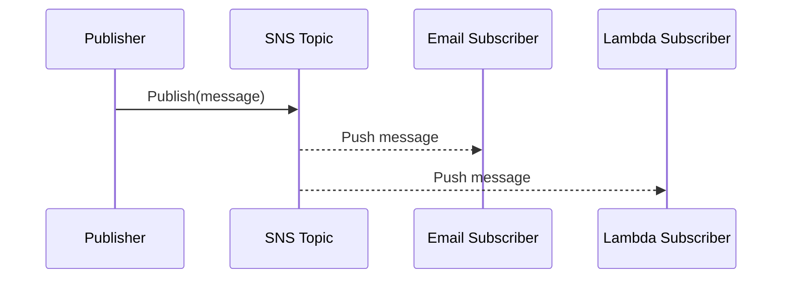

# 📢 **Amazon SNS – The Cloud’s Pub/Sub Notification Engine**

> _Amazon Simple Notification Service (SNS) makes it easy to send one message to many recipients across multiple protocols — instantly, reliably, and at scale._

---

<div align="center">
  
</div>

---

## 🔍 **What Is Amazon SNS?**

**Amazon SNS** is a fully managed **publish/subscribe (pub/sub)** messaging service. It lets **publishers** send messages to **topics**, which are then **pushed** to all **subscribers**.

Think of it as a **group broadcast system** for distributed applications.

---

## 🧱 **Core Components**

| Component      | Role & Description                                                 |
| -------------- | ------------------------------------------------------------------ |
| **Topic**      | A logical access point for publishing messages                     |
| **Publisher**  | Any AWS service, app, or function that sends messages to the topic |
| **Subscriber** | Services or endpoints that receive messages from the topic         |

Supported subscriber protocols include:

- ✅ **Amazon SQS**
- ✅ **AWS Lambda**
- ✅ **HTTP/S endpoints**
- ✅ **Email / SMS**
- ✅ **Application (Mobile Push)**

---

## 🔄 **How It Works – Basic Flow**

<div align="center">



</div>

---

## 🎯 **Common Use Cases**

| Use Case                       | Description                                                                |
| ------------------------------ | -------------------------------------------------------------------------- |
| 🚨 **Alerts & Notifications**  | Real-time alerts for ops, monitoring, and system health                    |
| 📱 **Mobile Push**             | Send push messages to apps via Amazon SNS Mobile Push                      |
| 🔄 **Microservice Fanout**     | Publish one message → deliver to multiple downstream services              |
| 🔗 **Workflow Triggers**       | Trigger Lambda or Step Functions when data is ready                        |
| 🔍 **Filtered Notifications**  | Subscribers only get messages matching specific attributes (filter policy) |
| 🧪 **Test & Monitoring Hooks** | Attach temporary HTTP/S endpoints for debugging or QA testing pipelines    |

---

## 🧩 **Advanced Features**

### 🌀 1. **SNS Fanout Pattern**

> Distribute a message to multiple SQS queues or Lambda functions for parallel processing.

```text
SNS Topic
 ├── SQS Queue A → Inventory Service
 ├── SQS Queue B → Billing Service
 └── Lambda       → Email Service
```

✅ Great for **event-driven decoupling**.

---

### 🧼 2. **Message Filtering**

> Send **only relevant messages** to subscribers using **filter policies**.

🔧 Example:

```json
{
  "eventType": ["order_placed", "order_cancelled"]
}
```

📌 Use this when:

- Different subscribers care about **different message types**
- You want to **reduce downstream noise**

---

### 💡 3. **Dead Letter Queues (DLQs)**

> If a subscriber endpoint (like Lambda or HTTP) fails too many times, SNS can move failed messages to a **DLQ (SQS queue)**.

📦 You can inspect the failed messages later for debugging.

---

### 🔁 4. **FIFO Topics**

> Guarantee **exact ordering** and **deduplicated delivery**.

- Used when **message order matters** (e.g., payment, banking).
- Requires **FIFO SQS** or **Lambda** as subscribers.

🧠 FIFO + Deduplication = Precise control and reliability.

---

### 🔒 5. **Security & Access Control**

- Use **IAM policies** to control:

  - Who can publish to topics
  - Who can subscribe to topics

- Topics support **KMS encryption** for sensitive payloads.
- Use **HTTPS** for encrypted delivery to webhooks.

---

## ⚙️ **Integration Examples**

| Publisher        | SNS Topic         | Subscriber(s)               |
| ---------------- | ----------------- | --------------------------- |
| S3 File Upload   | `file-uploads`    | Lambda → Resize images      |
| CloudWatch Alarm | `cpu-alerts`      | Email + SMS                 |
| Step Functions   | `workflow-events` | SQS → Processing Queue      |
| Custom App API   | `user-events`     | Lambda → Send Welcome Email |

---

## ✅ **SNS vs SQS – Key Differences**

| Feature         | **Amazon SNS**                 | **Amazon SQS**           |
| --------------- | ------------------------------ | ------------------------ |
| Type            | **Push-based** pub/sub         | **Pull-based** queue     |
| Subscribers     | Multiple                       | One consumer per message |
| Ordering        | FIFO optional                  | FIFO optional            |
| Use Case        | Notify many services           | Decouple and queue tasks |
| Fan-out Pattern | ✅ Built-in                    | ❌ Use SNS for fan-out   |
| Filtering       | ✅ Yes                         | ❌ No                    |
| Protocols       | Lambda, Email, HTTP, SQS, etc. | Only AWS consumers       |

---

## 🏁 **Conclusion**

Amazon SNS is a **foundational AWS messaging service** that helps you build scalable, loosely coupled systems with real-time communication. Whether you're triggering workflows, notifying users, or distributing events across services — **SNS provides the power and flexibility** to do it **securely, reliably, and fast**.
