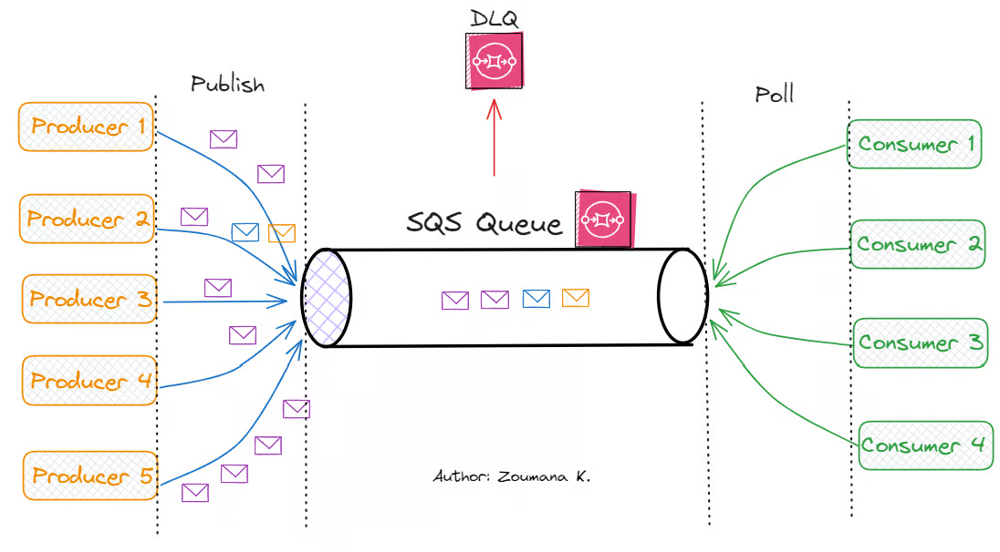

# 📬 **Amazon SQS – Mastering Serverless Message Queues**

> _Build scalable, resilient, and decoupled applications with AWS's fully managed message queuing service._

---

  

---

## 🧠 **What is Amazon SQS?**

**Amazon Simple Queue Service (SQS)** is a fully managed, serverless **message queuing service** that lets components of distributed systems communicate **asynchronously and reliably**.

Whether you're decoupling microservices, offloading long tasks from APIs, or buffering workloads — **SQS keeps your systems scalable and fault-tolerant**.

---

## 🔐 **Key Features at a Glance**

| Feature                | Description                                                         |
| ---------------------- | ------------------------------------------------------------------- |
| ⚡ **Fast & Reliable** | Delivers messages in milliseconds, ensuring no loss during transfer |
| 🪢 **Mechanism**        | It is **Pull Based Mechanism**                                      |
| 🧱 **Durable**         | Stores messages across **multiple AZs** within a region             |
| 🔒 **Secure**          | IAM integration for fine-grained access control                     |
| 🛠️ **Fully Managed**   | No need to manage infrastructure or scaling                         |
| 📈 **Scalable**        | Scales automatically to handle **millions of messages per second**  |

---

## 🌀 **Message Lifecycle Overview**

Here’s how messages move from sender to processor — with reliability baked into every step.

### 🔁 Step-by-Step Flow

```mermaid
sequenceDiagram
    participant Producer as 📝 Producer
    participant SQS as 📨 SQS Queue
    participant Consumer as 🛠️ Consumer

    Producer->>SQS: Send message
    SQS->>Consumer: Polls for message
    Consumer->>SQS: Deletes message if success
    alt Failure or timeout
        SQS-->>Consumer: Redelivers message
    end
```

---

## 📤 **1. Message Sending (Producer)**

- Produce Message to SQS using the **SDK (SendMessage API)**
- The message is persisted in SQS **until a consumer deletes it**
- **Single or Batch Send:** Send one message or up to **10 in a batch** _(max 256 KB total)_.
- **Optional Delay:** Use **Delay Queue** feature to delay message delivery _(0 to 15 min)_.

💡 **Example:** After user registration, delay the welcome email by 10 minutes.

---

## 💾 **2. Message Storage**

- **Retention Period:** Configurable from **1 minute to 14 days** _(default: 4 days)_.
- Ideal for **retries**, delayed processing, or batching.

---

## 🛠️ **3. Message Processing (Consumer)**

- Consumers **poll** the queue to receive messages.
- Poll SQS for messages (receive **up to 10 messages at a time**).
- Delete the messages using the **DeleteMessage API**.

- Choose between:

  - ⚡ **Short Polling** (returns immediately)
  - ⏳ **Long Polling** (waits up to 20s for new messages → lower cost)

- **Visibility Timeout:**
  Prevents duplicate processing by hiding the message from others while it's being handled.

  - **Default:** 30s | **Max:** 12 hours

✅ If successful → delete it  
❌ If failed or not deleted → message becomes visible again

> 💡 We can scale consumers horizontally to improve throughput of processing

---

## 🖼️ **Message Processing (Consumer)**

1. **Retrieve Message:** Consumer fetches a message from the queue.
2. **Lock Message:** The message becomes invisible to other consumers for the duration of the Visibility Timeout.
3. **Process Message:** Consumer processes the message.
4. **Delete Message:** Upon successful processing, the consumer deletes the message from the queue.
5. **Failed Processing:** If the consumer fails to delete the message within the Visibility Timeout, the message becomes visible again for another attempt (😱 infinite).

## ❌ **Failure Handling & Dead-Letter Queues (DLQ)**

**Dead Letter Queues (DLQ)** used to Capture messages that fail processing multiple times, aiding in troubleshooting and error handling.

- **Configuration:** Set up a DLQ to receive messages after a specified number of failed processing attempts.

- Set a **maximum receive count** (e.g., 3 attempts).
- After that, message is moved to a **Dead Letter Queue**.
- Great for isolating **poison messages** that break consumers.

---

## 🧱 **Queue Types**

### 🔄 1. **Standard Queue** (default)

| Property   | Details                                      |
| ---------- | -------------------------------------------- |
| Delivery   | At least once                                |
| Order      | Best-effort (not guaranteed)                 |
| Throughput | Nearly unlimited                             |
| Use Case   | High-speed systems where duplicates are okay |

✅ Example: Log processing, social notifications, telemetry

---

### 🔢 2. **FIFO Queue** (First-In-First-Out)

| Property   | Details                               |
| ---------- | ------------------------------------- |
| Delivery   | Exactly once                          |
| Order      | Guaranteed                            |
| Throughput | 300 TPS or 3,000 TPS with batching    |
| Use Case   | Tasks where order & uniqueness matter |

  

---

✅ Example: Payment processing, inventory adjustments

> 💡 Ordering by **Message Group ID** (all messages in the same group are ordered) – **mandatory parameter**

---

## 🔍 **Polling Types**

### ⚡ Short Polling

- Returns instantly (even if no messages)
- More API calls = higher cost

  

---

### ⌛ Long Polling (Recommended)

- Waits up to 20 seconds for new messages
- **Less expensive**, fewer empty responses

  

🛠️ **Configure with:**

- `WaitTimeSeconds` in `ReceiveMessage`
- Or queue-wide setting
- Long polling can be enabled at the queue level or at the API level using WaitTimeSeconds

> 💡 LongPolling decreases the number of API calls made to SQS while increasing the efficiency and reducing latency of your application

---

## ⏳ **Message Visibility Timeout**

  

---

- After a message is polled by a consumer, it becomes **invisible** to other consumers
- By default, the “message visibility timeout” is **30 seconds**, That means the message has **30 seconds** to be re-processed
- After the message visibility timeout is over, the message is **“visible”** in SQS
- If a message is not processed within the visibility timeout, it will be processed twice
- A consumer could call the **ChangeMessageVisibility** API to get more time
- If visibility timeout is high (hours), and consumer crashes, re-processing will take time
- If visibility timeout is too low (seconds), we may get duplicates

## ⏱️ **Control Timings Like a Pro**

| Feature                | What it Does                                      | Range                                    |
| ---------------------- | ------------------------------------------------- | ---------------------------------------- |
| **Retention**          | How long unprocessed messages stay in queue       | 1 minute – 14 days `(default is 4 days)` |
| **Delay Queue**        | Delay message delivery                            | 0 – 15 minutes `(default is 0)`          |
| **Visibility Timeout** | How long a message is hidden after being received | 0 – 12 hours `(default is 30s)`          |

---

## 🔐 **Security + Monitoring**

- **IAM Policies**: Control who can send/read/delete messages
- **Encryption**: Supports SSE (S3-like), including SSE-KMS
- **CloudWatch Metrics**: Monitor message age, queue size, DLQ count, etc.
- **X-Ray + Lambda**: Trace message flow through serverless architecture

---

## 🧰 **Best Practices**

- ✅ Use **FIFO queues** for workflows needing order
- ✅ Use **long polling** to reduce cost
- ✅ Implement **DLQs** for failed messages
- ✅ Tune **visibility timeout** to match your processing time
- ✅ Enable **encryption at rest (SSE-KMS)**
- ✅ Monitor queue metrics for spikes or dead letters

---

## ✅ **Summary**

| Component             | Purpose                                           |
| --------------------- | ------------------------------------------------- |
| 🎯 SQS                | Decouple components with reliable async messaging |
| 🔁 Visibility Timeout | Prevent duplicate processing                      |
| ⏳ Long Polling       | Efficient message retrieval                       |
| 🧯 DLQ                | Capture failed messages                           |
| 🔐 IAM & SSE          | Secure access and encrypt data                    |

---

> 💡 Amazon SQS is the backbone of **serverless**, **event-driven**, and **decoupled architectures** on AWS. With zero infrastructure management, support for retries and DLQs, and seamless integration with Lambda and Step Functions — **SQS lets you focus on logic, not plumbing.**
