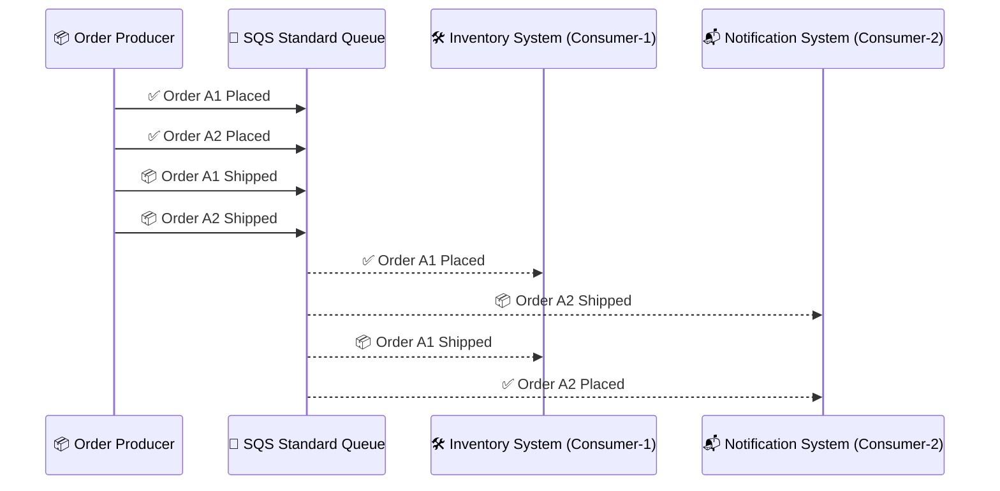
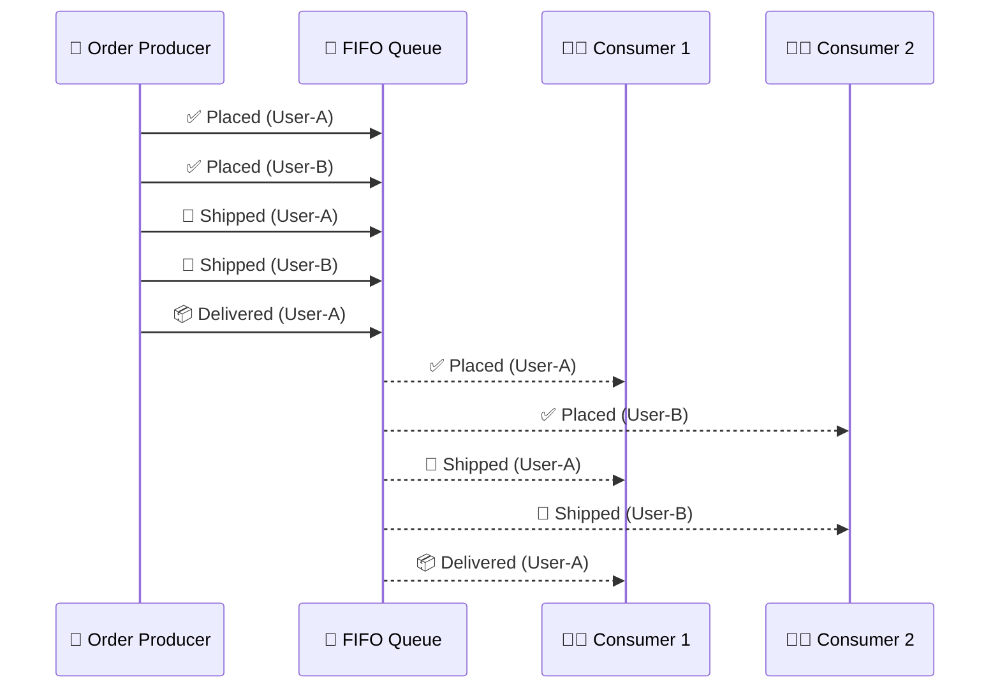

# 📬 **Multi-Consumer Behavior in Amazon SQS**

Unlike Kinesis or Kafka, **Amazon SQS does not support multiple consumers reading the _same_ message**. It follows a **message consumption model** where each message is **delivered only once** to **one consumer**, even when multiple consumers are polling concurrently.

Let’s explore **how SQS handles message processing, visibility, ordering, and isolation** — and how FIFO queues provide ordering guarantees.

---

## 🎯 **Scenario: E-Commerce Notifications & Order Processing**

Imagine an online store with two independent systems consuming messages from an SQS queue:

- 1️⃣ **Inventory System** 🏷 → Updates stock when orders are placed
- 2️⃣ **Notification System** 📢 → Sends emails/SMS to users

---

### 🟩 **With a Standard SQS Queue: Parallel but No Ordering**

| Timestamp | Order ID | Action     |
| --------- | -------- | ---------- |
| `T1`      | `A1`     | ✅ Placed  |
| `T2`      | `A2`     | ✅ Placed  |
| `T3`      | `A1`     | 📦 Shipped |
| `T4`      | `A2`     | 📦 Shipped |

---

🔁 These messages are **not guaranteed to be delivered in order**, and **may be duplicated**. However, **multiple consumers** can process them in **parallel**.

---

---

## 🧩 **Key Behavior: SQS Standard Queue**

| Behavior           | Standard Queue                                                                                            |
| ------------------ | --------------------------------------------------------------------------------------------------------- |
| Message Visibility | After one consumer retrieves a message, it is **invisible** to others until it is processed or times out. |
| Duplicate Messages | Possible. Apps must be **idempotent**.                                                                    |
| Order Guarantee    | ❌ No. Messages may be out of order.                                                                      |
| Parallelism        | ✅ High. Multiple consumers process in parallel.                                                          |
| Isolation          | ✅ Each message goes to only **one** consumer.                                                            |
| Re-processing      | ✅ Automatic if the consumer fails or times out.                                                          |

---

## 🔢 **With FIFO Queue: Group-Based Ordered Parallelism**

| Timestamp | Group (Customer) | Status       |
| --------- | ---------------- | ------------ |
| `T1`      | `User-A`         | ✅ Placed    |
| `T2`      | `User-B`         | ✅ Placed    |
| `T3`      | `User-A`         | 🚚 Shipped   |
| `T4`      | `User-B`         | 🚚 Shipped   |
| `T5`      | `User-A`         | 📦 Delivered |

---

📌 Here, each `MessageGroupId` (e.g., `User-A`) acts like a **shard** or **partition** — messages in the same group are **delivered in order**, and **only one consumer** can process a group at a time.

---

---

---

## ⚙️ **SQS Message Isolation Mechanisms**

| Mechanism                 | Purpose                                              |
| ------------------------- | ---------------------------------------------------- |
| ⏳ **Visibility Timeout** | Ensures messages are “locked” while being processed. |
| 🧺 **Dead Letter Queue**  | Captures failed messages after X retries.            |
| 🧾 **Message Retention**  | Stores messages for up to 14 days.                   |
| 🧪 **Deduplication ID**   | Ensures exactly-once delivery in FIFO queues.        |

---

## 🔁 **Why SQS Doesn't Do Multi-Consumer Fan-Out (Like Kinesis)**

| Concept            | SQS                             | Kinesis                      |
| ------------------ | ------------------------------- | ---------------------------- |
| 1 Message → N Apps | ❌ No (1 message, 1 consumer)   | ✅ Yes (fan-out per shard)   |
| Record Replay      | ❌ No (once deleted, it’s gone) | ✅ Yes (via checkpointing)   |
| Use Case           | Task queue / job processing     | Event processing / analytics |
| Ordering           | FIFO (group-based)              | Shard-based                  |

---

## 🧠 **When to Use SQS (vs. Kinesis)**

| Use Case                        | Use SQS                          | Use Kinesis                       |
| ------------------------------- | -------------------------------- | --------------------------------- |
| Work distribution               | ✅ Yes                           | 🚫 No                             |
| Message fan-out (1 → many apps) | 🚫 Use SNS or EventBridge        | ✅ Built-in fan-out via consumers |
| Event replay                    | 🚫 No (unless DLQ used manually) | ✅ Replay from stream (24h–365d)  |
| Throughput-critical pipeline    | ✅ Standard SQS                  | ✅ Kinesis with parallel shards   |
| Strict order                    | ✅ FIFO Queue                    | ✅ Per shard                      |
| Stream analytics (e.g., logs)   | 🚫 Not designed for this         | ✅ Yes                            |

---

## ✅ Final Takeaways

- **SQS is not for broadcasting messages to multiple consumers** — it delivers **only once per message**.
- **Standard queues** maximize throughput, while **FIFO queues** provide reliable, in-order processing **per group**.
- If you need **shared reads** or **replay**, choose **Kinesis Data Streams** instead.
