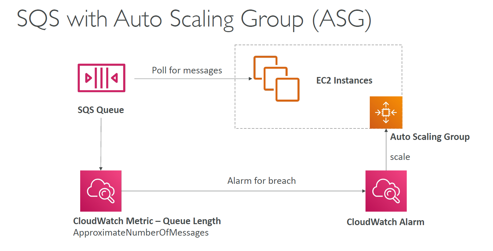

# 🛡️ **Auto Scaling SQS Consumers**

> _Ensure your application scales automatically to meet demand — no over-provisioning, no message delays._

---

<div align="center">
  
</div>

---

## 🤔 **Is Auto Scaling Useless for SQS Consumers?**

Great question — and the short answer is:

> ❌ **No, auto scaling consumers is _not_ useless for SQS** — in fact, it's **essential**, **but for different reasons** depending on whether you're using **Standard** or **FIFO** queues.

---

## 🧠 **Why Auto Scaling Still Matters**

Even though **only one consumer** in **FIFO per message group** is active at a time, **you still need auto scaling** to:

- handle **more message groups** concurrently,
- **reduce backlog** when there's a spike in traffic,
- and **scale down** when idle to save cost.

---

### 🟩 **SQS Standard: Auto Scaling is Very Valuable**

✅ In **Standard queues**, **there’s no sequencing constraint**, so:

- You can have **dozens or hundreds of consumers** pulling messages in parallel.
- Auto Scaling based on queue depth or message age makes a **huge impact** on throughput and cost efficiency.

**👉 Scaling Metric Example:**

- Scale out EC2/Lambda when `ApproximateNumberOfMessagesVisible > X`
- Or when `ApproximateAgeOfOldestMessage > Y`

---

### 🟦 **SQS FIFO: Auto Scaling is Still Helpful**

FIFO does **respect ordering**, but it does that per `MessageGroupId`.

That means:

- You can scale horizontally **only as many consumers as distinct message groups**.
- So if you have 100 groups, you can scale up to 100 consumers **safely**.

**👉 Auto Scaling here helps:**

- Allocate enough consumers to parallel message groups.
- Handle **message spikes** across many ordered workflows.

---

## 📈 **CloudWatch Metrics for Triggering Scale Events**

| Metric                                 | Description                                                   | Use Case                                               |
| -------------------------------------- | ------------------------------------------------------------- | ------------------------------------------------------ |
| **ApproximateAgeOfOldestMessage**      | Age (in seconds) of the **oldest message** still in the queue | Indicates backlogs or slow processing                  |
| **NumberOfMessagesSent**               | Number of messages added during a time window                 | Detects incoming traffic spikes                        |
| **ApproximateNumberOfMessagesVisible** | Number of messages currently available for processing         | Shows queue buildup and how fast consumers are working |

> 🧠 Use these metrics as **CloudWatch Alarms** to trigger scaling actions dynamically.

---

## ⚙️ **How to Implement Auto Scaling for SQS Consumers**

### 1️⃣ **EC2-Based Consumers**

Use **Auto Scaling Groups (ASG)** with scaling policies driven by CloudWatch metrics.

🔧 **Steps:**

1. Launch EC2 consumers in an ASG.
2. Attach scaling policies:

   - **Scale Out:** If `ApproximateNumberOfMessagesVisible > 100`
   - **Scale In:** If it drops below a certain threshold

3. Use **target tracking policies** to dynamically keep queue age low.

🔍 **Example Policy:**

```text
If ApproximateAgeOfOldestMessage > 300s, add 2 EC2 consumers
If Age < 30s for 5 min, remove 1 EC2 consumer
```

---

### 2️⃣ **Lambda-Based Consumers (Event-Driven)**

If you’ve subscribed **Lambda functions** to your SQS queue:

✔️ They **scale automatically** based on message volume
✔️ AWS **manages concurrency** behind the scenes

🧠 **But you can still customize:**

- **Reserved Concurrency**: Set max concurrent invocations per Lambda
- **Batch Size**: Control how many messages each Lambda invocation gets
- **Visibility Timeout**: Tune to allow retries without duplication

📊 **Monitor via CloudWatch:**

- `IteratorAge`: How far behind the Lambda is in processing
- `NumberOfMessagesReceived` / `Throttles`

---

## 📊 **Scaling Comparison Table**

| Consumer Type | Auto Scaling Method           | Use Case                      |
| ------------- | ----------------------------- | ----------------------------- |
| EC2           | Auto Scaling Groups + Metrics | Full control, long tasks      |
| Lambda        | Event Source Mapping (Auto)   | Serverless, real-time scaling |

---

## 🧠 **Best Practices for Scaling SQS Consumers**

| Best Practice                                | Benefit                                                        |
| -------------------------------------------- | -------------------------------------------------------------- |
| ⏱ **Use Age-of-Oldest-Msg for urgency**      | Tells you when messages are sitting too long                   |
| 📉 **Avoid scaling by queue depth alone**    | Depth might grow during slow batch processing (false positive) |
| 🔁 **Set cooldown periods** in ASG           | Prevents rapid scaling in/out (thrashing)                      |
| 🔍 **Enable DLQ** for EC2 or Lambda failures | Helps analyze stuck or malformed messages                      |
| 📈 **Tune Lambda batch size & concurrency**  | Optimize throughput + cost                                     |

---

## ✅ **Conclusion**

Auto-scaling SQS consumers ensures you **process messages reliably under any load** without manual intervention. Whether you're running EC2-based consumers or serverless Lambda functions:

- 🧠 Choose the right metrics (age, depth, send rate)
- ⚙️ Build intelligent scaling policies
- 📉 Avoid over-scaling or message delays
- 💸 Optimize for cost and performance
