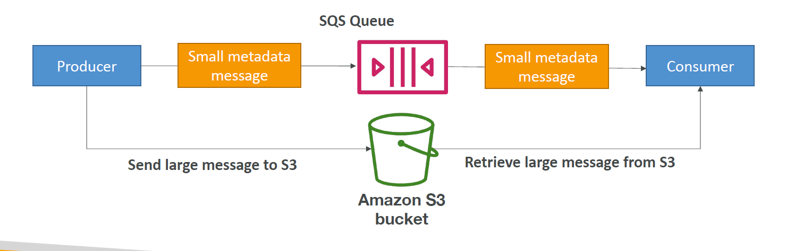
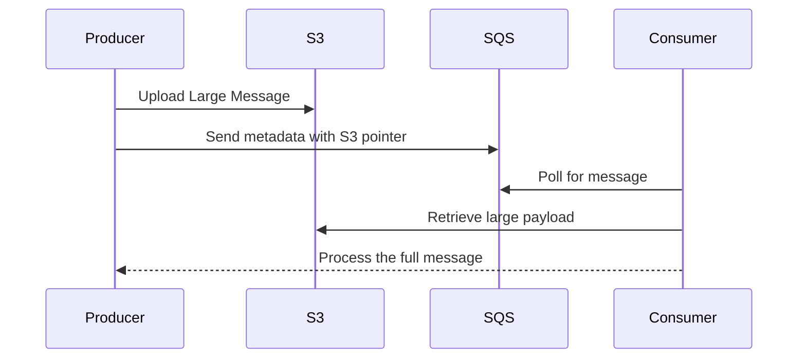

# 📦🚀 **Amazon SQS Extended Client – Handling Large Messages Beyond 256 KB**

> Amazon SQS has a **hard message size limit of 256 KB**. But what if your app needs to send **larger messages** (like 1MB, 10MB, or even 1GB)?
> That’s where the **SQS Extended Client Library** comes in — it seamlessly stores **large payloads in S3**, and only sends a reference to SQS.

---

## 📏 SQS Message Size Limit

| Limit Type          | Value                                |
| ------------------- | ------------------------------------ |
| Max message size    | **256 KB**                           |
| Min message size    | 1 byte                               |
| Exceeding the limit | ❌ Will cause `MessageTooLong` error |

---

## 💡 Solution: SQS Extended Client Library

The **SQS Extended Client** is an **AWS Java SDK library** that helps:

1. Automatically store **large message payloads in S3**.
2. Send a **small reference** (metadata) to SQS.
3. Consumers automatically fetch the payload back from S3.

---

## 🧠 Architecture Overview

<div style="text-align: center;">
    
</div>

---

<div align="center">



</div>

> 📌 The message sent to SQS contains only a **pointer to the object stored in S3**.  
> 📌 The SQS Extended Client handles **uploading to and reading from S3 automatically**.

---

## 🧰 Example – Java SDK with Extended Client

```java
import com.amazonaws.services.sqs.AmazonSQS;
import com.amazonaws.services.sqs.AmazonSQSClientBuilder;
import com.amazonaws.services.sqs.model.SendMessageRequest;
import com.amazonaws.services.sqs.model.ReceiveMessageRequest;
import com.amazonaws.services.sqs.util.SQSMessageConsumer;
import com.amazonaws.services.sqs.ExtendedClientConfiguration;
import com.amazonaws.services.sqs.AmazonSQSExtendedClient;

import com.amazonaws.services.s3.AmazonS3;
import com.amazonaws.services.s3.AmazonS3ClientBuilder;

public class SQSWithLargeMessages {
    public static void main(String[] args) {
        AmazonS3 s3 = AmazonS3ClientBuilder.defaultClient();
        AmazonSQS sqs = AmazonSQSClientBuilder.defaultClient();

        ExtendedClientConfiguration extendedConfig = new ExtendedClientConfiguration()
            .withLargePayloadSupportEnabled(s3, "my-sqs-large-payload-bucket")
            .withAlwaysThroughS3(true);  // Optional: force all messages through S3

        AmazonSQSExtendedClient sqsExtended = new AmazonSQSExtendedClient(sqs, extendedConfig);

        String queueUrl = "https://sqs.us-east-1.amazonaws.com/123456789012/my-queue";
        String longMessage = "A very long message..." + new String(new char[500_000]); // > 256 KB

        // Send large message
        sqsExtended.sendMessage(new SendMessageRequest(queueUrl, longMessage));

        // Receive and process
        String receivedMessage = sqsExtended.receiveMessage(new ReceiveMessageRequest(queueUrl).withMaxNumberOfMessages(1))
                                            .getMessages()
                                            .get(0)
                                            .getBody();
        System.out.println("Received message: " + receivedMessage);
    }
}
```

> 🔐 Make sure the **Lambda or EC2 instance IAM role** has access to both:
>
> - `sqs:*` on the queue
> - `s3:GetObject`, `s3:PutObject` on the target S3 bucket

---

## 🔍 Summary: When to Use the Extended Client?

| Scenario                             | Use SQS Extended Client? |
| ------------------------------------ | ------------------------ |
| Sending messages > 256 KB            | ✅ Yes                   |
| Transferring documents, images, logs | ✅ Yes                   |
| IoT or streaming raw data to SQS     | ✅ Yes                   |
| Small control messages               | ❌ No                    |

---

## ⚙️ Best Practices

| Best Practice                         | Why?                                 |
| ------------------------------------- | ------------------------------------ |
| Use a dedicated **S3 bucket per app** | Avoid collisions & improve security  |
| Enable **S3 lifecycle policy**        | Clean up unused messages             |
| Secure both **S3 and SQS access**     | Use least-privilege IAM roles        |
| Set **message retention** wisely      | Max SQS retention is 14 days         |
| Consider **cost trade-off**           | S3 PUT + GET adds storage + API cost |

---

## 🧠 Exam Tip for DevOps Pro

> SQS Extended Client is a **Java-only AWS SDK tool** that **bypasses the 256 KB limit** by offloading payloads to **Amazon S3**.

✅ SQS just stores a **metadata pointer**  
✅ S3 stores the **actual large payload**
