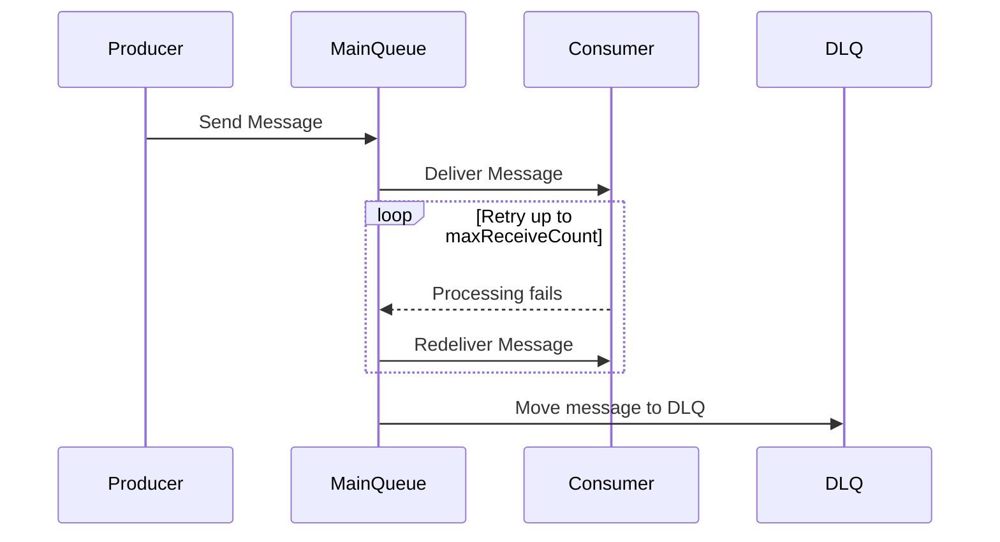

# 📮 **Amazon SQS Dead Letter Queues (DLQs)**

> Dead Letter Queues (DLQs) in SQS are **lifesavers** for **catching and analyzing failed messages**. They prevent bad data from clogging your system and offer a safe place to reprocess them **after fixing the root cause**.

---

## 💡 What Is a Dead Letter Queue?

A **DLQ** is a special SQS queue that stores **messages that couldn't be processed successfully** after a configurable number of tries.

> ✅ DLQs improve **system resilience**  
> ✅ DLQs enable **debugging and monitoring** of poison messages  
> ❌ DLQs **do not process messages automatically**

---

## 🧠 How DLQs Work (Lifecycle)

<div align="center">
  
</div>

---

<div align="center">



</div>

---

## ⚙️ Redrive Policy – The DLQ Link

To use a DLQ, you attach a **Redrive Policy** to your main SQS queue.

### Example JSON Redrive Policy

```json
{
  "maxReceiveCount": "5",
  "deadLetterTargetArn": "arn:aws:sqs:us-east-1:123456789012:my-dlq"
}
```

| Field                 | Purpose                                    |
| --------------------- | ------------------------------------------ |
| `maxReceiveCount`     | Max delivery attempts before moving to DLQ |
| `deadLetterTargetArn` | ARN of the target DLQ                      |

> 📦 After `maxReceiveCount`, the message is **moved to the DLQ** automatically.

---

## 🚨 When Should You Use DLQs?

| Situation                        | Benefit of DLQ                     |
| -------------------------------- | ---------------------------------- |
| ❌ Message handler crashes       | Store unprocessed messages         |
| 🛑 Lambda times out              | Capture failed event triggers      |
| 🧪 Poison messages               | Identify invalid or corrupted data |
| 🧠 Debugging intermittent issues | Analyze DLQ logs                   |

---

## 🔁 **Re-drive Messages Back to Main Queue**

Once you've resolved the bug or issue, **you can move messages back** from the DLQ to the source queue using **Re-drive support** in the SQS console.

<div align="center">
  
</div>

---

### 🔄 Re-drive Steps

1. 🕵️ Open the **DLQ** in AWS Console
2. ✅ Select messages you want to retry
3. 🔁 Click **"Start Re-drive"**
4. 🚚 SQS pushes them back to the **original source queue**
5. 📊 Monitor reprocessing with **CloudWatch Metrics**

> ⚠️ DLQ **does not auto-retry** messages — you have to **manually re-drive or script it via SDK/CLI**.

---

## 🛠 CLI Example: Re-drive Using `StartMessageMoveTask`

```bash
aws sqs start-message-move-task \
  --source-arn arn:aws:sqs:us-east-1:123456789012:my-dlq \
  --destination-arn arn:aws:sqs:us-east-1:123456789012:my-queue
```

---

## 🔐 DLQ Best Practices

| Practice                                           | Why?                                   |
| -------------------------------------------------- | -------------------------------------- |
| ✅ Always define a DLQ for critical queues         | Prevent message loss or silent failure |
| ⏰ Set `maxReceiveCount` thoughtfully              | Avoid infinite retries                 |
| 🔔 Use CloudWatch Alarms on DLQ size               | Detect high failure rates              |
| 🧼 Apply lifecycle rules to purge old DLQ messages | Prevent storage bloat                  |
| 🧪 Use DLQs for **Lambda event sources**           | See exactly which event failed         |

---

## ✅ Summary

| Feature            | Description                                              |
| ------------------ | -------------------------------------------------------- |
| What is DLQ        | A backup queue for failed messages                       |
| Trigger            | When message exceeds `maxReceiveCount`                   |
| Redrive support    | Reprocess fixed messages manually                        |
| DLQs don’t process | Only store for inspection — you must handle reprocessing |
| Best with          | Lambda, Step Functions, custom apps, event pipelines     |
