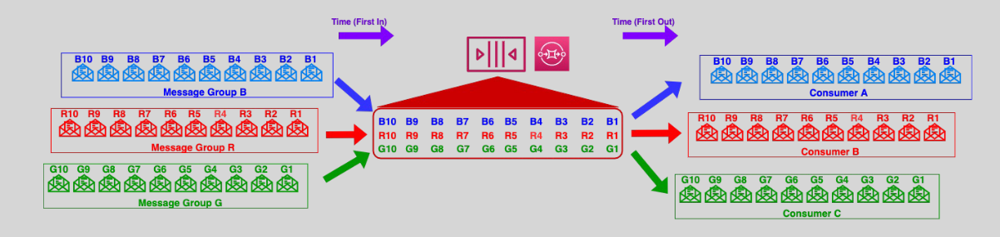

# 🔢 **Amazon SQS FIFO Queues & Message Grouping**

> **SQS FIFO (First-In-First-Out)** queues guarantee **strict ordering** and **exactly-once processing**, making them perfect for **transactional systems**, **state machines**, and **event-driven pipelines**.

But what happens when **you need both order and parallelism**?

That’s where **message grouping** comes in.

---

<div align="center">
  
</div>

---

## 🧩 Message Grouping: The Secret to Ordered Parallelism

> **Grouping messages** in FIFO queues allows you to **preserve strict order within each group**, while still allowing **parallel processing across groups**.

### 🔧 How Message Grouping Works

- Every message sent to a FIFO queue must include a **`MessageGroupId`**
- **SQS guarantees strict order within each group**
- Multiple `MessageGroupId`s = **independent processing lanes**

> 🎯 Think of each **`MessageGroupId`** as a **dedicated pipeline** for ordered delivery
> 🛣️ Multiple groups = **concurrent pipelines**

---

## 🧪 Real-Life Analogy

Imagine a **toll booth with 3 lanes**:

- 🚗 All cars in **lane A** must go in order.
- 🚙 All cars in **lane B** must go in order.
- But **lane A and B operate independently**, so they go **in parallel**.

Same with SQS FIFO:

- Messages with the **same `MessageGroupId`** = strict order
- Messages with **different `MessageGroupId`s** = processed **in parallel**

---

## ✍️ Sending Grouped Messages – CLI Example

```bash
aws sqs send-message \
  --queue-url https://sqs.us-east-1.amazonaws.com/123456789012/my-queue.fifo \
  --message-body "Withdraw $100" \
  --message-group-id "account-1234" \
  --message-deduplication-id "txn-001"
```

---

## 🛠 Important Notes

| Rule                                 | Details                                                              |
| ------------------------------------ | -------------------------------------------------------------------- |
| `MessageGroupId`                     | **Required** in FIFO queues                                          |
| Group locks during in-flight message | Next message waits until previous is **deleted**                     |
| Deduplication                        | Must be handled with `MessageDeduplicationId` or enabled via content |
| Parallelism requires multiple groups | Otherwise FIFO acts like a **global single-threaded** queue          |

---

## ✅ Benefits of Message Grouping

| Feature                 | Benefit                                               |
| ----------------------- | ----------------------------------------------------- |
| 🔁 **Ordered Delivery** | Guarantees exact order **per message group**          |
| ⚡ **Parallelism**      | Multiple message groups = **concurrent processing**   |
| 🧠 **Stateful Logic**   | Useful for **user sessions**, **banking flows**, etc. |
| 🧪 **Retry Isolation**  | Failures in one group **don't block others**          |

---

## 📌 Use Case Examples

### 👉 E-Commerce Order Processing 🛍️

| Group                    | MessageGroupId |
| ------------------------ | -------------- |
| All messages from User A | `user-a`       |
| All messages from User B | `user-b`       |

- `user-a`: Place → Pay → Ship → Deliver
- `user-b`: Pay → Cancel → Refund

> ✅ Messages from the same user **preserve logical order**  
> ✅ Multiple users are processed **in parallel**

---

### 👉 Banking Transaction Streams 🏦

- `MessageGroupId = account-1234`
- Messages: Debit → Balance Check → Statement → Alert
- ✅ Order critical to ensure **financial integrity**

---

## 🧠 Exam Tips (DevOps Pro / SAP-C02)

✅ FIFO queue requires both `MessageGroupId` and **deduplication**  
✅ Only one message per group is processed at a time  
✅ Failures in one group don’t affect others  
✅ Use multiple `MessageGroupId`s to **maximize throughput**
