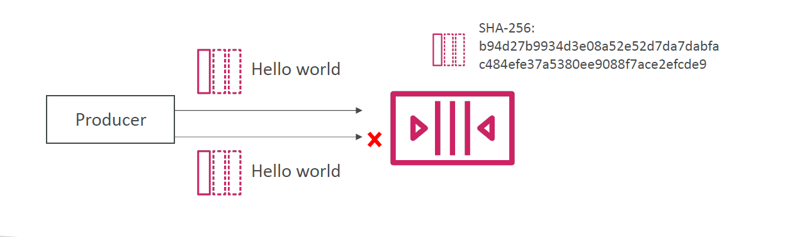

# 🔁📬 **SQS FIFO Queue Deduplication**

> Amazon SQS **FIFO Queues** ensure **exactly-once message delivery** by using **deduplication**, which prevents processing duplicate messages sent within a short time window.

---

## 🧠 Why Deduplication Matters in FIFO Queues

- **Standard Queues** allow **at-least-once** delivery (duplicates are possible).
- **FIFO Queues** offer **exactly-once processing** — and rely on **deduplication** to enforce it.

✅ This means **even if the same message is sent multiple times**, it’s **delivered only once** during the **deduplication interval**.

---

## 🕔 Deduplication Interval

- FIFO queues automatically deduplicate **messages sent within 5 minutes** that share:

  - the same **Message Deduplication ID**, or
  - the same **message body** (if content-based deduplication is enabled)

> 🧭 Time window: **5 minutes**
>
> 🧹 After that, deduplication resets and duplicate messages are allowed again.

---

## 🧰 Deduplication Methods

| Method                                       | Description                                               |
| -------------------------------------------- | --------------------------------------------------------- |
| 🧠 **Content-Based Deduplication** (default) | SQS calculates a **SHA-256 hash** of the **message body** |
| 🆔 **Explicit Deduplication ID**             | You manually specify a unique `MessageDeduplicationId`    |

---

### 🔒 1. **Content-Based Deduplication**

> Automatically detects duplicates **based on body hash**
> Requires the queue to have `ContentBasedDeduplication` enabled (default for many FIFO queues)

---

<div style="text-align: center;">
    
</div>

---

🧪 **Example:**

```bash
aws sqs send-message \
  --queue-url https://sqs.us-east-1.amazonaws.com/123456789012/my-queue.fifo \
  --message-body "Hello world" \
  --message-group-id "group1"
```

```text
Message Body: "Hello world"
SHA-256: b94d27b9934d3e08a52e52d7da7dabfa
```

- If the same message body is sent again within 5 minutes → **it will be ignored**.

---

### 🧾 2. **Explicit Message Deduplication ID**

> You provide your own unique `MessageDeduplicationId` (UUID, timestamp, hash, etc.)

🧪 **Example:**

```bash
aws sqs send-message \
  --queue-url https://sqs.us-east-1.amazonaws.com/123456789012/my-queue.fifo \
  --message-body "Important Job" \
  --message-group-id "group1" \
  --message-deduplication-id "job-123"
```

- If the same `message-deduplication-id` is used again within 5 minutes → **message is discarded**
- This gives you **full control** over deduplication behavior

---

## 💡 Which One Should You Use?

| Scenario                                                     | Use This Method                |
| ------------------------------------------------------------ | ------------------------------ |
| Simple messages, no ID logic                                 | ✅ Content-based deduplication |
| You want exact control over deduplication                    | ✅ Manual Deduplication ID     |
| Messages differ slightly in content but must be deduplicated | ✅ Manual Deduplication ID     |

---

## ⚙️ Important Rules

- FIFO queues **require**:

  - `MessageGroupId` (to preserve order)
  - Either deduplication method (enabled by default)

- If **ContentBasedDeduplication is disabled**, you **must** provide a `MessageDeduplicationId`
- The combination of:

  - `MessageGroupId`
  - and deduplication method
    determines message uniqueness

---

## 📝 Summary Table

| Feature                    | Details                                         |
| -------------------------- | ----------------------------------------------- |
| Deduplication Window       | **5 minutes**                                   |
| Content-Based Enabled?     | ✅ Optional (`ContentBasedDeduplication: true`) |
| SHA-256 of message body    | Used in content-based deduplication             |
| Manual Deduplication ID    | Send via `--message-deduplication-id`           |
| Duplicate message behavior | ✅ Ignored during window                        |
| FIFO requirement           | Must include `MessageGroupId`                   |

---

## 🧠 Exam Tips (SAP-C02 / DevOps Pro)

- ✅ FIFO queues require either **content-based** or **explicit deduplication**
- ✅ Deduplication only works **within a 5-minute window**
- ✅ Explicit IDs override content-based hashing
- ❌ Repeating the same deduplication ID = message is dropped (not reprocessed)
- ✅ You must provide a **MessageDeduplicationId** if content-based deduplication is disabled
