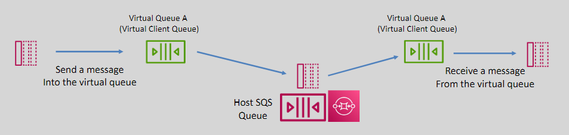

# 🧠 **What Problem Do Virtual Queues Solve?**

> **Temporary Queues (Virtual Queues)** provide lightweight, automatically-deleted queues for specific messaging patterns, such as request/response interactions. These queues simplify communication between application threads or processes, reducing development time and operational costs.

---

<div align="center">
  
</div>

---

## ❓ Real Problem

Let’s say you’re building a system where **thousands of clients** (users/devices/functions) each need a **temporary, unique response queue**.

### If you used _real SQS queues_

- You’d need to create and delete **thousands of SQS queues** (slow, expensive, rate-limited).
- It would **bloat the AWS Console**.
- It would **require IAM policies, naming, lifecycle cleanup, etc.**

### ✅ With _Virtual Queues_

- You use **one shared FIFO queue**.
- Each client gets a **virtual queue ID** (like `session-123`, `user-abc`).
- Messages are **tagged** with the ID (`MessageGroupId` or message attribute).
- The **client-side SDK** filters only messages **matching its virtual ID**.

> ✅ No need to create real queues  
> ✅ No clutter, no limits hit  
> ✅ Still gets "private-like" messaging

---

## 💬 **Real-World Example 1: Request/Response Messaging (RPC)**

### Example: Microservice A calls Microservice B, expects a result

#### Normal flow (without virtual queues)

- A sends request to B
- A needs a **dedicated queue** to get B’s response
- Creates one → waits → deletes it after reply ✅ **but slow and expensive**

#### Using virtual queues

- A includes a `virtual-queue-id` like `reply-to-session-456`
- B sends the reply to the shared FIFO queue with that tag
- A’s SDK listens **only to its virtual tag**
- ✅ Fast, no SQS creation or deletion needed

📌 **Used in SDKs that do RPC over SQS!**

---

## 🛍 **Real-World Example 2: Checkout Flow in E-commerce**

Each **customer checkout** needs its own session:

1. Order validation
2. Stock check
3. Payment
4. Confirmation

Instead of building a separate SQS queue per user or session:

- Use virtual queues with `session-abc123` as the virtual queue ID
- Backend logic sends step-by-step messages with that ID
- Frontend or session listener **only consumes** messages with that ID

✅ This keeps each checkout session **isolated**
✅ Messages are still processed **in order (FIFO)**
✅ Backend scales to 1000s of users with **one physical queue**

---

## 🧪 **How Do Consumers Read Their Virtual Messages?**

> **Your SDK handles filtering.**

If you're using the **SQS Java Extended Client**, you set:

```java
ReceiveMessageRequest request = new ReceiveMessageRequest()
    .withQueueUrl(SHARED_FIFO_QUEUE)
    .withMessageAttributeNames("All")
    .withMessageGroupId("session-123");
```

The SDK:

- Polls messages from the shared queue
- **Filters messages by tag** (`MessageGroupId` or `MessageAttribute`)
- Delivers **only messages for your virtual queue**

✅ Think of it as a **software-layer filter on top of a shared pipe**

---

## 📌 Summary: When Are Virtual Queues Worth It?

| Use Case                     | Benefit from Virtual Queues? | Why It Helps                                  |
| ---------------------------- | ---------------------------- | --------------------------------------------- |
| Chatbot per user             | ✅ Yes                       | Unique message stream for each session        |
| Lambda Function per request  | ✅ Yes                       | Each function has its own reply route         |
| Thousands of micro-RPC calls | ✅ Yes                       | Avoids queue sprawl                           |
| Short-lived task isolation   | ✅ Yes                       | Keeps context clean without resource creation |
| Logging, events, telemetry   | ❌ No                        | Use Standard SQS                              |
| Long-running workflows       | ❌ No                        | Use Step Functions or real FIFO queues        |

---

## 🛡️ Bonus: Why It’s Not Slower

> You asked: **Won’t shared queues be slow if they have many messages?**

✅ **No — because messages in FIFO queues are tagged by `MessageGroupId`**, and SQS **processes each group independently**.

> So even if 1000 virtual queues share the same physical queue, they’re all processed in **parallel lanes** — each with its own order and visibility control.

---

## 🧠 TL;DR

| Concept         | Summary                                                               |
| --------------- | --------------------------------------------------------------------- |
| Virtual Queue   | In-memory filtering mechanism using a shared FIFO queue               |
| Message Routing | Uses `MessageGroupId` or custom attributes to route to right consumer |
| Queue Creation  | ✅ You don’t create SQS queues — you just tag messages                |
| Good For        | RPC, chat, short-lived sessions, parallel workflows                   |
| Not Good For    | Durable queueing, analytics, long-running jobs                        |
