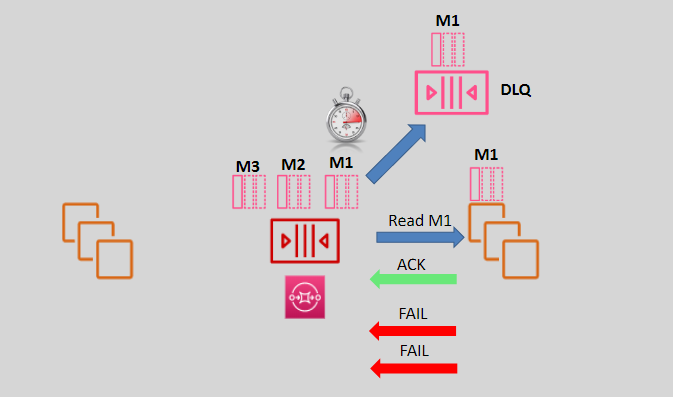
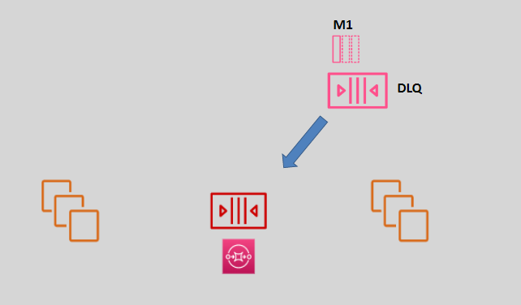

# 📬 **Amazon SQS – Advanced Features to Power Your Messaging Architecture**

> _Go beyond basic queuing — unleash the power of **Dead Letter Queues**, **Message Grouping**, and **Temporary Queues** in Amazon SQS for more resilient, ordered, and scalable applications._

---

## 🔑 **Advanced Capabilities Overview**

Amazon SQS offers powerful features that go beyond just queuing:

1. ✅ **Dead Letter Queues (DLQs)** – for fault isolation and failure recovery
2. 🧩 **Message Grouping in FIFO Queues** – for ordered yet parallel processing
3. ⏳ **Temporary Queues (Virtual Queues)** – for lightweight, auto-cleaning communication

---

## 📮 **1. Dead Letter Queues (DLQs)**

Dead Letter Queues help you isolate and troubleshoot **messages that repeatedly fail**. Instead of losing them or retrying forever, DLQs give you a second chance to fix and reprocess.

  

### 🧠 How It Works

- Messages are **moved to the DLQ** after exceeding the `maxReceiveCount`.
- You define a **Redrive Policy** to link a DLQ to your main queue.

> 💡 _DLQs don’t process messages — they store them for inspection and reprocessing._

### 🔄 **Re-drive Messages Back to Main Queue**

Amazon SQS supports **Re-drive** – a native feature to move messages back from DLQ to the source queue once issues are resolved.

  

**Steps to Re-drive:**

1. 🕵️ **Review messages** in the DLQ
2. 🔁 **Select messages** and choose "Start Re-drive"
3. 🚚 Messages are **pushed back** to the source queue
4. 🔍 Monitor their reprocessing in CloudWatch or DLQ metrics

> 🛡 _Use DLQ with alarms to alert for high failure rates._

---

## 📦 **2. Grouping Messages in FIFO Queues**

Message Grouping in **FIFO queues** ensures that related messages are processed **in order** — perfect for transactions or stateful flows.

  

---

### 🔧 How It Works

- Each message is sent with a **`MessageGroupId`**
- SQS guarantees **exact order delivery** for each group
- Different groups are **processed in parallel**

> 🎯 One message group = one processing lane  
> 🛣️ Multiple groups = multiple lanes with independent order guarantees

### ✅ Benefits

| Feature                | Description                                      |
| ---------------------- | ------------------------------------------------ |
| 🔁 Ordered Delivery    | Ensures strict order within the same group       |
| ⚡ Parallel Throughput | Processes multiple groups concurrently           |
| 📦 Stateful Workflows  | Ideal for customer sessions, transactions, steps |

### 📌 Use Case Example: E-Commerce Fulfillment

- All orders from **User A** use `MessageGroupId = user-a`
- Messages: Placed → Shipped → Delivered
- FIFO queue ensures **each order lifecycle stays in order**
- Meanwhile, orders from **User B** process in **parallel**

---

## ⏱️ **3. Temporary Queues (Virtual Queues)**

**Temporary Queues (Virtual Queues)** provide lightweight, automatically-deleted queues for specific messaging patterns, such as request/response interactions. These queues simplify communication between application threads or processes, reducing development time and operational costs.

  

### 🛠️ How It Works

- You configure a **host queue** (backed by a real SQS queue)
- Temporary queues are **virtual**, with **unique URLs**
- They are **automatically cleaned up** after inactivity
- All virtual queues are **mapped** to the same host queue

### 🧰 Ideal for

| Use Case                 | Why It Fits                                  |
| ------------------------ | -------------------------------------------- |
| 🔁 **Request/Response**  | Fast dynamic replies with minimal setup      |
| 🧪 **Temporary Workers** | Spawn short-lived processing threads or jobs |
| 💬 **Session Messaging** | Unique communication per session or user     |

### ⚙️ Key Benefits

| Feature               | Benefit                                  |
| --------------------- | ---------------------------------------- |
| 🧼 **Auto-delete**    | No need to manage queue cleanup          |
| 💸 **Cost-efficient** | Single host queue, no extra cost per URL |
| 🔄 **Simple Routing** | Each queue gets its own unique URL       |

### 📌 Example: API Response Queue

1. Client sends request with a **reply-to temporary queue URL**
2. Worker processes and sends the **response back to that temp queue**
3. Queue is **auto-deleted** after use

---

## 🧠 Summary Table

| Feature              | Purpose                        | Best For                                    |
| -------------------- | ------------------------------ | ------------------------------------------- |
| **DLQ**              | Error isolation & reprocessing | Fault-tolerant applications                 |
| **FIFO Grouping**    | Ordered, isolated flows        | Stateful processes, transactional pipelines |
| **Temporary Queues** | Short-lived communication      | Request/response, dynamic messaging         |

---

## 🏁 Final Thoughts

Amazon SQS offers more than just queues — it delivers:

- 🎯 **Reliability** with DLQs
- 🧵 **Order + parallelism** with FIFO message groups
- ⚡ **Fast request/response** with temporary virtual queues
