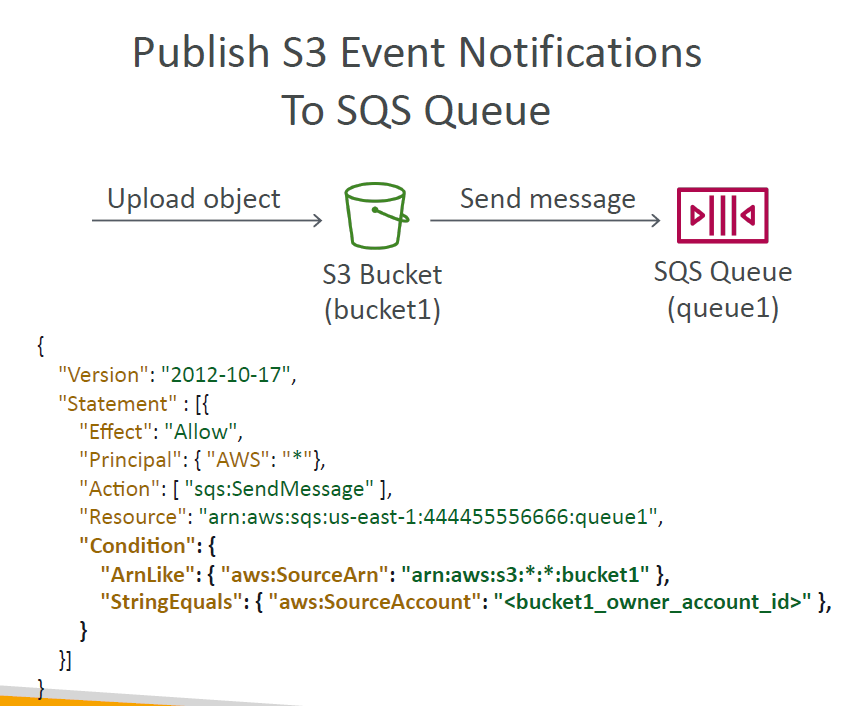
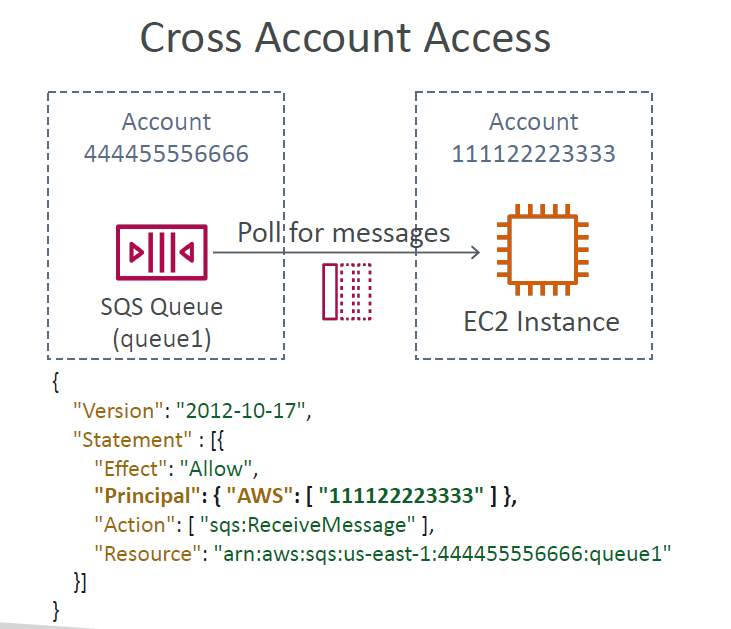

# 🔒 **Amazon SQS Security & Access Management – Simplified**

> _Protect your queues, control who sends/reads messages, and ensure encrypted delivery with IAM, policies, and KMS encryption._

---

## 🛡️ **Core Security Layers in SQS**

Amazon SQS provides three main security mechanisms:

| Feature                    | Purpose                                   |
| -------------------------- | ----------------------------------------- |
| ✅ IAM Policies            | Control access at the **user/role level** |
| ✅ Resource-Based Policies | Control access at the **queue level**     |
| 🔐 Encryption              | Protect data in-transit and at-rest       |

---

## 🔑 **1. IAM Policies – Who Can Access What**

- Define **who (IAM users/roles)** can do **what (Send, Receive, Delete)** on specific queues.
- Attach policies to users, groups, or roles.

```json
{
  "Effect": "Allow",
  "Action": ["sqs:SendMessage"],
  "Resource": "arn:aws:sqs:region:account-id:queue-name"
}
```

🧠 **Use Case:**
Allow a Lambda function to send messages but not delete them.

---

## 📦 **2. Resource-Based Policies – Queue-Level Permissions**

Resource policies are attached **directly to a queue** and define **who (IAM or service)** can use it.

✅ Useful for:

- 🔁 **Cross-account access**
- 📥 **S3 → SQS notifications**
- 🕓 **Temporary delegation**

📌 **Example: Allow S3 to send messages to SQS**

```json
{
  "Effect": "Allow",
  "Principal": { "Service": "s3.amazonaws.com" },
  "Action": "sqs:SendMessage",
  "Resource": "arn:aws:sqs:region:account-id:queue-name",
  "Condition": {
    "ArnEquals": { "aws:SourceArn": "arn:aws:s3:::your-bucket" }
  }
}
```

---

## 🔐 **3. Encryption – Protect Your Messages**

### 🛜 In-Transit

- ✅ **TLS/HTTPS** by default for all SQS endpoints.
- Ensures messages are encrypted while moving between clients and SQS.

### 🧊 At-Rest

- ✅ **Server-Side Encryption (SSE)** with AWS KMS.

| Option                                           | What It Means                    |
| ------------------------------------------------ | -------------------------------- |
| 🔐 SSE with AWS Managed Key (`SSE-SQS`)          | Easy default encryption          |
| 🔐 SSE with Customer-Managed KMS Key (`SSE-KMS`) | More control, auditing, rotation |

🧠 **Why use encryption?**
To meet compliance, prevent unauthorized access, and protect sensitive data (e.g., order details, user data).

---

## 🎯 **Example Use Cases**

### 📥 **S3 Triggers SQS**

<div align="center">
  
</div>

---

### 🔄 **Cross-Account Queue Access**

<div align="center">
  
</div>

---

### 🕐 **Temporary Access to SQS**

- **Goal:** Allow limited-time access for a developer or script
- **Setup:**

  - Create IAM role with SQS access
  - Use **session policies** or **STS tokens** with time-bound credentials

---

## ✅ Best Practices Recap

| Practice                       | Why It's Important                   |
| ------------------------------ | ------------------------------------ |
| 🔒 Use IAM + Resource Policies | Layered control                      |
| 🕵️ Enable Logging              | Track who accessed what (CloudTrail) |
| 🔐 Use SSE + KMS               | Encrypt data at-rest                 |
| ⛔ Block Wildcard `*` access   | Avoid unintentional full access      |
| 🧼 Clean up unused policies    | Reduce attack surface                |

---

## 🏁 **Conclusion**

Amazon SQS offers **flexible, secure, and layered access control**:

- 🎯 IAM for **who**
- 🎯 Resource policies for **which queue**
- 🎯 Encryption to protect **how**

Together, they ensure **your queues are private, your data is protected**, and **only the right systems** can send, receive, or delete messages.
