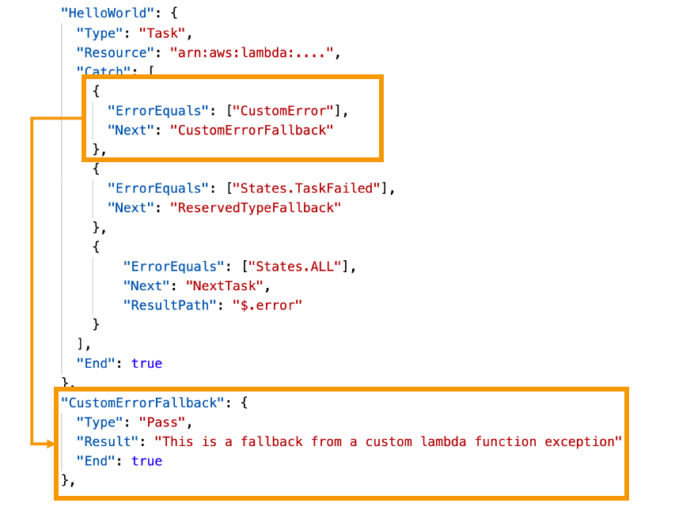
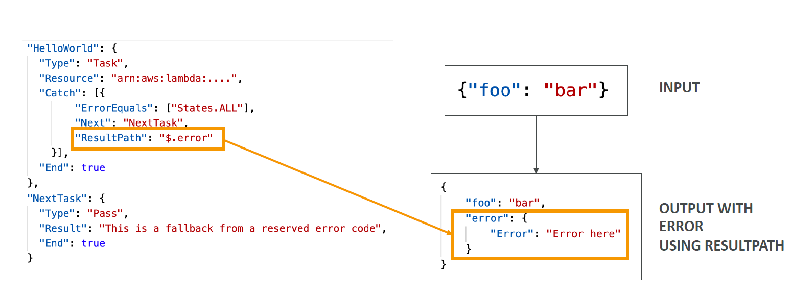

# 🛡️ Error Handling in AWS Step Functions

In AWS Step Functions, **error handling** is built-in and declarative. Instead of embedding error logic inside your Lambda or application code, you define **Retry**, **Catch**, and **ResultPath** policies at the state level. This makes workflows more **resilient**, **maintainable**, and **self-healing**.

---

## 🔍 Why Is Error Handling Important?

Any state in Step Functions may encounter runtime failures, including:

- ❌ **Application Exceptions**: Errors from Lambda, DynamoDB, etc.
- ⏱️ **Timeouts**: Tasks exceeding their `TimeoutSeconds`.
- 🔒 **Permission Denied**: IAM errors.
- 🧠 **Logic Issues**: Invalid input, unmatched `Choice`, etc.

To manage this gracefully, use:

- ✅ `Retry`: Attempts the state again with exponential backoff.
- 🚨 `Catch`: Routes to fallback states on failure.
- 🧾 `ResultPath`: Injects error data into state input for inspection/logging.

---

## 🔁 Retry Strategy in Step Functions

You can **retry a failing task** before moving to failure logic. The `Retry` block supports multiple error conditions.

### 🔁 Sample Retry Pattern

```json
"HelloWorld": {
  "Type": "Task",
  "Resource": "arn:aws:lambda:REGION:ACCOUNT_ID:function:FUNCTION_NAME",
  "Retry": [
    {
      "ErrorEquals": ["CustomError"],
      "IntervalSeconds": 1,
      "MaxAttempts": 2,
      "BackoffRate": 2.0
    },
    {
      "ErrorEquals": ["States.TaskFailed"],
      "IntervalSeconds": 30,
      "MaxAttempts": 2,
      "BackoffRate": 2.0
    },
    {
      "ErrorEquals": ["States.ALL"],
      "IntervalSeconds": 5,
      "MaxAttempts": 5,
      "BackoffRate": 2.0
    }
  ],
  "End": true
}
```

> 🧠 **Note**: Retries are evaluated top-to-bottom.

---

## 🎯 Catch Strategy – Handling Failure Gracefully

If retries fail or aren't configured, `Catch` defines what happens next.

---

<div style="text-align: center;">
  
</div>

---

### 🪝 Sample Catch Pattern

```json
"HelloWorld": {
  "Type": "Task",
  "Resource": "arn:aws:lambda:...",
  "Catch": [
    {
      "ErrorEquals": ["CustomError"],
      "Next": "CustomErrorFallback"
    },
    {
      "ErrorEquals": ["States.TaskFailed"],
      "Next": "ReservedTypeFallback"
    },
    {
      "ErrorEquals": ["States.ALL"],
      "Next": "NextTask",
      "ResultPath": "$.error"
    }
  ],
  "End": true
}
```

---

## 📦 ResultPath – Capture Errors into Input

Use `ResultPath` to **include error information in the next state input**, so you can log or debug it later.

---

<div style="text-align: center;">
  
</div>

---

## 🧾 Predefined Error Types

| **Error Code**                  | **Meaning**                                              |
| ------------------------------- | -------------------------------------------------------- |
| `States.ALL`                    | Catch any error                                          |
| `States.Timeout`                | Task timed out (no heartbeat or exceeded TimeoutSeconds) |
| `States.TaskFailed`             | Task failed execution                                    |
| `States.Permissions`            | IAM policy prevented execution                           |
| `States.ResultPathMatchFailure` | `ResultPath` couldn't apply transformation               |

---

## ✅ Best Practices

- Use **specific error names** before `States.ALL`.
- Always combine `Retry` with `Catch`.
- Leverage `ResultPath` to pass diagnostics downstream.
- Set `MaxAttempts` to `0` to **disable retry** on certain errors.
- Monitor retries and failures via **CloudWatch Metrics**.

---

## 💡 Conclusion

Error handling in Step Functions is **declarative**, **powerful**, and **modular**. You define failure responses outside your business logic and ensure your workflows recover from failures predictably.
