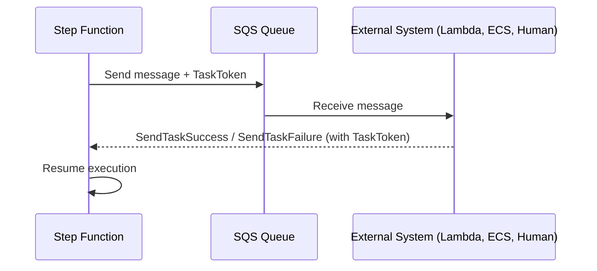
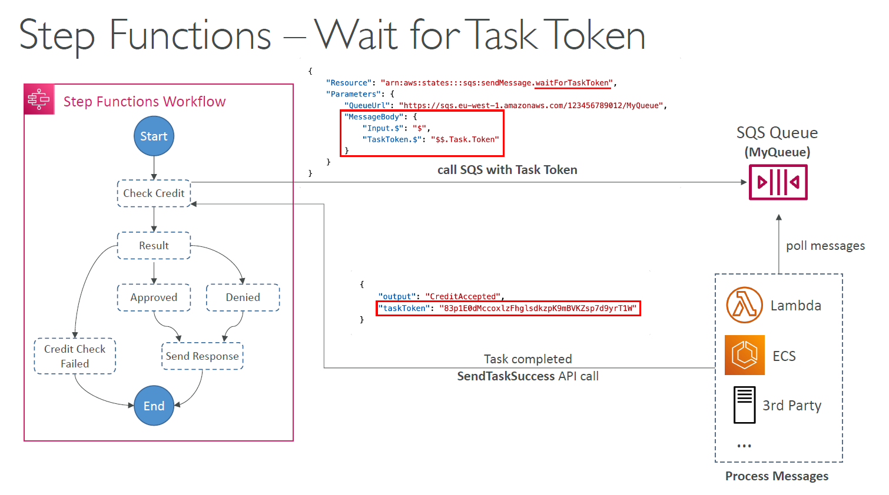

# ⏳ **Step Functions – Wait for Task Token Explained**

AWS Step Functions offers a powerful feature called **`Wait for Task Token`**, which allows a state in your workflow to **pause execution** until an external system **confirms completion**. It’s especially useful for workflows that require **asynchronous processing**, **human intervention**, or **3rd-party integrations**.

---

## 📌 **What is "Wait for Task Token"?**

A **Task Token** is a unique identifier used to **pause** the Step Functions workflow at a particular state. The workflow only resumes when a corresponding external system **sends back the token** to signal success or failure.

### ✅ **Use Cases:**

- 🧑‍⚖️ **Human approval workflows**
- 🏢 **Legacy system integration**
- 🔄 **Long-running background jobs**
- 🔌 **3rd-party or external APIs**
- ⏱ **Asynchronous SQS → Lambda → Callback**

---

## 🧠 **How It Works: Simplified Flow**

<div align="center">



</div>

---

## 🏗️ **State Configuration Example**

```json
"CheckCredit": {
  "Type": "Task",
  "Resource": "arn:aws:states:::sqs:sendMessage.waitForTaskToken",
  "Parameters": {
    "QueueUrl": "https://sqs.us-east-1.amazonaws.com/123456789012/MyQueue",
    "MessageBody": {
      "Input.$": "$",
      "TaskToken.$": "$$.Task.Token"
    }
  },
  "Next": "ProcessResponse"
}
```

### 💡 What’s Happening Here?

- `sendMessage.waitForTaskToken`: tells Step Functions to pause the workflow.
- It **sends a message to SQS** with the TaskToken.
- A worker (e.g., Lambda) will **poll the queue**, perform a task, then call:

  - `SendTaskSuccess(taskToken, output)`
  - or `SendTaskFailure(taskToken, error)`

---

## 🧰 **Callback Example (Lambda)**

Once your worker finishes processing:

```js
const AWS = require("aws-sdk");
const stepfunctions = new AWS.StepFunctions();

await stepfunctions
  .sendTaskSuccess({
    taskToken: event.taskToken,
    output: JSON.stringify({ status: "approved" }),
  })
  .promise();
```

Or on error:

```js
await stepfunctions
  .sendTaskFailure({
    taskToken: event.taskToken,
    error: "ValidationError",
    cause: "Invalid customer credit score",
  })
  .promise();
```

---

## 🚦 **Visual Workflow Example**

<div style="text-align: center;">
  
</div>

---

- Workflow sends message to SQS
- Lambda processes and calls `sendTaskSuccess`
- Step Function continues to next step (e.g., store results or notify user)

---

## 🛡️ Benefits

| Feature         | Description                                            |
| --------------- | ------------------------------------------------------ |
| ✅ Non-blocking | Step Function execution is paused, not timed out       |
| ✅ Secure       | Task Token is unique and expires if not used           |
| ✅ Asynchronous | Integrates with systems that don’t respond immediately |
| ✅ Decoupled    | Loosely connects Step Functions and external systems   |

---

## 🚀 Summary

**Step Functions – Wait for Task Token** is ideal when you need to pause workflows and **wait for confirmation from an external system**. Whether it’s a human in the loop, an email confirmation, or a complex background job, this pattern helps keep your orchestration **reliable**, **flexible**, and **event-driven**.
