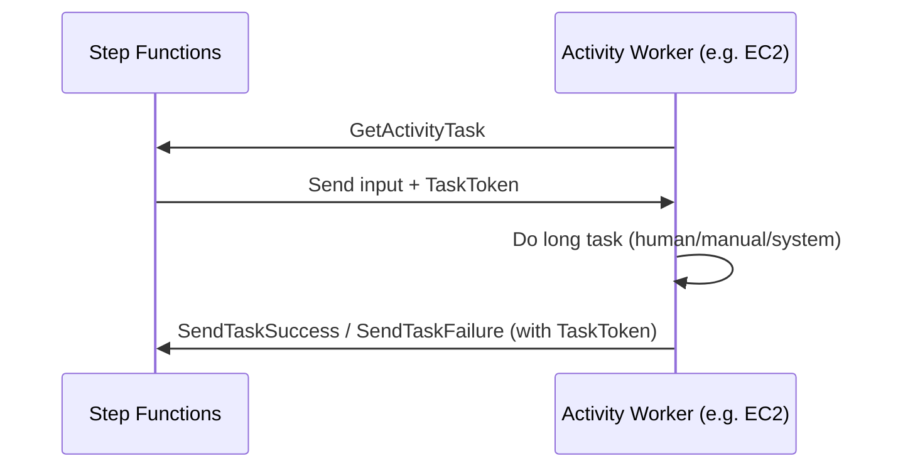
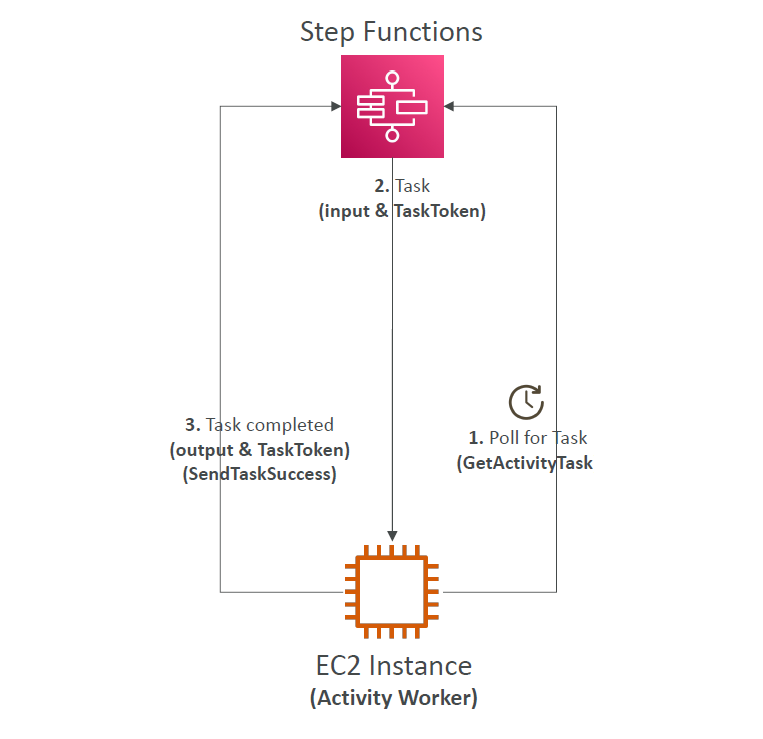

# ⚙️ **AWS Step Functions – Activity Tasks Simplified**

**Step Functions Activity Tasks** allow you to **delegate work to external workers** (such as EC2, ECS, on-prem apps, or mobile devices) instead of executing it directly within AWS services.

This is useful when your logic must be run **outside AWS Lambda**, like in:

- Legacy systems (e.g., .NET/Java apps)
- Long-running computations
- Custom devices (IoT, mobile)
- EC2/ECS containers

---

## 🧭 **How It Works: Overview**

<div align="center">



</div>

---

## 🧩 **Components Explained**

### 🛠 **1. Activity Definition**

In your ASL (Amazon States Language), use `"Type": "Task"` and set `"Resource"` to the Activity ARN.

```json
"MyActivityState": {
  "Type": "Task",
  "Resource": "arn:aws:states:region:account:activity:MyActivity",
  "HeartbeatSeconds": 60,
  "TimeoutSeconds": 300,
  "End": true
}
```

### 🧠 **2. Activity Worker**

A worker is your **external app** (e.g. EC2, container, mobile) that:

- 🌀 **Polls for work** using:

  ```bash
  aws stepfunctions get-activity-task --activity-arn arn:aws:states:...:activity:MyActivity
  ```

- ✅ **Processes the task**
- 📤 **Reports result** using:

  ```bash
  aws stepfunctions send-task-success --task-token TOKEN --output file://result.json
  ```

- ❌ Or reports errors with:

  ```bash
  aws stepfunctions send-task-failure --task-token TOKEN --error "InternalError"
  ```

---

## ⏱ **Managing Timeouts and Heartbeats**

| **Config**         | **Purpose**                                                           |
| ------------------ | --------------------------------------------------------------------- |
| `TimeoutSeconds`   | How long the task is allowed to run before failing automatically      |
| `HeartbeatSeconds` | How often the worker should signal it's alive (`send-task-heartbeat`) |

🔁 **Why send heartbeats?**
To keep the task active. If no heartbeat is sent in time, Step Functions will assume the task is dead and **fail it**.

---

## 💻 **Real-World Example**

Imagine your **EC2-based credit approval system**:

1. Step Function starts `CheckCredit` state.
2. EC2 app polls for the task using `get-activity-task`.
3. EC2 app runs a legacy rules engine.
4. When done, it responds via `send-task-success`.

---

## 🔐 **IAM Permissions Needed**

For the **Step Function**:

- `states:StartExecution`
- `states:DescribeExecution`
- `states:GetActivityTask`

For the **Activity Worker**:

- `states:GetActivityTask`
- `states:SendTaskSuccess`
- `states:SendTaskFailure`
- `states:SendTaskHeartbeat` (optional)

---

## 📊 **Visual Summary**

<div style="text-align: center;">
    
</div>

---

## ✅ **When to Use Activity Tasks**

| Use Case                                    | Why Activity Tasks?                          |
| ------------------------------------------- | -------------------------------------------- |
| Run workflows on EC2/ECS or on-prem servers | You can't (or don’t want to) use Lambda      |
| Need long-running, stateful logic           | Can wait up to **1 year** with heartbeat     |
| Human approval / manual systems             | Works with polling and token-based responses |
| Bring-your-own-runtime (C++, PHP, etc.)     | Full flexibility on how logic is implemented |

---

## 🏁 **Conclusion**

Activity Tasks give you **fine-grained control** over workflow execution, especially when using **external systems** outside of serverless AWS services. Combined with **Task Tokens**, **heartbeats**, and **timeouts**, they help you build **reliable**, **scalable**, and **flexible** workflows that fit into any architecture.
