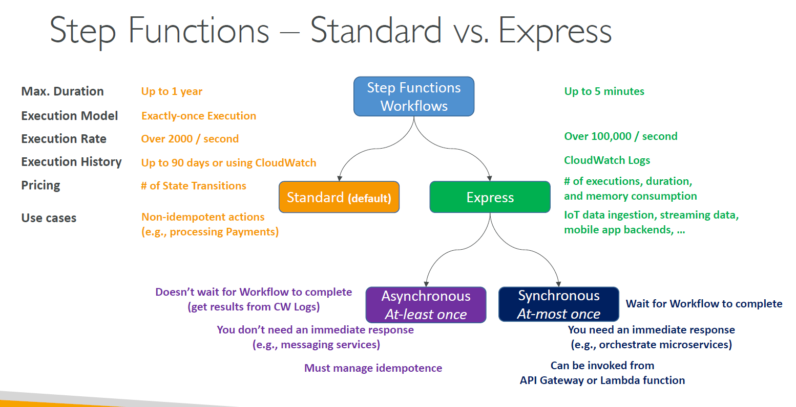

# 🔀 **AWS Step Functions – Standard vs. Express Workflows**

AWS Step Functions provides **two workflow types** — **Standard** and **Express** — each optimized for different use cases, performance needs, and pricing models. Choosing the right one depends on your **execution duration**, **volume**, **cost**, and **response requirements**.

---

    

---

## 📊 **Feature Comparison Table**

| Feature               | 🟧 **Standard Workflows**                  | 🟩 **Express Workflows**                             |
| --------------------- | ------------------------------------------ | ---------------------------------------------------- |
| **Max Duration**      | ⏳ Up to **1 year**                        | ⏱️ Up to **5 minutes**                               |
| **Execution Model**   | ✅ **Exactly-once** (durable and reliable) | 🔁 **At-least-once** or **at-most-once**             |
| **Execution Rate**    | 🚀 Up to **2,000+ executions/second**      | ⚡ Over **100,000 executions/second**                |
| **Execution History** | 📚 Stored up to **90 days**                | 📄 **Not stored**, but can stream logs to CloudWatch |
| **Pricing**           | 💵 Billed **per state transition**         | 💸 Billed per **invocation, duration, memory used**  |
| **Logging**           | ✔ Optional with CloudWatch Logs            | ✔ Integrated with CloudWatch Logs                    |

---

## 🧠 **Use Case Differences**

### 🟧 Standard Workflows

Best for:

- ✅ Long-running processes (approvals, ETL, human input)
- ✅ **Business-critical workflows** requiring **durability**
- ✅ **Non-idempotent** operations (e.g., **payment processing**)
- ✅ Strong audit and debugging with execution history

⏳ May run **minutes, hours, or even days**
🧱 More robust, with automatic retries, state durability

---

### 🟩 Express Workflows

Best for:

- ⚡ **High-throughput**, **low-latency** workloads
- 📲 Event-driven apps, IoT ingestion, real-time streaming
- 📦 Lightweight **microservice orchestration**
- ⏱️ Sub-second execution for **mobile app backends**

🚫 No detailed visual execution history
⚠️ Must handle **idempotency** in application logic

---

## 🔄 **Execution Models in Express**

| Mode             | Description                                            | Use Case                                    |
| ---------------- | ------------------------------------------------------ | ------------------------------------------- |
| **Asynchronous** | Doesn’t wait for workflow to finish. Result via logs.  | Batch jobs, SQS-triggered flows             |
| **Synchronous**  | Waits for workflow to complete and returns the result. | REST APIs (API Gateway, Lambda integration) |

---

## 🧪 **When to Choose Which?**

| Need                            | Choose      |
| ------------------------------- | ----------- |
| Long workflows with human input | ✅ Standard |
| Real-time image processing      | ✅ Express  |
| Guaranteed single execution     | ✅ Standard |
| Millions of executions per sec  | ✅ Express  |
| Cost-sensitive event workflows  | ✅ Express  |
| Strong observability            | ✅ Standard |

---

## 🔚 **Summary**

| 🔶 **Standard**                             | 🟩 **Express**                               |
| ------------------------------------------- | -------------------------------------------- |
| Durable, reliable, and slow                 | Fast, scalable, but less durable             |
| Use for workflows where correctness matters | Use for real-time data or event-driven flows |
| Supports **exactly-once** execution         | Supports **at-least-once or at-most-once**   |
| Supports up to **1 year** duration          | Up to **5 minutes** only                     |
