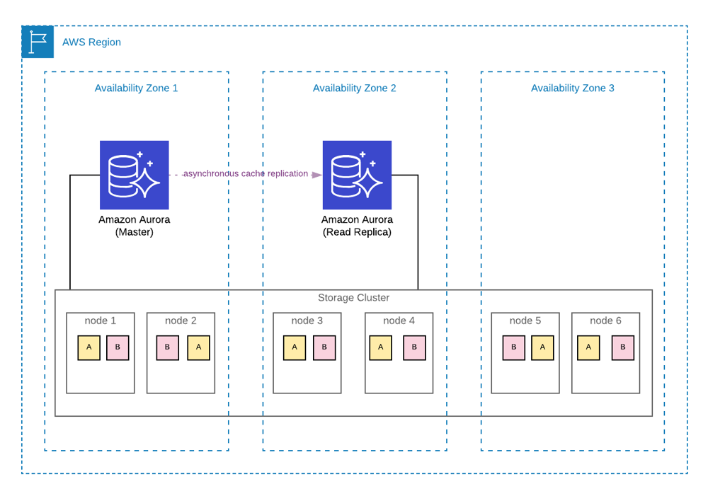
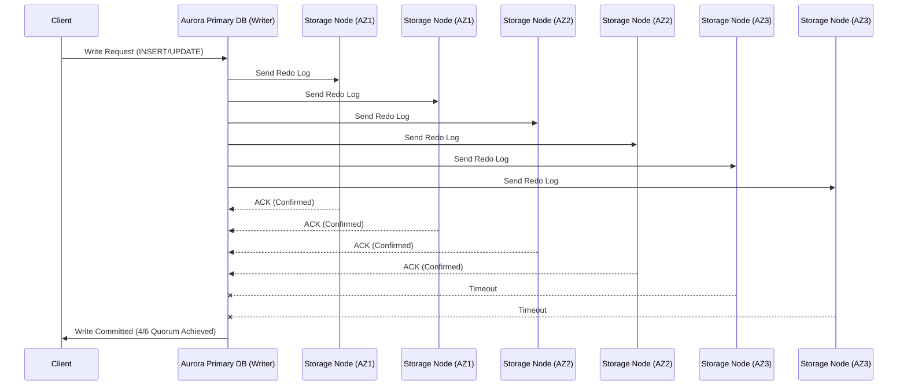
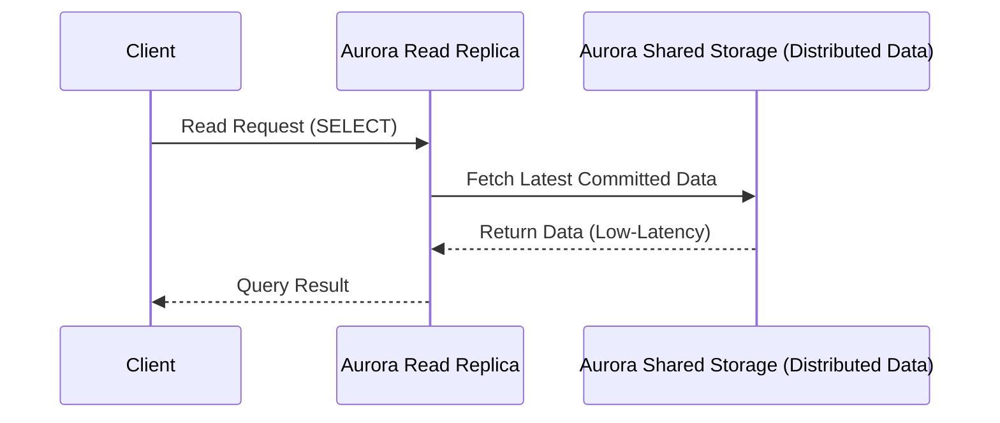

---
tags:
  - aws
  - aws/service
  - aws/domain/database
  - aws/topic/aurora
aliases:
  - "Amazon Aurora Architecture"
  - "Aurora Architecture"
---

# ☀️ **Amazon Aurora Architecture**

Amazon Aurora is a **cloud-native relational database** designed to provide **high availability, scalability, and performance**. Unlike traditional relational database systems, **`Aurora separates compute from storage`**, making it **more resilient, scalable, and cost-efficient**.

---

    

---

## 📌 **Core Architectural Components of Aurora**

Amazon Aurora consists of **two main layers** that work together to provide its advanced capabilities:

### **🔹 1. Compute Layer (Database Instances)**

- The **compute layer** runs the database engine (**Aurora MySQL or Aurora PostgreSQL**).
- It processes **SQL queries, transactions, and indexing** but **does not store data locally**.
- The **compute instances connect to a shared distributed storage layer** for data retrieval.
- Supports:
  - **Primary instance (Writer)** – Handles **both read and write operations**.
  - **Up to 15 Read Replicas per Region** – For **scaling read workloads** and **automatic failover**.
- **Failover Process**:
  - If the **writer fails**, **Aurora promotes a read replica** to a new primary **`within ~30 seconds`**.

### **🔹 2. Storage Layer (Aurora’s Distributed Storage)**

- **Fully managed, auto-scaling distributed storage** spanning **3 AWS Availability Zones (AZs)**.
- **Automatically scales from 10GB to 128TiB** without downtime or manual provisioning.
- **Data is stored in 10GB "Protection Groups"**, each replicated **six times (two per AZ)** for fault tolerance.
- **Quorum-based replication**: A write is **confirmed when at least 4 out of 6 storage nodes acknowledge it**.
- **Read replicas share the same storage**, reducing replication lag to **`<100ms`**.

📌 **How This Differs from Traditional RDS**

- In **regular RDS**, each database instance has its own **dedicated storage volume**.
- In **Aurora**, all instances **share the same distributed storage layer**, eliminating replication delays.

---

## 🔄 **How Aurora Handles Reads & Writes**

### **✍️ Aurora Write Process**

✔ **Writes only happen in the primary instance (Writer).**  
✔ **Aurora does NOT write entire data pages** to storage – it **stores only redo log records**.  
✔ **No WAL (Write-Ahead Log) shipping** – Instead, writes are sent **directly to Aurora storage nodes**.  
✔ A write is **considered committed when 4 out of 6 storage nodes acknowledge it**.

📌 **Key Takeaways**

- Aurora **does not modify database pages immediately**—it first **stores redo logs in storage nodes**.
- **Less I/O overhead**, increasing performance significantly.
- Even if **1 or 2 storage nodes fail**, writes continue **without data loss**.

---

### **📖 Aurora Read Process**

✔ Read replicas **do not maintain separate database copies**.  
✔ Instead, all read replicas **query the shared storage layer directly**.  
✔ This **eliminates replication lag** and **allows instant failover**.

📌 **Key Takeaways:**

- **No need for WAL log replay**—replicas instantly access the same data.
- **Near-zero replication lag** (**<100ms**).
- Up to **15 read replicas** for **high-performance scaling**.

---

## 🛠️ **Aurora Storage System – Self-Healing, Fault-Tolerant**

### 🔹 **10 GB Protection Groups**

- Data is split into **units of 10 GB**, called Protection Groups.
- Each group is **replicated across 3 AZs**, with **6 total copies**.

### 🔹 **Write Durability via Quorum**

- A write is successful if **4 of 6 nodes** acknowledge it.
- Even if **2 nodes fail**, the system continues without issue.

### 🔹 **Self-Healing**

- If any node fails:

  - Aurora **reconstructs the missing data** from surviving replicas.
  - **No impact** on database availability or performance.

---

## 👩🏻‍⚖️ **Aurora vs. Traditional RDS – Key Differences**

| Feature               | **Aurora**                                      | **Amazon RDS**                                 |
| --------------------- | ----------------------------------------------- | ---------------------------------------------- |
| **Storage Model**     | **Shared, distributed storage (multi-AZ)**      | **EBS-based storage (single AZ per instance)** |
| **Replication**       | **Storage-level replication (no WAL shipping)** | **Streaming WAL logs to replicas**             |
| **Replication Lag**   | **Milliseconds (<100ms)**                       | **Seconds to minutes**                         |
| **Failover Time**     | **~30 seconds**                                 | **60-120 seconds**                             |
| **Read Replicas**     | **Up to 15, zero-lag**                          | **Up to 5, replication lag exists**            |
| **Storage Scaling**   | **Auto-scales to 128TiB**                       | **Manual resizing required**                   |
| **Backup & Recovery** | **Continuous, no performance impact**           | **Daily snapshots (affects performance)**      |

📌 **Key Takeaways:**

- ✔ **Aurora eliminates replication lag by sharing a single storage layer.**
- ✔ **Aurora failover is ~30s, RDS failover takes ~1-2 minutes.**
- ✔ **Aurora scales automatically, RDS requires manual resizing.**

---

## 🏆 **6️⃣ Unique Aurora Features**

### 🌍 **Aurora Global Database**

- 🔁 Replicates across **multiple AWS regions**.
- 🌍 Cross-region lag **<1s**.
- 🛡 Great for disaster recovery and global reads.

### ⚙️ **Aurora Serverless (v2)**

- Auto-scales **compute capacity**, not just storage.
- Perfect for **variable workloads and dev/test** environments.

### 🧬 **Aurora Cloning**

- ⚡ Instantly clone databases **without copying full data**.
- Use cases: **QA, testing, analytics**.

### 🔄 **Cluster Cache Management**

- Promoted replicas **inherit warm cache**.
- Prevents performance drops after failover (unlike RDS).

---

## 🎯 **Final Summary: Why Aurora’s Architecture is Superior**

| **Feature**               | **Why Aurora is Better**                                         |
| ------------------------- | ---------------------------------------------------------------- |
| **Auto-Scaling Storage**  | **Grows from 10GB to 128TiB automatically**                      |
| **Shared Storage Layer**  | **Ensures zero-lag replication & fast failover**                 |
| **No WAL Shipping**       | **Writes are stored in shared storage, reducing network delays** |
| **Instant Read Replicas** | **Replicas do not require full data copies**                     |
| **Crash Recovery**        | **No need to replay logs, instant recovery**                     |

💡 **Final Thought**: **Aurora’s architecture is designed for modern cloud scalability, offering better performance, durability, and cost efficiency than traditional RDS.** 🚀🔥
---

## Related Notes
- [[aws-services/8.database/aurora/|Index]] - folder map
- [[aws-services/8.database/aurora/1.2.aurora-deep-search|Amazon Auroras Distributed Storage Architecture]] - previous lesson
- [[aws-services/8.database/aurora/1.4.how-async-replication-works|Amazon Aurora Redo Log & Replica Sync Deep Dive with Flush Lifecycle]] - next lesson
- [[aws-daily/aws-cloud-Concepts/6.disaster-recovery|Disaster Recovery DR in AWS]] - mentions Disaster Recovery
- [[aws-services/8.database/aurora/1.1.aurora-overview|Amazon Aurora]] - mentions Amazon Aurora
- [[aws-daily/aws-architectures/3.1.serverless|Server-Based Architectures vs. Serverless Computing]] - mentions Serverless
- [[aws-services/10.developer/1.4.aws-sam/1.serverless|The Ultimate Guide to Serverless Computing & Tools]] - mentions Serverless
- [[aws-services/8.database/dynamodb/1.4.backup|AWS DynamoDB Backup]] - mentions Backup
- [[aws-services/5.compute/2.ebs/1.1.ebs|Amazon EBS Elastic Block Store Scalable Persistent Storage for EC2]] - mentions EBS

---
