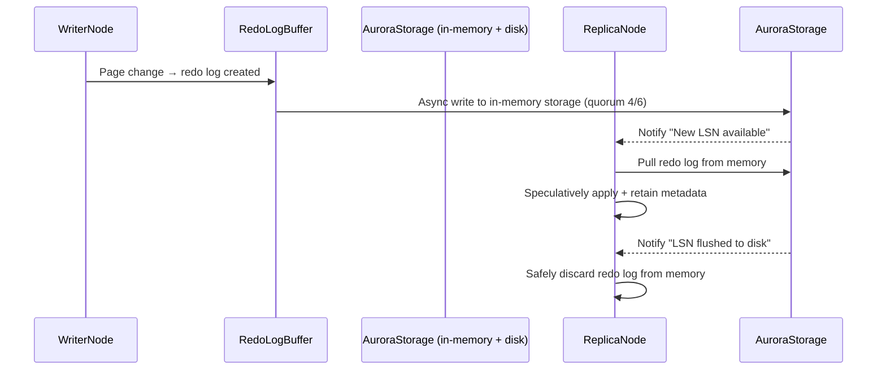

# 🧾 **Amazon Aurora Redo Log & Replica Sync: Deep Dive with Flush Lifecycle**

> Understand how Amazon Aurora achieves ultra-low-latency replication, memory-safe syncing, and delayed durability via its intelligent **Redo Log + Flush Notification System**.

---

## 🧠 **What Is the Aurora Redo Log?**

The **Aurora Redo Log** is a distributed, cloud-native log mechanism used in **Amazon Aurora (MySQL/PostgreSQL)** to:

- Record all changes to data pages.
- Enable high-performance **replica synchronization**.
- Power fast, reliable **crash recovery**.
- Replace traditional disk-bound WAL/InnoDB redo logs with **distributed in-memory storage logging**.

---

## ⚙️ **How Aurora Redo Logging Works Internally**

### 🧩 Log Lifecycle Overview

---

## 🧠 **Step-by-Step Breakdown**

### 🟦 1. **Writer Generates Redo Log**

- A change to a data page triggers a **redo log entry**.
- Log is buffered on the writer node.

### 🟧 2. **Log Sent to Aurora Storage (Memory-Only at First)**

- Redo log is sent to **Aurora’s distributed storage**.
- It is stored **in-memory across 6 nodes in 3 AZs**.
- Commit is confirmed once **4 out of 6 nodes** acknowledge receipt.

> ✅ This commit happens **before** writing to disk!

---

### 🟨 3. **Replica Notified (Pre-Flushed)**

- Aurora storage **notifies replicas** that a new **Log Sequence Number (LSN)** is available.
- This **does not mean it’s flushed to disk yet**.
- Replicas then **pull the redo log from storage’s memory layer**.

---

### 🟩 4. **Replica Applies Redo Log (Speculatively)**

- Replicas **apply the redo log to their memory/cache** for read consistency.
- They also **retain log metadata** and **do not advance LSN state fully**.

> 🧠 This is known as **speculative apply**: they tentatively apply but don’t finalize until flush confirmation.

---

### 🟫 5. **Storage Flushes to Disk (Eventually)**

- Aurora storage **flushes redo logs to disk** in the background.
- This is **asynchronous and optimized**, avoiding I/O bottlenecks.

---

### ✅ 6. **Flush Notification Sent to Replicas**

- Once the redo log is durably persisted to disk:

  - The **storage layer sends a flush-complete signal** to all replicas.
  - Replicas now:

    - **Confirm the log is durable.**
    - **Safely discard the log from memory.**
    - **Advance their LSN state**.

---

## 🧠 Why This Matters

| ✅ Feature                  | 🔍 Benefit                                                              |
| --------------------------- | ----------------------------------------------------------------------- |
| ⚡ **Low-latency commits**  | Writer commits after 4/6 memory acknowledgments — not waiting for disk. |
| 🛡️ **Durable by design**    | Aurora Storage guarantees log durability and replication.               |
| 🧠 **Memory-safe replicas** | Replicas don’t discard logs until durability is confirmed.              |
| 🔁 **Catch-up support**     | Lagging replicas can re-pull logs anytime from storage.                 |

---

## 🆚 Aurora vs Traditional DBs

| Feature               | Traditional MySQL/PostgreSQL  | Aurora                                   |
| --------------------- | ----------------------------- | ---------------------------------------- |
| Log written to        | Local disk                    | Shared, replicated in-memory storage     |
| Replica receives logs | Streamed over TCP             | Pulls from storage after notification    |
| Commit durability     | After disk write              | After memory quorum (4/6)                |
| Disk flush            | Required before replica apply | Happens after apply (async)              |
| Memory cleanup        | Manual or fixed               | Based on **flush-confirm notifications** |

---

## 🧪 Real-Life Analogy

> Imagine the Writer is a teacher giving students (replicas) a draft answer key.
>
> The students **review and apply it tentatively**, but they **don’t erase their notes** until the teacher confirms the final answer is **archived and official**.
>
> This keeps everyone synced, correct, and responsive — without being blocked by permanent storage.

---

## ✅ Summary Table

| 🔹 Phase | 🔸 Behavior                                           |
| -------- | ----------------------------------------------------- |
| Write    | Redo log generated in memory                          |
| Commit   | After 4/6 storage nodes acknowledge in-memory receipt |
| Flush    | Aurora Storage flushes to disk asynchronously         |
| Notify   | Replicas notified pre-flush and post-flush            |
| Apply    | Replicas speculatively apply logs and wait            |
| Discard  | Logs discarded only after flush confirmation          |

---

## 💡 Key Clarifications

- ✅ **Replicas never hold redo logs in memory forever.**
- ✅ **They only discard logs after flush-confirmation**.
- ✅ **Durability is the responsibility of Aurora Storage**, not replicas.
- ✅ **Aurora’s async flush + notification system is core to its performance edge**.
