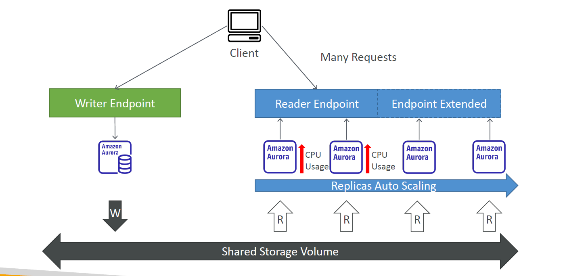

---
tags:
  - aws
  - aws/service
  - aws/domain/database
  - aws/topic/aurora
aliases:
  - "Auto Scaling in Amazon Aurora Provisioned Clusters"
  - "Aurora Auto Scaling Policy"
---

# 🚀 **Auto Scaling in Amazon Aurora (Provisioned Clusters)**

  

---

## **📌 Introduction to Auto Scaling in Aurora (Non-Serverless)**

Amazon Aurora **provisioned clusters** allow **automatic scaling** of read replicas to handle changing workloads. This Auto Scaling feature helps maintain **high availability**, **low query latency**, and **cost efficiency** without manual intervention.

### ✅ **Why Use Auto Scaling?**

✔ **Handles spikes in traffic automatically** by adding read replicas.  
✔ **Reduces costs during low traffic** by removing unnecessary replicas.  
✔ **Minimizes replication lag** by keeping read replicas optimized.  
✔ **Improves read performance** by distributing queries efficiently.

---

## **⚙️ How Aurora Auto Scaling Works**

Amazon Aurora **Auto Scaling dynamically adds or removes read replicas** based on pre-defined scaling policies.

### **🔹 Scaling Read Replicas Automatically**

- Aurora **monitors CPU, connections, query throughput, and replication lag**.
- When the load exceeds a threshold, **new read replicas are created** automatically.
- If load decreases, **excess read replicas are removed** to reduce costs.

📌 **Key Takeaway:**  
🚀 **Auto Scaling applies only to Aurora read replicas, NOT the writer instance.**

---

## **1️⃣ Configuring Auto Scaling for Read Replicas**

Aurora Auto Scaling works by **attaching an Auto Scaling policy** to a **read replica Auto Scaling group**.

### **Steps to Enable Auto Scaling:**

1️⃣ **Create an Aurora Cluster.**  
2️⃣ **Enable Read Replicas.**  
3️⃣ **Attach an Auto Scaling Policy.**  
4️⃣ **Define Scale-In and Scale-Out Policies.**

---

## **2️⃣ Scaling Policies in Aurora Auto Scaling**

Aurora Auto Scaling supports **multiple scaling policies**, allowing fine-tuned control over when to add or remove read replicas.

### **🔹 Policy 1: CPU-Based Scaling** (Recommended for most workloads)

✅ **Auto-add a read replica** when CPU usage exceeds **75%**.  
✅ **Remove a replica** when CPU drops below **30%**.

📌 **Example:**

- 🚀 CPU reaches 80% → **New read replica added**.
- 💤 CPU drops to 25% → **One read replica removed**.

---

### **🔹 Policy 2: Query Throughput-Based Scaling**

✅ **Auto-add a read replica** when queries per second exceed **50,000 reads/sec**.  
✅ **Remove a replica** when queries per second drop below **10,000 reads/sec**.

📌 **Example:**

- 🚀 60,000 queries/sec → **Adds a new read replica**.
- 💤 8,000 queries/sec → **Removes an extra read replica**.

---

### **🔹 Policy 3: Replication Lag-Based Scaling**

✅ **Adds a read replica** if **replication lag exceeds 50ms**.  
✅ **Removes a read replica** when lag is below 10ms.

📌 **Example:**

- 🚀 Replication lag reaches **80ms** → **Adds a new replica**.
- 💤 Lag falls below **5ms** → **Removes an extra read replica**.

---

### **🔹 Policy 4: Scheduled Scaling**

✅ **Pre-configured scaling events based on expected traffic patterns.**

📌 **Example:**

- 🕘 **Morning (8 AM - 12 PM)** → **Scale to 5 replicas (business hours)**.
- 🌙 **Night (12 AM - 6 AM)** → **Scale down to 1 replica (low traffic)**.

---

## **3️⃣ Multi-AZ Auto Scaling & High Availability**

Aurora **Auto Scaling works with Multi-AZ deployments**, but they serve different purposes:

| **Feature**          | **Auto Scaling**                            | **Multi-AZ**                                 |
| -------------------- | ------------------------------------------- | -------------------------------------------- |
| **Purpose**          | **Improves read scalability**.              | **Provides failover protection**.            |
| **Scaling Type**     | **Adds/removes read replicas dynamically**. | **Creates a standby instance for failover**. |
| **Impact on Writes** | ❌ **Does not auto-scale the writer**.      | ❌ **Does not increase write capacity**.     |
| **Impact on Reads**  | ✅ **Distributes queries across replicas**. | ❌ **Only used in failure scenarios**.       |

📌 **Key Takeaways:**  
✔ **Auto Scaling ensures optimal performance during load spikes.**  
✔ **Multi-AZ ensures failover but does not automatically add/remove read replicas.**  
✔ **Read replicas created for Auto Scaling can also be used for Multi-AZ failover if needed.**

---

## **4️⃣ How Many Read Replicas Can Auto Scaling Manage?**

- Aurora supports **up to 15 read replicas** per cluster.
- Auto Scaling dynamically adjusts the **number of replicas based on workload demand**.

📌 **Example:**

- 🚀 Peak traffic → Aurora **adds 5 read replicas**.
- 💤 Low traffic → Aurora **removes 3 read replicas**.

---

## **5️⃣ How Does Auto Scaling Impact Query Performance?**

✔ Aurora **uses a reader endpoint** to automatically **distribute queries across all read replicas**.  
✔ Aurora ensures **even load balancing** across replicas to avoid bottlenecks.  
✔ Reducing replication lag **keeps data fresh across replicas**.

📌 **Key Takeaway:**  
🚀 **Read Auto Scaling optimizes query response time, reducing query latency.**

---

## **🎯 Final Summary – Aurora Auto Scaling Explained**

| **Feature**              | **Behavior**                                                                                     |
| ------------------------ | ------------------------------------------------------------------------------------------------ |
| **Applies To**           | **Read replicas only (not writer instance).**                                                    |
| **Scaling Type**         | **Horizontal Scaling (adds/removes read replicas).**                                             |
| **Triggers**             | **CPU, Query Throughput, Replication Lag, Scheduled Events.**                                    |
| **Multi-AZ Integration** | ✅ **Can be used with Multi-AZ, but separate feature.**                                          |
| **Max Read Replicas**    | **Up to 15 per cluster.**                                                                        |
| **Failover Impact**      | ❌ **Auto Scaling does NOT promote replicas as writers (unless manual failover is configured).** |

---

## **🚀 Best Practices for Aurora Auto Scaling**

✅ **Use CPU-Based Scaling** for general workloads.  
✅ **Use Query-Based Scaling** for high-traffic applications.  
✅ **Use Replication Lag Scaling** to ensure real-time data freshness.  
✅ **Use Scheduled Scaling** for predictable traffic patterns.  
✅ **Combine Auto Scaling with Multi-AZ** for the best HA & failover protection.

🔥 **Final Thought:** Aurora Auto Scaling dynamically manages **read replicas** to ensure **high performance, cost savings, and reliability**—all without manual intervention. 🚀
---

## Related Notes
- [[aws-services/8.database/aurora/|Index]] - folder map
- [[aws-services/8.database/aurora/1.7.why-multi-az-deployment-option-exist|Why Does Aurora Have Multi-AZ Deployment Options If It Uses Log-Based Storage Replication]] - previous lesson
- [[aws-services/8.database/aurora/2.aurora-security|Amazon Aurora Security Deep Dive & Best Practices]] - next lesson
- [[aws-services/5.compute/1.3.ec2-auto-scaling/2.2.scaling-policy|Auto Scaling Policies]] - mentions Scaling Policy
- [[aws-services/8.database/aurora/1.1.aurora-overview|Amazon Aurora]] - mentions Amazon Aurora
- [[aws-daily/aws-waf/3.1.reliability|Reliability]] - mentions Reliability
- [[aws-daily/aws-architectures/3.1.serverless|Server-Based Architectures vs. Serverless Computing]] - mentions Serverless
- [[aws-services/10.developer/1.4.aws-sam/1.serverless|The Ultimate Guide to Serverless Computing & Tools]] - mentions Serverless

---
