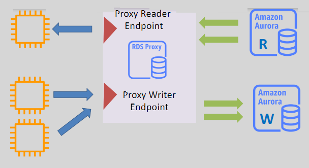

# 🚦 **Amazon Aurora RDS Proxy – Smart Connection Management**

**Amazon RDS Proxy** is a **fully managed, highly available connection pooler** for relational databases — built to boost Aurora’s performance, scalability, and availability by **reusing database connections efficiently**.

It's especially valuable for applications that experience:

- 🧵 Short-lived, frequent connections
- 🔁 Spiky traffic
- 🚀 Auto-scaling compute layers (e.g., Lambda, Fargate)

---

  

---

## 🧠 **What Does RDS Proxy Do?**

| Feature                   | Description                                                                             |
| ------------------------- | --------------------------------------------------------------------------------------- |
| 🔄 **Connection Pooling** | RDS Proxy keeps a pool of **warm, reusable connections**, reducing connection overhead. |
| 🔒 **High Availability**  | Deployed across **multiple AZs** and supports **automatic failover**.                   |
| 🌐 **Secure Access**      | Supports **IAM-based auth** and **AWS Secrets Manager** integration.                    |
| 📈 **Scalable Access**    | Handles **thousands of connections** from apps (e.g., Lambda, EC2, Fargate).            |

---

## 🧩 **How RDS Proxy Integrates with Aurora**

You can attach RDS Proxy to an **Aurora MySQL or PostgreSQL cluster**, and route requests to:

### ✍️ **Writer Endpoint**

- Connects to the **primary Aurora instance**.
- Ideal for **read-write workloads**.
- Proxy ensures automatic **failover redirection** during DB instance switchover.

### 👀 **Reader Endpoint**

- Distributes connections across **Aurora replicas**.
- Helps balance **read-heavy traffic** and reduce primary load.

### 🌐 **Cross-VPC Access**

- RDS Proxy supports **cross-VPC endpoints**, enabling access to Aurora **from other VPCs**.
- Great for **multi-tier or multi-region architectures**.

---

## 🌟 **Key Benefits of Using RDS Proxy with Aurora**

### 💡 **Improved Connection Efficiency**

- No need to open a new connection for each request.
- Reduces pressure on the Aurora DB engine.

### ⚡ **Lower Latency**

- Reuses existing TCP connections → avoids handshake overhead.

### 🚀 **Built-in High Availability**

- Deployed across AZs.
- Redirects traffic seamlessly during **Aurora failovers**.

### 📈 **Enhanced Scalability**

- Perfect for **bursty workloads** (e.g., API spikes).
- Works well with **serverless compute** (Lambda, ECS, EKS, etc.).

### 🔐 **Secure Authentication**

- ✅ Supports **IAM authentication** (passwordless access).
- ✅ Integrates with **AWS Secrets Manager** for secure credential storage.

---

## 🛠️ **How to Use RDS Proxy with Aurora**

### 💻 **Step 1 – Create Your Aurora Cluster**

- Use Aurora **MySQL or PostgreSQL** engine.
- Ensure the cluster is configured for **IAM auth** if you plan to use token-based access.

### ⚙️ **Step 2 – Set Up RDS Proxy**

- Go to the **AWS Console → RDS Proxy → Create Proxy**.
- Associate it with your **Aurora cluster** and choose:

  - Writer endpoint for **read-write** apps
  - Reader endpoint for **read-only** scaling

### 🔑 **Step 3 – Configure IAM Auth (Optional but Recommended)**

- Attach IAM roles and policies that allow the app to request a **database token**.
- Attach the policy to the app (Lambda, EC2, etc.).

### 🖥️ **Step 4 – Update Your App Connection String**

- Instead of connecting to `aurora-cluster.cluster-xyz...`,
  ➤ Connect to `rds-proxy-name.proxy-xyz...`.

> 💡 Now RDS Proxy **manages connections**, improves reuse, and handles failover behind the scenes.

---

## ✅ **When Should You Use RDS Proxy?**

| Use Case                                | Why Use RDS Proxy                                |
| --------------------------------------- | ------------------------------------------------ |
| 🧵 High connection churn (e.g., Lambda) | Avoid the overhead of frequent connection setups |
| 📈 Spiky traffic workloads              | Smooths connection burst handling                |
| 🔁 Auto-scaling apps                    | Keeps connections warm and efficiently shared    |
| 🔐 Secure credential management         | Integrates with IAM + Secrets Manager            |
| ⏱️ Fast failover                        | Keeps connections alive during DB failover       |

---

## 📋 **Summary: Why Use RDS Proxy with Aurora**

| ✅ Benefit                | 🔍 Description                                   |
| ------------------------- | ------------------------------------------------ |
| 🔄 **Connection pooling** | Reduces connection creation overhead             |
| ⚡ **Lower latency**      | Reuses existing connections instantly            |
| 🚀 **HA & Failover**      | Seamless connection failover during DB promotion |
| 🔐 **Secure access**      | Supports **IAM + Secrets Manager**               |
| 🌍 **Cross-VPC Support**  | Enables access from multiple VPCs securely       |

💡 **Final Thought**:
**Amazon RDS Proxy + Aurora** is a must for apps that prioritize **performance**, **scalability**, and **availability** — especially in **serverless**, **event-driven**, and **multi-tier architectures**.
