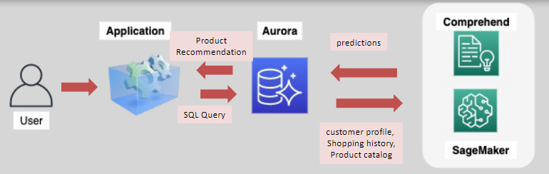

# 🤖 **Amazon Aurora + Machine Learning – Predictive Power at the Data Layer**

Amazon Aurora now integrates directly with **Amazon SageMaker** and **Amazon Comprehend**, enabling developers to **embed ML predictions into SQL queries** — no ETL pipelines, no data movement.
This makes Aurora a **hybrid transactional + intelligent system**, perfect for **real-time analytics**, **AI-powered applications**, and **predictive automation**.

---

<div align="center">
  
</div>

---

## 🌐 **1️⃣ What Is Aurora with Machine Learning?**

> Aurora’s ML integration allows your database to **call ML inference APIs** directly from **SQL queries**, using native functions — no need to export data or manage SDKs.

| ML Service               | What It Adds                                              |
| ------------------------ | --------------------------------------------------------- |
| 📊 **Amazon SageMaker**  | Predictive analytics using custom-trained models          |
| 🧠 **Amazon Comprehend** | Natural Language Processing (NLP) for text-based insights |

✅ **Use ML from your DB directly**:

```sql
SELECT predict_fraud_score(customer_data) FROM transactions;
```

---

## 💡 **2️⃣ Core Capabilities**

### 📊 **A. Integration with Amazon SageMaker**

- Run **custom-trained ML models** directly from Aurora queries.
- Supports **batch** and **real-time inference endpoints**.
- Use cases: **fraud detection**, **credit scoring**, **churn prediction**, **recommendations**.

### 🧠 **B. Integration with Amazon Comprehend**

- Analyze text fields for **sentiment**, **entities**, **topics**, and **PII**.
- Ideal for analyzing **customer feedback**, **social media data**, or **support tickets**.
- Use cases: **ad targeting**, **reputation analysis**, **customer profiling**.

### 🔮 **C. In-Database Inference**

- Invoke ML models **within SELECT statements**.
- Results are returned as part of your query response.
- Great for **real-time scoring** during transactional operations.

### 🔁 **D. Zero Data Movement**

- No need to extract or copy data to another service.
- Aurora sends data securely to SageMaker/Comprehend and retrieves results — **all from SQL**.

---

## 🚀 **3️⃣ Use Cases**

### 🔒 **1. Fraud Detection**

- Train a **SageMaker model** on historical transaction patterns.
- Predict fraud scores in real-time from within Aurora queries.
- Auto-flag or block suspicious activity instantly.

### 🎯 **2. Ad Targeting & Personalization**

- Use **Comprehend** to analyze reviews, feedback, or user messages.
- Identify **interests**, **intent**, or **sentiment** to refine ad delivery.

### 🛍️ **3. Product Recommendations**

- Analyze user behavior stored in Aurora (e.g., views, clicks, carts).
- Predict next-best product or personalized bundles using **SageMaker models**.
- Deliver recommendations **inline** in product feeds or checkout flows.

---

## 🌟 **4️⃣ Key Benefits**

| 🔍 Feature                         | ✅ Benefit                                               |
| ---------------------------------- | -------------------------------------------------------- |
| 🧠 **In-query ML**                 | Fetch predictions during query execution — no ETL        |
| ⏱️ **Real-time scoring**           | Enable instant responses from predictive models          |
| 🔗 **Tight AWS integration**       | Native support for SageMaker and Comprehend              |
| 🔁 **Secure, no data duplication** | No exports, no third-party dependencies                  |
| ⚖️ **Scales automatically**        | Aurora + SageMaker scale independently based on workload |

> 💡 This architecture reduces complexity and minimizes latency for intelligent, data-driven applications.

---

## 🛠️ **5️⃣ How It Works**

1. ✅ **Train a model** in **SageMaker** or use **Comprehend** (no training needed for Comprehend).
2. ✅ **Deploy the model** as a **real-time endpoint**.
3. ✅ **Call the endpoint from Aurora** using built-in SQL functions like:

   - `aws_comprehend_detect_sentiment(text_column)`
   - `aws_sagemaker_invoke_endpoint(model_endpoint, input_data)`

4. ✅ **Process the result inline** with your query logic.

---

## 📌 **Summary: ML-Driven Databases Are Here**

| ✅ Capability          | 🌟 What It Enables                                     |
| ---------------------- | ------------------------------------------------------ |
| In-SQL ML inference    | Call SageMaker/Comprehend from Aurora queries          |
| Secure integration     | No data exports, all calls stay in AWS                 |
| Real-time predictions  | Use ML outputs for instant decision-making             |
| Text analysis with NLP | Extract sentiment, entities, and PII from text columns |
| Scalable architecture  | Aurora + ML services scale on demand                   |

---

💡 **Final Thought**:
With Aurora’s native ML integration, your database is no longer just a data store — it becomes a **predictive engine**. You can power fraud detection, personalization, text analysis, and more — all without writing ML code in your application.

Let me know if you'd like:

- Sample SQL queries for invoking SageMaker or Comprehend
- A step-by-step setup guide
- Architecture diagrams showing Aurora + ML integration paths ✅
