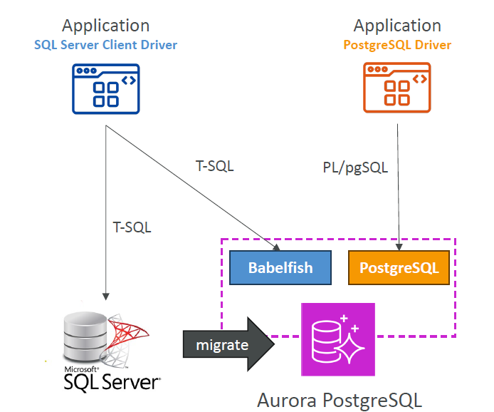

# 🐟 **Babelfish for Aurora PostgreSQL**

**Babelfish** is a powerful feature that allows **Amazon Aurora PostgreSQL** to **understand Microsoft SQL Server (T-SQL) commands** — enabling you to run SQL Server-based applications on Aurora **with minimal to no code changes**.

---

    

---

## 🧠 **Key Highlights**

- 🗣️ **T-SQL Compatibility**: Aurora PostgreSQL can **interpret T-SQL commands**, the native language of SQL Server.
- 🧩 **Application Reuse**: SQL Server applications can continue working **without changing SQL queries or client drivers**.
- 🔄 **Seamless Migration**: Use **AWS SCT** (Schema Conversion Tool) and **AWS DMS** (Database Migration Service) to migrate SQL Server databases to Aurora PostgreSQL.
- 🔌 **Same Drivers**: You can keep using **Microsoft SQL Server ODBC/JDBC drivers** with Babelfish-enabled clusters.

---

## 🚀 **Use Case**

Babelfish is ideal for organizations wanting to **move away from SQL Server** licensing costs while **preserving their applications** — it enables you to modernize to Aurora PostgreSQL **without a full rewrite**.
