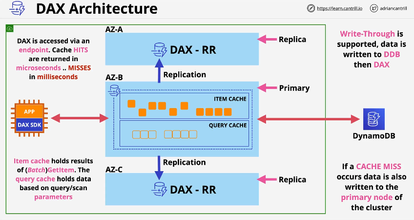

---
tags:
  - aws
  - aws/service
  - aws/domain/database
  - aws/topic/dynamodb
  - aws/topic/ddb-in-depth
aliases:
  - "DynamoDB Accelerator DAX In-Memory Caching for DynamoDB"
  - "Ddb Dax"
  - "DynamoDB Dax"
---

# ⚡ **DynamoDB Accelerator (DAX): In-Memory Caching for DynamoDB**

## 📌 **What is DynamoDB Accelerator (DAX)?**

**DynamoDB Accelerator (DAX)** is a **fully managed, in-memory cache** for Amazon DynamoDB that **improves read performance** by up to **10x**. It is **designed for high-throughput, low-latency applications** that require **millisecond response times**.

🔹 **Key Features:**

- 🚀 **In-Memory Cache**: Stores frequently accessed items in RAM for ultra-fast reads.
- 🔄 **Seamless API Integration**: Works with existing **DynamoDB SDKs** (drop-in replacement).
- 📉 **Reduces Read Latency**: Typical DynamoDB read latency is **single-digit milliseconds**, but **DAX reduces it to microseconds**.
- 🛠 **Automatic Cache Management**: Handles **cache invalidation and replication** automatically.
- 🔥 **Highly Scalable**: Supports **millions of requests per second** without performance degradation.
- ⚖ **Multi-Node Cluster**: Provides **fault tolerance and replication** to prevent data loss.

---

<div style="text-align: center;">
  
</div>

---

## 🔄 **How DAX Works**

📌 **DAX sits between your application and DynamoDB, intercepting requests to speed up read operations.**

1️⃣ **Application sends a read request** to DynamoDB (e.g., `GetItem` or `Query`).  
2️⃣ **DAX checks if the data is cached**:

- ✅ **If cached**, it **returns data instantly** (microsecond latency).
- ❌ **If not cached**, DAX retrieves the data from **DynamoDB**, stores it in cache, and returns it.

3️⃣ **Subsequent reads** are **served from the cache**, reducing database load.  
4️⃣ **When an item is modified (written to DynamoDB)**, DAX automatically **invalidates** the cache entry to ensure consistency.

---

## 🏗 **DAX vs. Traditional Caching Solutions**

| **Feature**                 | **DAX**                 | **Redis/Memcached**                  |
| --------------------------- | ----------------------- | ------------------------------------ |
| **Fully Managed**           | ✅ Yes                  | ❌ No, requires setup                |
| **DynamoDB API Compatible** | ✅ Yes                  | ❌ No, requires manual caching logic |
| **Auto Scaling**            | ✅ Yes                  | ❌ No, manual scaling required       |
| **Data Consistency**        | ✅ Write-through & TTL  | ❌ Must handle manually              |
| **Performance**             | 🚀 Microseconds latency | ⚡ Low latency, but app-managed      |

---

## 🔥 **When Should You Use DAX?**

### ✅ **Best Use Cases for DAX**

- ✔ **High-Traffic Applications**: Social media feeds, gaming leaderboards, e-commerce catalogs.
- ✔ **Read-Heavy Workloads**: Applications with a **high read-to-write ratio** (e.g., 90% reads, 10% writes).
- ✔ **Session Management**: Storing frequently accessed user session data.
- ✔ **IoT & Real-Time Analytics**: Applications needing ultra-fast read performance.

### ❌ **When NOT to Use DAX**

- 🚫 **Write-heavy applications** (DAX is optimized for reads, not writes).
- 🚫 **Strongly consistent reads** (DAX only supports **eventual consistency**).
- 🚫 **If your read latency is already acceptable** (e.g., single-digit ms is fine).

---

## 🏗 **Deploying a DAX Cluster**

### ✅ **Step 1: Create a DAX Cluster**

```sh
aws dax create-cluster \
    --cluster-name OrdersDAXCluster \
    --node-type dax.r5.large \
    --replication-factor 3 \
    --subnet-group-name my-subnet-group \
    --iam-role-arn arn:aws:iam::123456789012:role/DAXAccessRole
```

📌 **Explanation:**

- `--node-type dax.r5.large` → Specifies the instance size for DAX nodes.
- `--replication-factor 3` → Deploys **3 nodes** for fault tolerance.
- `--subnet-group-name` → Defines where the DAX cluster runs.
- `--iam-role-arn` → Grants the necessary IAM permissions.

---

### ✅ **Step 2: Update Application to Use DAX**

📌 **Modify your application to connect to DAX instead of DynamoDB directly.**

🔹 **Python Example:**

```python
import boto3

# Initialize DAX client instead of DynamoDB
dax = boto3.client('dax')

response = dax.get_item(
    TableName='Orders',
    Key={'OrderID': {'S': '12345'}}
)

print(response['Item'])
```

✅ **This automatically checks the DAX cache first before querying DynamoDB.**

---

## 🔄 **How DAX Handles Writes & Cache Invalidations**

📌 **DAX is a "Write-Through" Cache:**

- **Writes are always sent to DynamoDB first.**
- **DAX then invalidates the outdated cache entry.**
- **Next read request fetches fresh data from DynamoDB and updates the cache.**

🔹 **Example Write Operation:**

```sh
aws dynamodb put-item \
    --table-name Orders \
    --item '{
        "OrderID": {"S": "12345"},
        "CustomerID": {"S": "User567"},
        "OrderStatus": {"S": "Shipped"}
    }'
```

📌 **DAX will remove "OrderID = 12345" from cache, forcing a fresh read next time.**

---

## 🔥 **Performance Impact: DAX vs. No DAX**

| **Operation**                 | **Without DAX** | **With DAX**                  |
| ----------------------------- | --------------- | ----------------------------- |
| `GetItem` (cached)            | **~5ms**        | **<1ms** 🚀                   |
| `Query` (cached)              | **~10ms**       | **<1ms** 🚀                   |
| `WriteItem` (DDB)             | **~5ms**        | **~5ms**                      |
| **Overall Performance Boost** | -               | ✅ **Up to 10x faster reads** |

---

## 🎯 **Best Practices for Using DAX**

- ✔ **Use DAX for read-heavy workloads** to reduce database load.
- ✔ **Deploy at least 3 nodes** for fault tolerance.
- ✔ **Use IAM policies** to restrict access to DAX clusters.
- ✔ **Monitor performance using Amazon CloudWatch metrics.**
- ✔ **Keep DAX and DynamoDB in the same AWS region** to minimize latency.

---

## 🔥 **Key Takeaways**

- ✔ **DAX is a fully managed in-memory cache for DynamoDB, reducing read latency to microseconds.**
- ✔ **It is a drop-in replacement for DynamoDB API, requiring minimal changes to existing apps.**
- ✔ **Works best for read-heavy, low-latency applications like gaming, e-commerce, and analytics.**
- ✔ **DAX does NOT support strongly consistent reads; use DynamoDB directly for such cases.**
- ✔ **Write-through caching ensures cache consistency with DynamoDB.**

🚀 **If your application needs ultra-fast read performance, DAX is the perfect solution!**
---

## Related Notes
- [[aws-services/8.database/dynamodb/ddb-in-depth/|Index]] - folder map
- [[aws-services/8.database/dynamodb/ddb-in-depth/12.2.ddb-ttl|DynamoDB Time-To-Live TTL Explained]] - previous lesson
- [[aws-services/8.database/dynamodb/ddb-in-depth/13.ddb-security-and-backup|AWS DynamoDB Backup]] - next lesson
- [[aws-services/8.database/dynamodb/ddb-in-depth/1.1.ddb|Deep Dive into AWS DynamoDB]] - mentions DynamoDB
- [[aws-services/8.database/dynamodb/1.1.dynamodb|AWS DynamoDB]] - mentions Dynamodb
- [[aws-services/2.security/1.1.iam/1.fundmmentals/1.2.iam|AWS Identity and Access Management IAM]] - mentions IAM

---
