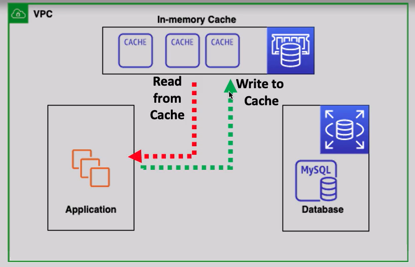
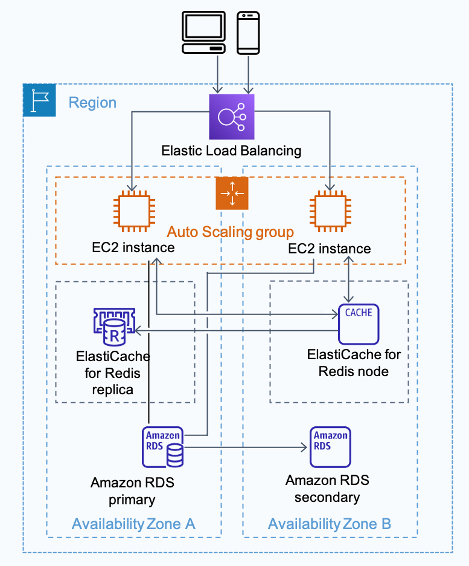
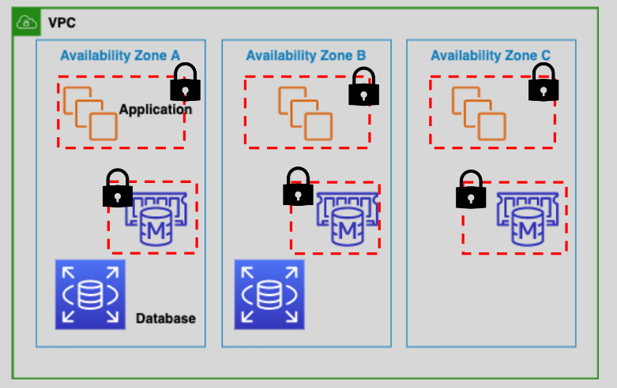
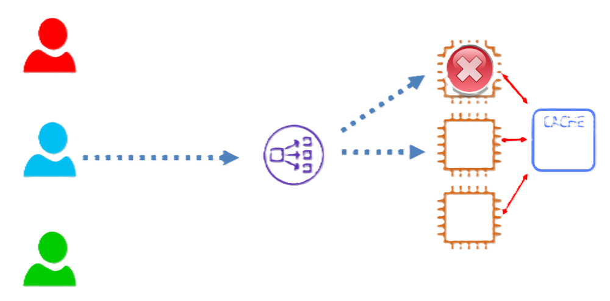

# ⚡ **AWS ElastiCache – Real-Time Caching at Cloud Scale**

**Amazon ElastiCache** is a **fully managed, low-latency, distributed in-memory data store** that helps you deliver lightning-fast application performance by **caching frequently accessed data**.

> 🚀 _"High-Performance In-Memory Data Store with Sub-Millisecond Latency"_

---

  

---

## 📌 **What is AWS ElastiCache?**

ElastiCache provides an **in-memory key-value store** to reduce response time and offload read/write operations from primary databases.

### 🎯 **Primary Benefits**

- 🧠 **Accelerates applications** with in-memory speed
- ⚙️ **Reduces backend load** by offloading frequent queries
- ⏱️ **Delivers sub-millisecond response times**
- 📦 **Supports microservices, serverless, and monolithic apps**

### 🧩 **Supported Engines**

| Engine           | Description                                                                   |
| ---------------- | ----------------------------------------------------------------------------- |
| 🔴 **Redis**     | Feature-rich, supports persistence, pub/sub, replication, advanced data types |
| 🔵 **Memcached** | Simple, high-performance caching with horizontal scalability                  |

> 🛠️ AWS handles provisioning, patching, scaling, and backups — so you focus on development.

---

  

---

## 🔐 **ElastiCache Cluster Architecture**

ElastiCache is deployed in **clusters of one or more nodes** inside your **VPC**, offering secure and scalable in-memory storage.

  

---

### 🧱 **Cluster Highlights**

| Component                    | Functionality                                                            |
| ---------------------------- | ------------------------------------------------------------------------ |
| 💡 **Node (EC2-based)**      | Holds in-memory data. Redis can have primary & replicas.                 |
| 🌐 **VPC Integration**       | Fully isolated within your network; no internet access                   |
| 🔗 **Endpoint Access**       | Connect via primary/read endpoints; clients use simple SDKs or libraries |
| ⏱️ **Failover & Resilience** | Redis supports automatic failover via replication groups                 |
| 🔔 **Monitoring**            | Integrated with **CloudWatch** for metrics and **SNS** for alerting      |
| 💰 **Pricing**               | Use **On-Demand** or **Reserved** instances (Spot not supported)         |

> ✅ **ElastiCache automatically replaces failed nodes**, ensuring **high availability** with minimal ops.

---

## 📝 **Use Case: Storing Session Data in Stateless Apps**

  

### 🧠 **Why Use ElastiCache for Sessions?**

- Stateless applications don’t retain session context.
- ElastiCache provides a **fast, durable, and centralized store** for:

  - 🛒 **Shopping carts**
  - 🧍‍♂️ **User login sessions**
  - 📋 **Application state**

### 🎯 **Benefits**

- 🔁 **Consistent user experience** across web/app servers
- 📉 **Reduced database traffic** by keeping sessions in memory
- 🧪 **Low-latency access** improves response time

> 💡 **Example**: E-commerce sites use ElastiCache Redis to keep users’ carts alive between page visits or logins.

---

## 📊 **Common ElastiCache Use Cases**

| Use Case                       | How ElastiCache Helps                                    |
| ------------------------------ | -------------------------------------------------------- |
| 🧠 **Session management**      | Shared session store across distributed services         |
| 🔄 **Database query caching**  | Cache expensive DB results to reduce latency             |
| 🏆 **Leaderboards / counters** | Use Redis Sorted Sets for real-time ranking              |
| 📈 **Analytics pipelines**     | Temporarily cache metrics or intermediate results        |
| 📮 **Pub/Sub messaging**       | Redis supports lightweight pub/sub for event-driven apps |

---

## ✅ **Conclusion**

**AWS ElastiCache** is not just a caching tool — it’s a **high-speed memory layer** built to scale your app’s performance, reduce DB load, and keep users happy with sub-millisecond response times.

> 🔥 Whether you’re building e-commerce platforms, real-time analytics dashboards, or modern serverless apps — **ElastiCache (especially Redis)** gives you **speed, reliability, and operational simplicity**.
