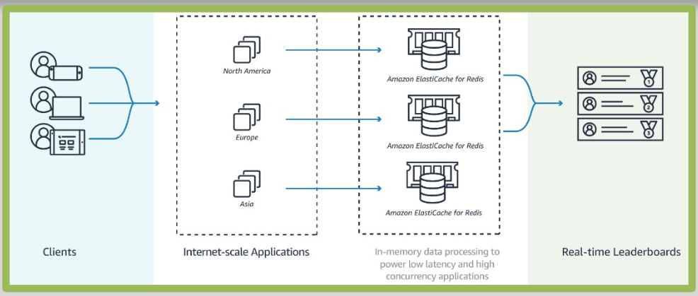
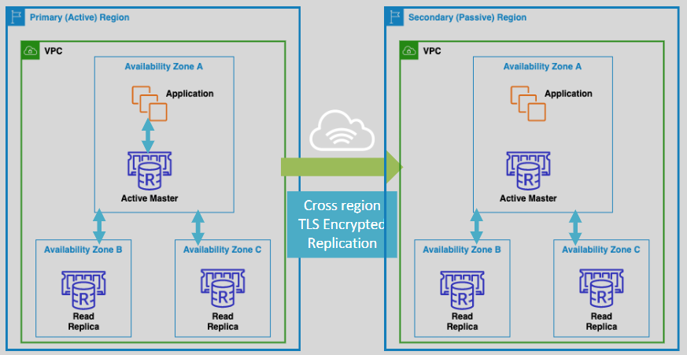

# 🎮 **ElastiCache for Redis – Key Features for Real-Time Applications**

**Amazon ElastiCache for Redis** provides powerful features designed for **ultra-fast, in-memory processing** and **globally available data**, making it ideal for **gaming leaderboards**, **real-time analytics**, and **cross-region architectures**.

---

## 📊 **Sorted Sets – Real-Time Leaderboards & Ranking**

**Sorted Sets** (`ZSET`) are a Redis data structure that combines **uniqueness** and **automatic ordering** — a perfect fit for **gaming leaderboards**, **reputation systems**, and **score tracking**.

  

### 🔧 **Key Capabilities of Sorted Sets**

| Feature                     | Benefit                                                                  |
| --------------------------- | ------------------------------------------------------------------------ |
| 🎯 **Unique Members**       | Each player or item appears only once in the set                         |
| 📈 **Score-Based Ordering** | Members are sorted by a **numeric score** (e.g., points, rank)           |
| 🔁 **Real-Time Re-ranking** | Updates reflect **immediately** on the leaderboard                       |
| 🔍 **Fast Range Queries**   | Retrieve **top N scores**, ranks, or percentile players with low latency |
| ⏱️ **Time-Based Ranking**   | Combine scores and timestamps to rank by activity over time              |

> 💡 Example: `ZADD leaderboard 1570 "player1"` instantly updates and ranks player1 based on their score.

---

## 🌍 **Global Data Stores – Cross-Region Read Replica Clusters**

With **ElastiCache Global Datastores**, you can replicate Redis data across AWS regions to achieve **low-latency reads**, **global availability**, and **enhanced disaster recovery**.

  

### 🌐 **Key Features of Cross-Region Clusters**

| Component                                  | Role                                          |
| ------------------------------------------ | --------------------------------------------- |
| 🧑‍💻 **Primary Cluster (Region A)**       | Handles **read/write** traffic                |
| 👁️ **Secondary Clusters (Region B, C, …)** | **Read-only replicas**, sync from the primary |

### 🚀 **Advantages**

- 🔄 **Asynchronous Global Replication**
  Data changes in the primary cluster are **automatically propagated** to all replica regions.

- 🌐 **Low Latency Access for Global Users**
  Apps in other regions can read from **local replicas**, reducing latency.

- 🛡️ **Disaster Recovery Ready**
  Secondary clusters can be **promoted to primary** for business continuity.

- 📊 **Scalable Reads**
  Spread read queries across multiple regions without overloading the primary.

---

## ✅ **Summary – Why Use These Features?**

| Feature                         | Use Case                                                            |
| ------------------------------- | ------------------------------------------------------------------- |
| 🧮 **Sorted Sets**              | Real-time ranking for **games, contests, reputation, leaderboards** |
| 🌎 **Cross-Region Replication** | **Low-latency access** for global apps and **HA/DR architecture**   |

> 🧠 **Final Thought**:
> Redis in ElastiCache gives you **more than a cache** — it’s a real-time, global data layer with powerful features that power **modern, user-centric applications**.
