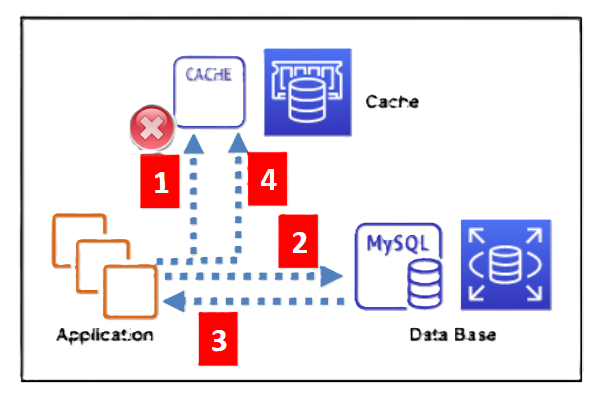
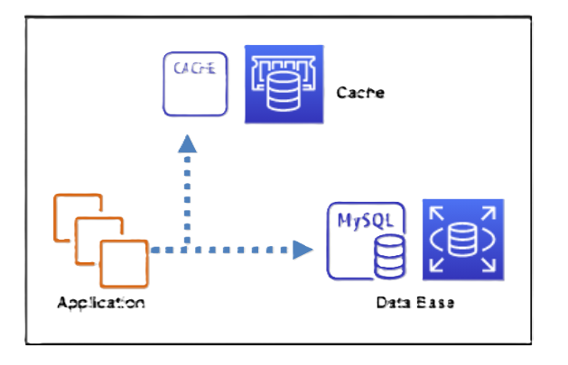
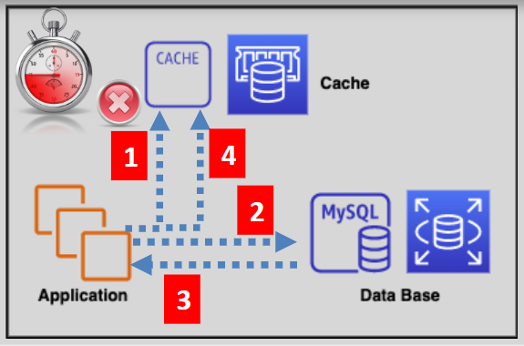

# 📝 **Caching Strategies – Optimize Performance with the Right Technique**

Caching helps reduce load on your database, improve application responsiveness, and handle high traffic gracefully. But not all caching is the same — choosing the **right strategy** is key to balancing **latency**, **freshness**, and **resource usage**.

---

## 💤 **Lazy Loading (Cache-aside Pattern)**

  

---

### 📌 How It Works

- Application tries to read data from the cache.

  - ✅ **Cache Hit** → Return the value.
  - ❌ **Cache Miss** → Fetch from DB → Store in cache → Return to user.

### ✅ Pros

- Caches **only requested data**, saving memory.
- Avoids unnecessary cache population.

### ❌ Cons

- **First request is slow** (cold cache).
- Cached data may become **stale** unless explicitly invalidated.

> 💡 **Best For**: Read-heavy apps where occasional latency is acceptable (e.g., product pages, dashboards).

---

## ✍️ **Write-Through Caching**

  

---

### 📌 How It Works

- Every write goes to **both** the cache and the database.
- Ensures **real-time cache sync** with DB.

### ✅ Pros

- Cache is always **fresh and consistent**.
- Great for systems that **read frequently after write**.

### ❌ Cons

- **Write overhead** (2 operations per write).
- May cache data that's **never read**.
- New cache nodes start **empty** (cold boot).

> 💡 **Best For**: Systems requiring **read-after-write consistency**, like profile updates or pricing engines.

---

## ⏳ **Adding TTL (Time-to-Live)**

  

---

### 📌 How It Works

- Assign a **TTL expiration time** to each cache entry.
- Data auto-expires after the TTL, keeping the cache fresh.

### ✅ Pros

- Prevents **stale data** from lingering in cache.
- Reduces **memory bloat** over time.

### ❌ Cons

- Choosing the **right TTL is tricky**:

  - Too short = frequent cache misses
  - Too long = stale data risk

> 💡 **Best For**: Apps where **data changes periodically**, like stock prices or blog articles.

---

## 📋 **Summary Table: Caching Strategy Comparison**

| Strategy         | Data Freshness        | Write Load  | Cache Hit Efficiency        | Use Case Highlights          |
| ---------------- | --------------------- | ----------- | --------------------------- | ---------------------------- |
| 💤 Lazy Loading  | ❌ May go stale       | ✅ Low      | ✅ Good (on repeated reads) | Read-heavy, flexible latency |
| ✍️ Write Through | ✅ Always fresh       | ❌ High     | ✅ High                     | Read-after-write consistency |
| ⏳ TTL-Based     | ✅ Controlled via TTL | ➖ Moderate | ✅ Depends on TTL           | Time-bound freshness control |

---

## ✅ **Final Thoughts**

Choosing the right caching strategy depends on your app’s:

- **Read/write ratio**
- **Tolerance for stale data**
- **Memory and cost limits**
- **Need for consistency**

> 🎯 **Smart Tip**:
> You can **combine strategies** for optimal results!
> E.g., use **Lazy Loading + TTL** to auto-refresh frequently accessed but not always updated data.
