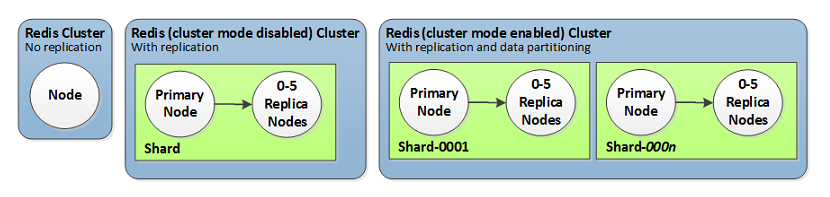
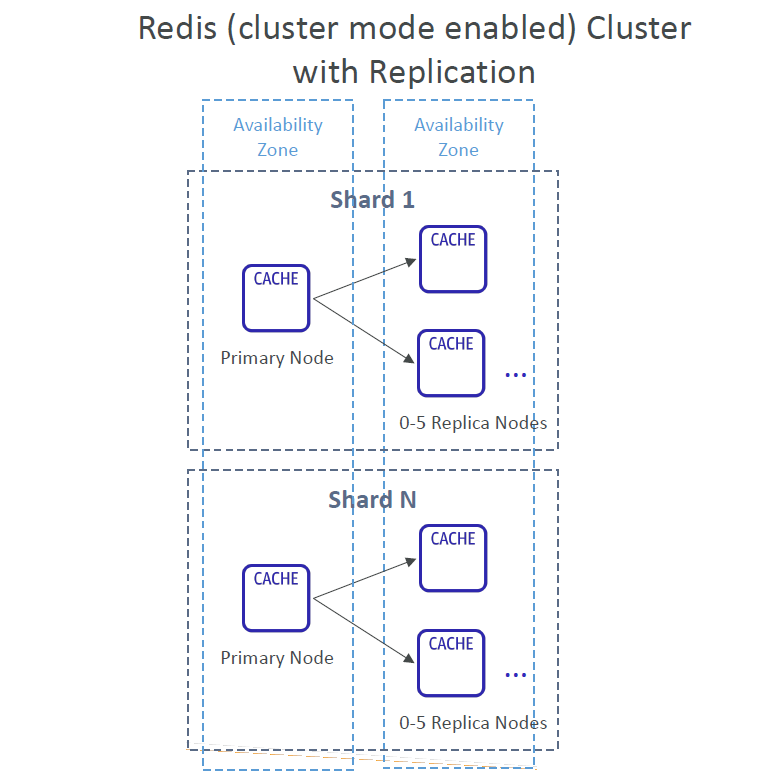
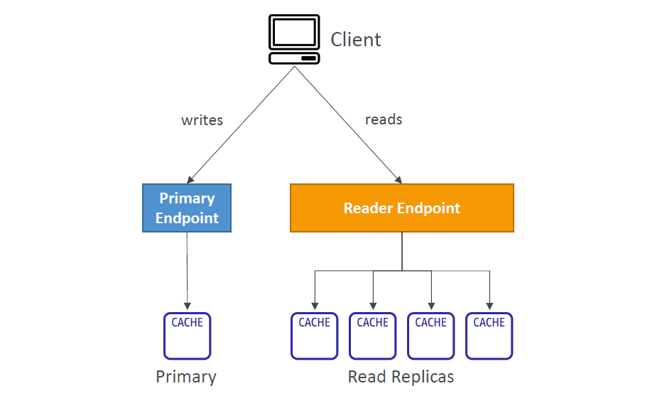
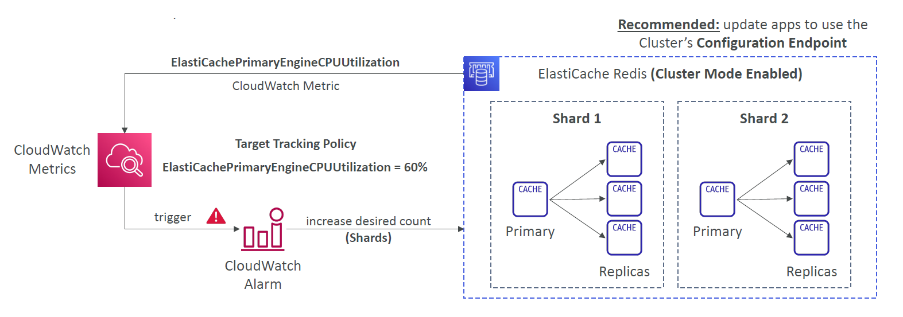

---
tags:
  - aws
  - aws/service
  - aws/domain/database
  - aws/topic/elasticache
aliases:
  - "AWS ElastiCache for Redis Deployment Modes & Best Practices"
  - "Elasticache Redis Deployment Modes"
---

# ☁️ AWS ElastiCache for Redis: Deployment Modes & Best Practices

AWS **ElastiCache for Redis** is a fully managed, in-memory data store service that helps developers build highly responsive and scalable applications. It's ideal for caching, session storage, real-time analytics, and pub/sub use cases.

In this topic, we'll cover:

- ✅ What ElastiCache for Redis is
- ⚙️ Different deployment modes
- 📦 Common use cases
- 🛡️ High availability (HA) options
- 🌐 VPC integration

---

## 🧠 What Is ElastiCache for Redis?

ElastiCache for Redis is AWS's managed version of open-source **Redis**, providing:

- Fully managed infrastructure (patching, backups, monitoring)
- Built-in **replication and automatic failover**
- **VPC-native** network support
- **Horizontal and vertical scaling**
- Optional **persistence** (RDB/AOF)

---

## 📦 Common Use Cases

- ⚡ Session storage
- 📊 Real-time leaderboards and analytics
- ⏱ Rate limiting / throttling
- 🔁 Pub/Sub messaging
- 📥 Queueing
- 🔍 Caching frequently accessed data

---

## 🧭 ElastiCache for Redis Deployment Modes

ElastiCache supports two key deployment models:

<div style="text-align: center;">
    
</div>

---

### 1️⃣ **Single Node (Non-Clustered)**

A single Redis instance (no clustering, no partitioning).

- Simpler setup
- Lower cost
- ❌ No automatic partitioning
- ❌ Not suitable for large datasets

> Best for: Dev/test environments or small, read-heavy apps

---

### 2️⃣ **Replication Group (Primary + Replica)**

One primary node + multiple replicas (read-only). Failover is automatic.

- ✅ High availability (HA)
- ✅ Automatic failover
- ✅ Improved read throughput (read from replicas)

> Best for: Session stores, apps needing HA but small to medium dataset

---

### 3️⃣ **Redis Cluster Mode Enabled (Sharded)**

<div style="text-align: center;">
    
</div>

---

Horizontal scaling via partitioning using **Redis Cluster protocol**.

- ✅ Native support for **sharding** using **hash slots**
- ✅ Each shard = 1 primary + N replicas
- ✅ Scales to hundreds of GBs or TBs
- ✅ Supports **multi-threaded reads** (Redis 7+)
- ✅ Up to **500 Node per Cluster** for example:
  - 500 shards with single master
  - 250 shards with 1 master and 1 replica
  - …
  - 83 shards with one master and 5 replicas

> Best for: Large-scale apps, multi-AZ HA, and high concurrency

```txt
Cluster = Multiple Shards
Shard 1: Master1 + Replica1
Shard 2: Master2 + Replica2
Shard 3: Master3 + Replica3
```

📌 **Keys are auto-partitioned across shards** using CRC16(key) % 16384.

---

## 🌐 Network & VPC Integration

- Deployed within a **VPC** (recommended)
- Accessed via **DNS endpoint**
- Supports **TLS in-transit encryption**
- **Security groups** control access

---

## 🎯 Redis Connection Endpoints

<div style="text-align: center;">
    
</div>

---

### 1️⃣ Standalone Node

One endpoint for read and write operations

### 2️⃣ Cluster Mode Disabled Cluster

- **Primary Endpoint** – for all write operations
- **Reader Endpoint** – evenly split read operations across all read replicas
- **Node Endpoint** – for read operations

### 3️⃣ Cluster Mode Enabled Cluster

- **Configuration Endpoint** – for all read/write operations that support Cluster Mode Enabled commands
- **Node Endpoint** – for read operations

## 🛡️ High Availability & Failover

### 🔁 Replication Group (Cluster Disabled)

- One **primary**, up to **5 replicas**
- In case of failure → replica is promoted

### 🧩 Redis Cluster Mode (Cluster Enabled)

<div style="text-align: center;">
    
</div>

---

- **Each shard** has a replica
- If a primary fails → replica becomes new primary
- Clients get updated slot mapping automatically

---

## 🔄 Backup & Persistence Options

- ✅ **Snapshots**: Manual or scheduled backups
- ✅ **RDB persistence**: Save memory state to disk
- ✅ **AOF (Append Only File)**: Log every write (more durable)

---

## 🧰 Client Requirements

- Use **Redis Cluster-aware clients** (e.g., redis-py-cluster, JedisCluster) when cluster mode is enabled
- AWS SDKs and libraries support **Auto Discovery**

---

## ✅ Best Practices

| Practice           | Recommendation                                  |
| ------------------ | ----------------------------------------------- |
| Deployment Mode    | Use Redis Cluster for scale & HA                |
| Availability Zones | Place replicas in different AZs                 |
| Node Size          | Use memory-efficient instance types             |
| Backup & Restore   | Enable daily snapshots + test restore regularly |
| Session Storage    | Use TTLs + fallback for cache miss              |
| Monitoring         | Use CloudWatch metrics and alarms               |

---

## 🧠 Final Thoughts

ElastiCache for Redis helps simplify deployment and management of Redis in production. Whether you're building a distributed session store or powering real-time analytics, its flexible deployment models offer high availability, scalability, and performance in a fully managed way.

[Reference From AWS Blogs](https://aws.amazon.com/blogs/database/work-with-cluster-mode-on-amazon-elasticache-for-redis/)
---

## Related Notes
- [[aws-services/8.database/elasticache/|Index]] - folder map
- [[aws-services/8.database/elasticache/3.caching-strategies|Caching Strategies Optimize Performance with the Right Technique]] - previous lesson
- [[aws-services/8.database/elasticache/4.2.elasticache-for-redis-features|ElastiCache for Redis Key Features for Real-Time Applications]] - next lesson
- [[aws-services/8.database/elasticache/2.1.aws-elasticache|AWS ElastiCache Real-Time Caching at Cloud Scale]] - mentions AWS Elasticache
- [[aws-services/5.compute/1.1.ec2/2.3.instance-types|Amazon EC2 Instance Types Explained Clearly]] - mentions Instance Types
- [[aws-services/4.storage/1.s3/2.5.encryption|Amazon S3 Encryption]] - mentions Encryption
- [[aws-services/8.database/dynamodb/1.4.backup|AWS DynamoDB Backup]] - mentions Backup

---
