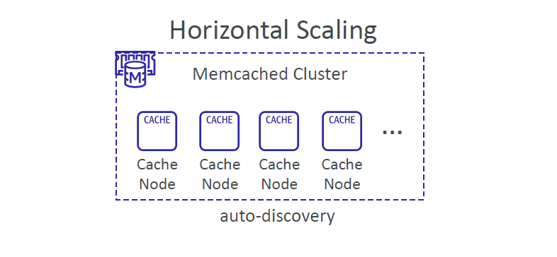
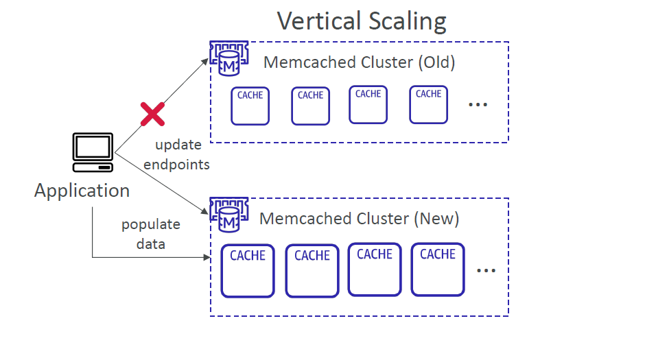

# ⚙️ **Amazon ElastiCache (Memcached) – Scaling Strategies**

> _Scaling your in-memory caching layer to meet growing application demands._

---

## 📈 **Horizontal vs Vertical Scaling**

ElastiCache for Memcached offers two ways to scale your infrastructure, depending on whether you need more **compute power**, **memory**, or **node count**.

---

### 🧱 Horizontal Scaling – Add/Remove Nodes Dynamically

  

---

**Highlights:**

- ✅ Add or remove **cache nodes** to/from the cluster on the fly
- 🔄 **Auto-discovery** allows your applications to discover all nodes without manual updates
- 💡 Useful when scaling out for higher throughput, low-latency needs

> Cluster size soft limit: **40 nodes**

---

### 📦 Vertical Scaling – Scale Up to Bigger Instances

  

---

**Steps:**

1. 🆕 Launch a **new cluster** with a larger node type
2. 🔁 Point your app to the **new cluster endpoint**
3. 🧹 **Decommission** the old cluster

**Drawback:**

- 🚫 Manual endpoint updates required
- 🛑 Cluster starts **empty** (no data migration)

---

## 🤖 **Auto-Discovery: Behind the Scenes**

With **Auto Discovery**, your client libraries automatically pull the list of active nodes from the configuration endpoint.
You don’t need to hard-code individual node IPs!

> Ideal for load balancing and failover logic.

---

## 📌 **When to Use What?**

| Scenario                           | Recommended Scaling         |
| ---------------------------------- | --------------------------- |
| You need more nodes or throughput  | Horizontal                  |
| You need more memory/CPU per node  | Vertical                    |
| Your app supports endpoint refresh | Vertical (manual update)    |
| You want seamless growth           | Horizontal (auto-discovery) |

---

## 🧠 Pro Tips

- 🧹 Memcached clusters start empty — implement smart repopulation logic in your app
- 🧰 Use **CloudWatch metrics** to monitor memory use, evictions, and node performance
- 🧪 Test auto-discovery support in your SDK or client library (e.g., Java, Python)
