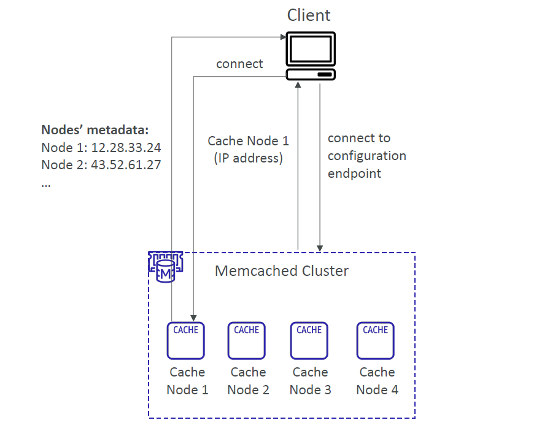

# 🔎 **Memcached Auto Discovery**

> _Let your clients dynamically discover cache nodes without hardcoding anything._

---

## 📖 What Is Auto Discovery?

In a traditional setup, applications must manually connect to each **cache node endpoint**. But in Memcached, that can become tedious and error-prone—especially when scaling.

**Auto Discovery** solves this by allowing your client to dynamically **fetch a list of all nodes** in a Memcached cluster via a **single configuration endpoint**.

---

### 🔧 How It Works

  

Here’s how your app connects using Auto Discovery:

1. The client connects to the **configuration endpoint** of the Memcached cluster.
2. It receives **metadata** about all nodes (IP addresses, status).
3. Then it establishes direct connections to the available **cache nodes** (e.g., Node 1, Node 2…).

---

## 🧠 Behind the Scenes

- 📦 Each cache node maintains **metadata** about every other node in the cluster.
- 🔁 Node list is refreshed automatically by the client.
- 🔗 Clients don’t need to know individual node addresses ahead of time.

---

## ✅ Benefits of Auto Discovery

| Benefit                 | Why It Matters                               |
| ----------------------- | -------------------------------------------- |
| 🔄 No hardcoding needed | Clients discover new nodes automatically     |
| 📈 Easier scaling       | Add/remove nodes without app reconfiguration |
| 🛠️ Reduced ops overhead | Ideal for dynamic infrastructure             |
| ☁️ Cloud-native support | Designed for Amazon ElastiCache Memcached    |

---

## 💡 Supported SDKs

Many AWS-supported SDKs and Memcached clients support Auto Discovery out-of-the-box, such as:

- **Java** (via AWS ElastiCache SDK)
- **Python (boto3 + pylibmc)**
- **.NET / Node.js** (with custom config helpers)

---

## 📝 Best Practices

✅ Use Auto Discovery if:

- Your cluster has more than a few nodes
- You frequently **scale horizontally**
- You want to avoid redeploying apps for endpoint changes

🚫 Avoid manual node tracking unless required for custom setups.
