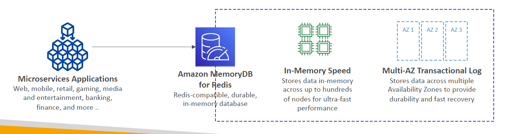

# 🧠 **Amazon MemoryDB for Redis**

**Amazon MemoryDB for Redis** is a **Redis-compatible, fully managed, durable, in-memory database** designed for **ultra-low latency** and **high availability**. Unlike traditional in-memory caches, **MemoryDB retains your data durably** across Multi-AZ setups — making it suitable for **primary data stores**, not just caching.

> ✅ **Important**: **MemoryDB is NOT deprecated** — it is actively supported and regularly updated by AWS.

---

  

---

## ⚡ **Key Features of MemoryDB**

| Feature                        | Description                                                                             |
| ------------------------------ | --------------------------------------------------------------------------------------- |
| 🚀 **Performance**             | Handles **160+ million requests per second**, ideal for real-time workloads             |
| 🔁 **Durable In-Memory Store** | Data is stored in-memory for fast access and backed by a **multi-AZ transactional log** |
| 🔐 **Highly Available**        | Designed for **99.99% availability**, with automatic failover and Multi-AZ replication  |
| 📈 **Scalable**                | Grows from **tens of GBs to hundreds of TBs** with seamless horizontal scaling          |
| 🔧 **Fully Redis-Compatible**  | Works with existing Redis clients, tools, and commands                                  |
| 🧩 **Use Cases**               | Web/mobile apps, gaming, ML feature stores, leaderboards, media streaming, and more     |

---

## 🔄 **MemoryDB vs. ElastiCache for Redis**

| Feature                     | **Amazon MemoryDB for Redis**                  | **Amazon ElastiCache for Redis**        |
| --------------------------- | ---------------------------------------------- | --------------------------------------- |
| **Primary Use**             | **Durable in-memory database** (data store)    | **In-memory cache** (data acceleration) |
| **Durability**              | ✅ Yes (multi-AZ write-ahead log + snapshots)  | ⚠️ Partial (persistence optional)       |
| **Multi-AZ Writes**         | ✅ Supported (active replication)              | ❌ Only one primary + replicas          |
| **Use as System of Record** | ✅ Yes                                         | ⚠️ Not recommended                      |
| **Data Recovery**           | ✅ Instant recovery from log                   | ⚠️ May involve snapshot restore         |
| **Latency**                 | Ultra-low                                      | Ultra-low                               |
| **Performance**             | 160M+ requests/sec                             | Millions/sec (varies by node size)      |
| **Price**                   | 💰 Higher (durability, multi-AZ write support) | 💰 Lower (optimized for caching)        |

---

## 🧪 **When to Use MemoryDB vs. ElastiCache**

| Use Case                                              | Best Option    |
| ----------------------------------------------------- | -------------- |
| 🧠 **Real-time analytics with guaranteed durability** | ✅ MemoryDB    |
| 🎮 **Gaming leaderboards with instant writes**        | ✅ MemoryDB    |
| 🧾 **User sessions or shopping carts (non-critical)** | ✅ ElastiCache |
| 🧪 **ML feature stores** with real-time read/write    | ✅ MemoryDB    |
| 📚 **Caching query results or API responses**         | ✅ ElastiCache |

---

## ✅ **Summary**

**Amazon MemoryDB for Redis** is a purpose-built **durable in-memory database** for **mission-critical applications** where **speed AND durability** are non-negotiable. While it’s more expensive than ElastiCache, it delivers **multi-AZ transactional durability**, making it ideal for real-time applications that can’t afford to lose data.

> 🧠 **ElastiCache for Redis** is still your go-to for **cost-effective caching**, while **MemoryDB** shines when you need **in-memory primary storage with durability guarantees**.
