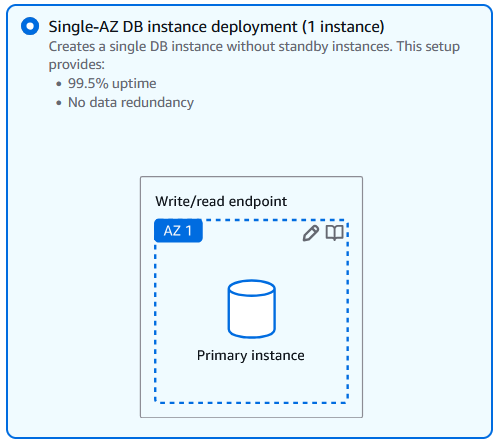
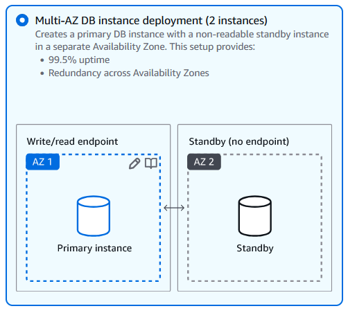
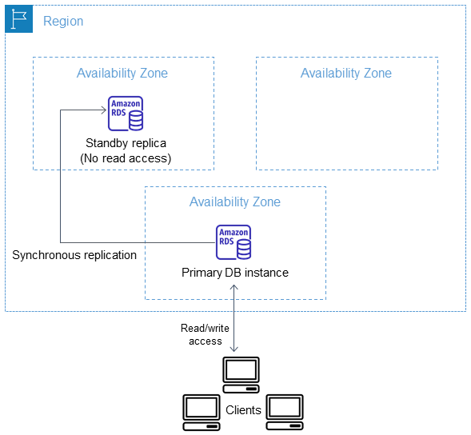
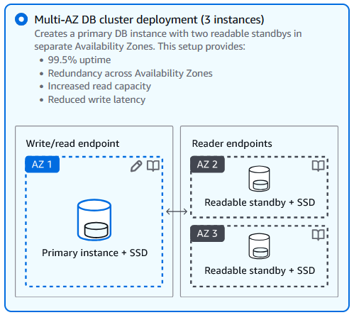
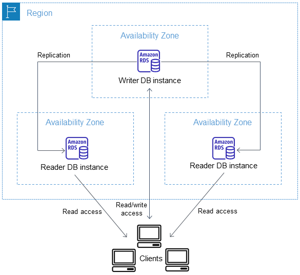
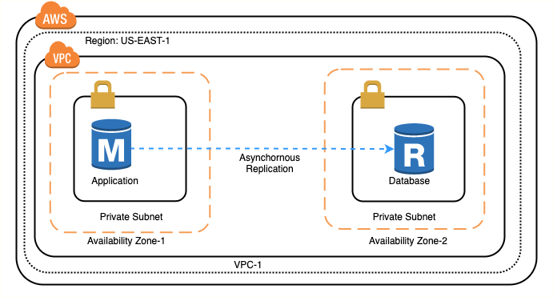

---
tags:
  - aws
  - aws/service
  - aws/domain/database
  - aws/topic/rds
aliases:
  - "Amazon RDS Deployment Options & Scaling"
  - "RDS Deployment Options"
---

# ☁️ **Amazon RDS Deployment Options & Scaling** ⚖️

Amazon **RDS (Relational Database Service)** provides multiple deployment options tailored for **availability, performance, and scalability**. Choosing the right deployment method depends on your workload's **redundancy, failover, and read capacity** needs. Below is a breakdown of **deployment options and their supported database engines**.

---

## 💪 **1. Single-AZ Deployment**

    

---

- ✅ **Availability:** **99.5% uptime**
- ❌ **Durability:** **No data redundancy**
- ❌ **Replication Type:** **None** (No standby, no replication)
- ✅ **Endpoints:**
  - **✅ Write/Read Endpoint:** Primary instance
  - **❌ Standby Endpoint:** None

---

📝 **How It Works:**

- The **database exists in a single Availability Zone** (AZ).
- If the instance fails, **manual intervention** is required for recovery.
- **No automatic failover** since there is **no standby**.

---

## 🌍 **2. [Multi-AZ DB Instance Deployment](https://docs.aws.amazon.com/AmazonRDS/latest/UserGuide/Concepts.MultiAZSingleStandby.html)**

    

---

A **Multi-AZ DB instance deployment** provides **high availability** by maintaining a **standby replica** in a different AZ. Amazon RDS automatically provisions and maintains this standby, offering **seamless failover**.

- ✅ **Availability:** **99.95% uptime**
- ✅ **Durability:** **Redundancy across Availability Zones**
- 🟥 **Replication Type:** **Fully Synchronous Replication**
- ✅ **Endpoints:**
  - **✅ Write/Read Endpoint:** Primary instance
  - **❌ Standby Endpoint:** No direct access (not readable)

---

📝 **How It Works:**

- **AWS automatically provisions a standby instance** in another **AZ**.
- **Replication is fully synchronous**, meaning data is **committed to both the Primary and Standby** before acknowledgment to the application.
- If the **primary fails**, the **standby is promoted to primary** automatically.
- 🚫 **The standby cannot serve read traffic**.

---

🔍 **Supported Technologies:**

- **Amazon failover technology** (for MariaDB, MySQL, Oracle, PostgreSQL, and RDS Custom for SQL Server).
- **Microsoft SQL Server** uses:

  - **Database Mirroring (DBM)**
  - **Always On Availability Groups (AGs)**

---

    

---

## 🚀 **3. [Multi-AZ DB Cluster Deployment](https://docs.aws.amazon.com/AmazonRDS/latest/UserGuide/multi-az-db-clusters-concepts.html)**

    

---

A **Multi-AZ DB cluster** includes a **primary DB instance with two readable standby instances** across different AZs. This setup improves **commit latency, failover time, and read capacity**.

- ✅ **Availability:** **99.95% uptime**
- ✅ **Durability:** Redundancy **across Availability Zones**
- 🟥 **Replication Type:** **Semi-Synchronous Replication**
- ✅ **Endpoints:**
  - **✅ Write/Read Endpoint:** Primary instance + SSD
  - **✅ Reader Endpoints:** Readable Standby + SSD (x2)
- ✅ **Key Features:**
  - **Faster failover** (under 35 seconds).
  - **Two read-enabled standby instances**, reducing read traffic on primary DB.
  - **Ideal for high-availability applications** requiring fast disaster recovery.

📝 **How It Works:**

- **Semi-synchronous replication**: Requires **acknowledgment from at least one reader DB instance** before a change is committed.
- **Does not require full execution and commit on all replicas** before proceeding.
- **Readable standbys** reduce read latency and **increase read throughput**.
- If failover occurs, **Amazon RDS promotes the reader instance** with the most recent changes.

🔗 **Supported Engines:**

- ✔ **MySQL**
- ✔ **PostgreSQL**

---

    

---

## **📌 Summary of Replication Types for AWS RDS Deployment**

| **Deployment Option**                  | **Availability**  | **Durability**   | **Replication Type**                                                                         | **Read Replicas?** | **Failover?** | **Endpoints**                                                 |
| -------------------------------------- | ----------------- | ---------------- | -------------------------------------------------------------------------------------------- | ------------------ | ------------- | ------------------------------------------------------------- |
| **Single-AZ (1 instance)**             | **99.5% uptime**  | ❌ No redundancy | ❌ No replication                                                                            | ❌ No              | ❌ Manual     | ✅ Primary (Read/Write)                                       |
| **Multi-AZ DB Instance (2 instances)** | **99.95% uptime** | ✅ Redundant     | 🟥 **Fully Synchronous (Primary → Standby)**                                                 | ❌ No              | ✅ Automatic  | ✅ Primary (Read/Write)                                       |
| **Multi-AZ DB Cluster (3 instances)**  | **99.95% uptime** | ✅ Redundant     | 🟩 **Semi-Synchronous (Primary → Standby 1)**   🟦 **Asynchronous (Primary → Standby 2)** | ✅ Yes (2)         | ✅ Automatic  | ✅ Primary (Read/Write)   ✅ Reader (x2 Readable Standbys) |

---

## ⚡ **4. Amazon Aurora Clusters**

Amazon **Aurora**, designed for **MySQL and PostgreSQL**, replicates data across multiple AZs **automatically** and supports **up to 15 read replicas**.

### ✅ **Key Features**

- **Up to 15 low-latency read replicas**.
- **Replication across multiple AZs** for high durability.
- **Aurora Serverless** option for dynamic scaling.

### 🔗 **Supported Engines:**

✔ **Amazon Aurora (MySQL-Compatible)**  
✔ **Amazon Aurora (PostgreSQL-Compatible)**

---

## 📖 **5. Read Replicas (Horizontal Scaling)**

    

---

Read replicas allow **read-heavy workloads** to be distributed across multiple copies of the primary database, improving **performance and scalability**.

### ✅ **Key Features**

- **Asynchronous replication**, improving read performance.
- **Supports cross-region replication** for global applications.
- **Can be promoted** to a standalone database during failover.

### 🔗 **Supported Engines:**

✔ **MySQL**  
✔ **PostgreSQL**  
✔ **MariaDB**  
✔ **Oracle**  
✔ **Amazon Aurora (MySQL-Compatible)**  
✔ **Amazon Aurora (PostgreSQL-Compatible)**

> 💡 Ms SQL Server does not support read replicas

---

## 🏢 **6. RDS on Outposts (On-Premises RDS)**

**Amazon RDS on AWS Outposts** allows databases to run **on-premises** using AWS infrastructure, ensuring **low-latency connections** for on-prem apps.

### ✅ **Key Features**

- Provides **AWS-managed databases on-premises**.
- Ensures **low latency** for applications close to on-prem workloads.
- Uses **AWS Outposts infrastructure** for local data residency.

### 🔗 **Supported Engines:**

✔ **MySQL**  
✔ **PostgreSQL**  
✔ **MariaDB**

---

## 🔧 **7. RDS Custom (Full OS Access & Custom Configurations)**

**RDS Custom** offers deep control over the database OS and configurations, making it suitable for **legacy apps** requiring custom setup.

### ✅ **Key Features**

- **Full OS access** for custom configurations.
- Supports **third-party applications requiring database customization**.
- **Managed backups and monitoring by AWS**.

### 🔗 **Supported Engines:**

✔ **Oracle**  
✔ **Microsoft SQL Server**

---

Here's your updated section with the new question added:

---

## 🤔 **Questions**

### ❓ **If I choose Single-AZ deployment, can I add a standby instance later?**

✅ **Yes, you can convert a Single-AZ deployment to Multi-AZ**, but you **cannot manually add a standby instance**. Instead, you must **modify your RDS instance** to enable Multi-AZ, which will create a synchronous standby in a different Availability Zone.

### ❓ **Can I add a read replica for a Single-AZ deployment?**

✅ **Yes, read replicas can be created from a Single-AZ deployment**. Read replicas use **asynchronous replication** and help distribute read traffic, improving performance for read-heavy applications.

### ❓ **Are all read replicas also standby instances?**

🚫 **No, read replicas are not the same as standby instances in Multi-AZ deployments**.

- **Multi-AZ standby instances** are **synchronous replicas** used only for **failover** (not readable).
- **Read replicas** are **asynchronous replicas** that can **handle read queries** and **be promoted to primary if needed**.

### ❓ **For Multi-AZ cluster deployments, are readable standby instances using synchronous or asynchronous replication with the primary?**

✅ **In Multi-AZ cluster deployments, readable standby instances use asynchronous replication with the primary**. Unlike traditional Multi-AZ setups where the standby is purely for failover, Multi-AZ clusters provide **readable secondaries**, but they replicate data asynchronously.

### ❓ **Can I deploy a Multi-AZ standby instance in a different region from the primary database?**

🚫 **No, Multi-AZ standby instances must be in the same AWS region as the primary database**, but they are located in a different Availability Zone for high availability and automatic failover.

✅ **For cross-region redundancy, you can use cross-region read replicas**, which replicate data **asynchronously** and can be promoted to primary in case of failure.

## 🎯 **Key Considerations When Choosing an RDS Deployment**

🔹 **Need cost-effective storage?** → **Single-AZ Deployment**.  
🔹 **Need high availability?** → **Multi-AZ DB Instance or Multi-AZ Cluster**.  
🔹 **Scaling reads globally?** → **Read Replicas**.  
🔹 **Using AWS on-prem infrastructure?** → **RDS on Outposts**.  
🔹 **Requiring full OS access?** → **RDS Custom**.

🚀 **Choosing the right RDS deployment depends on your application’s needs for failover, read performance, customization, and global reach!**
---

## Related Notes
- [[aws-services/8.database/rds/|Index]] - folder map
- [[aws-services/8.database/rds/2.aws-rds|AWS RDS]] - previous lesson
- [[aws-services/8.database/rds/3.2.rds-multi-az-mode|AWS RDS Multi-AZ Deployment]] - next lesson
- [[aws-services/8.database/rds/6.1.rds-on-aws-outposts|Amazon RDS on AWS Outposts]] - mentions Amazon RDS on AWS Outposts
- [[aws-daily/aws-cloud-Concepts/6.disaster-recovery|Disaster Recovery DR in AWS]] - mentions Disaster Recovery
- [[aws-services/8.database/aurora/1.1.aurora-overview|Amazon Aurora]] - mentions Amazon Aurora
- [[aws-services/5.compute/7.1.aws-outposts/10.aws-outposts|AWS Outposts]] - mentions AWS Outposts
- [[aws-daily/aws-architectures/3.1.serverless|Server-Based Architectures vs. Serverless Computing]] - mentions Serverless
- [[aws-services/8.database/rds/6.2.rds-custom|Amazon RDS Custom for Oracle and MS SQL]] - mentions RDS Custom
-[[1.serverless|The Ultimate Guide to Serverless Computing & Tools]]] - mentions Serverless
- [[aws-services/1.management-governance/1.cloudformation/.docs|CND Useful References]] - mentions Docs

---
