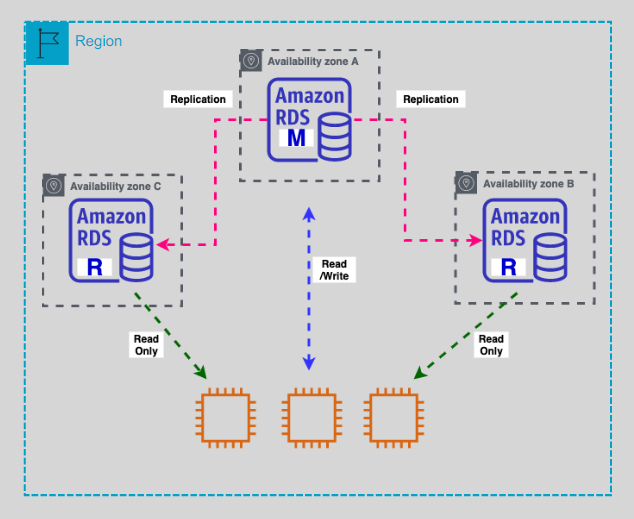

---
tags:
  - aws
  - aws/service
  - aws/domain/database
  - aws/topic/rds
aliases:
  - "Amazon RDS Multi-AZ DB Cluster Deployment for MySQL & PostgreSQL"
  - "Rds Multi Az Cluster Mode"
---

# **🌍 Amazon RDS – Multi-AZ DB Cluster Deployment for MySQL & PostgreSQL**

Amazon **RDS Multi-AZ DB Cluster Deployment** provides **high availability, automatic failover, and improved read performance** for **MySQL** and **PostgreSQL** databases. This architecture ensures **resilient and scalable** database operations by maintaining a **primary instance** and **two readable standbys** across multiple **Availability Zones (AZs)**.

    

---

## **🛠 What is Multi-AZ DB Cluster Deployment?**

A **Multi-AZ DB Cluster** consists of:

- **📝 Primary DB Instance (Writer):** Handles **all write** and **transactional** operations.
- **📖 Readable Standby Instances (2 Replicas):** Serve **read queries** and act as **failover targets**.
- **🔄 Automatic Failover:** If the **primary fails**, RDS **automatically promotes** one standby as the new **primary** (failover occurs in **under 35 seconds**).
- **📡 Semi-Synchronous Replication:** Changes must be **acknowledged by at least one standby** before committing.

---

## **📦 Deployment Options & Availability**

✅ **Supported Engines:** **MySQL 8.0.28+** | **PostgreSQL 13.4+**  
✅ **Redundancy:** **Data is replicated across three AZs.**  
✅ **Performance Boost:** **Up to 2x faster** commit latency compared to other Multi-AZ deployments.

### **🔹 How Multi-AZ DB Cluster Works**

1️⃣ **Applications connect to the Cluster Endpoint** for writes.  
2️⃣ **Replication happens between Primary and Standbys** (Semi-Synchronous).  
3️⃣ **Read traffic is distributed using the Reader Endpoint** (Async replication).  
4️⃣ **In case of failure, one reader is promoted to primary** automatically.

---

## **🚀 Key Features of Multi-AZ DB Cluster Deployment**

### **🔗 1. Cluster Endpoints**

- **✍️ Cluster Endpoint (Writes)** → Directs traffic to the primary DB instance.
- **📖 Reader Endpoint (Reads)** → Distributes read queries across the **two readable standbys**.

### **🔄 2. Automatic Failover & High Availability**

- **📉 Failover time: ~35 seconds** (Minimal downtime).
- **🔄 No manual intervention required**—AWS automatically promotes a new primary.
- **✅ Readers become writable during failover**.

### **📡 3. Replication Model**

- **📌 Semi-Synchronous Replication:** Primary waits for **one standby to acknowledge** writes.
- **📌 Asynchronous Replication:** Second standby receives updates **without delaying transactions**.

### **📷 4. Snapshots & Restorations**

- **📍 Automated backups & snapshots are supported**.
- **📤 Snapshots can be restored to create new Multi-AZ clusters**.

---

## **⚠️ Limitations of Multi-AZ DB Clusters**

While **Multi-AZ DB Clusters** offer many advantages, there are a few **limitations** to consider:

| ❌ **Not Supported Features** | ❗ Details                                                    |
| ----------------------------- | ------------------------------------------------------------- |
| **🚫 RDS Proxy**              | **Not compatible** with Multi-AZ Clusters.                    |
| **🚫 IAM DB Authentication**  | Only **user-based authentication** is allowed.                |
| **🚫 Dual Stack (IPv6)**      | Supports **only IPv4 networking**.                            |
| **🚫 Export to S3**           | Cannot export **snapshots to Amazon S3**.                     |
| **🚫 Read Replicas**          | **No additional read replicas** beyond the built-in standbys. |
| **🚫 Storage Autoscaling**    | **Storage size must be managed manually.**                    |

---

## **✅ Benefits of Multi-AZ DB Cluster Deployment**

✔ **🔄 Automatic Failover:** Ensures **high availability** & **quick recovery**.  
✔ **📈 Better Performance:** **Lower write latency** & **optimized read queries**.  
✔ **📡 Multi-Region Availability:** Data **replicated across AZs** for resilience.  
✔ **⚡ Increased Read Capacity:** Two **standby readers** improve **query performance**.  
✔ **📊 Load Balancing:** Reader endpoint distributes **read traffic efficiently**.

---

## **📝 Conclusion**

Amazon **RDS Multi-AZ DB Cluster** is an **ideal choice** for **high-availability production environments** requiring **automatic failover, fast transaction processing, and read scalability**. The **semi-synchronous replication model** ensures **data integrity and redundancy**, while **reader instances** help scale **read-heavy workloads**.

However, **before deploying**, consider limitations like **manual storage scaling, lack of IAM authentication, and no additional read replicas**.

🚀 **Use this deployment for mission-critical applications needing seamless failover and performance scaling!** 🔥
---

## Related Notes
- [[aws-services/8.database/rds/|Index]] - folder map
- [[aws-services/8.database/rds/3.2.rds-multi-az-mode|AWS RDS Multi-AZ Deployment]] - previous lesson
- [[aws-services/8.database/rds/3.4.rds-storage-auto-scaling|Amazon RDS Storage Auto Scaling Simplified]] - next lesson
- [[aws-services/8.database/rds/5.2.rds-proxy|Amazon RDS Proxy Secure & Scalable Database Access]] - mentions Rds Proxy
- [[aws-services/2.security/1.1.iam/1.fundmmentals/1.2.iam|AWS Identity and Access Management IAM]] - mentions Iam

---
