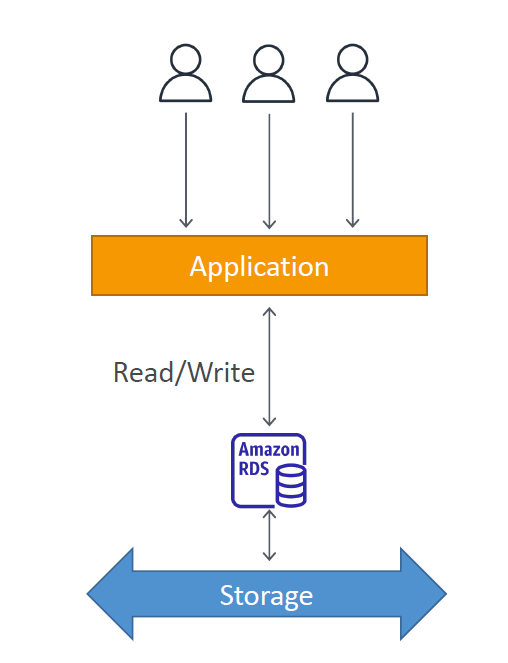

# 💽 **Amazon RDS Storage Auto Scaling – Simplified**

When your database suddenly runs out of space, your app crashes 💥 — unless you've got **RDS Storage Auto Scaling** turned on.

This feature **automatically increases your DB storage** without downtime, without alerts, and without manual effort. Let’s see how it works, why it’s useful, and when it kicks in.

---

<div style="text-align: center;">
    
</div>

---

## 🤔 **What Is RDS Storage Auto Scaling?**

RDS Storage Auto Scaling automatically **increases the size** of your database volume when you’re running out of free space.

> 🧠 No alarms. No intervention. Just auto-grow when needed.

---

## 🧠 **Why You Need It**

| Problem Without It                | Solved With Auto Scaling ✅        |
| --------------------------------- | ---------------------------------- |
| Manual resizing & downtime needed | 📈 Storage expands automatically   |
| Risk of app failure when full     | 🚫 Prevents “out-of-space” crashes |
| Unpredictable growth?             | 🌊 It adapts in real time          |

---

## 🔧 **How It Works – Behind the Scenes**

RDS monitors your storage usage and triggers an auto-scale **only if** these three conditions are met:

### 📦 Auto-Scaling Triggers

1. **Free storage is < 10%** of current volume
2. This low space continues for **at least 5 minutes**
3. **6+ hours** have passed since the last resize

> ✅ When all 3 match → Storage grows automatically without reboot or downtime.

---

## 🎛️ **What You Control**

- You **enable it** when creating or modifying the DB
- You set a **Maximum Storage Threshold** (e.g., 500 GiB)

> RDS will auto-scale until it hits your limit — but never beyond.

---

## 🔁 **How It Grows**

- 📈 RDS **gradually increases** your allocated storage in chunks.
- The **amount added** depends on your workload and free space trends.
- Storage remains **SSD-optimized** and available the entire time.

---

## 🧪 **Supported Engines**

✅ Available for **all RDS engines**, including:

- PostgreSQL
- MySQL
- MariaDB
- Oracle
- SQL Server

> Works with both **General Purpose (gp2/gp3)** and **Provisioned IOPS (io1/io2)**

---

## 🧰 **Enable Storage Auto Scaling (Step-by-Step)**

### ✅ Using AWS Console

1. Go to **Amazon RDS → Databases**
2. Choose **Create database** (or Modify existing)
3. In **Storage Settings**:

   - Check **"Enable storage autoscaling"**
   - Set **Maximum storage threshold** (e.g., 1000 GiB)

4. Click **Create / Modify**

### ✅ Using AWS CLI

```bash
aws rds modify-db-instance \
  --db-instance-identifier my-db \
  --max-allocated-storage 1000 \
  --apply-immediately
```

> This example sets max storage limit to **1000 GiB**

---

## 📦 Example Use Case

> You start with a 100 GiB MySQL DB and enable auto scaling with a max limit of 500 GiB.

- Your app goes viral 😱
- In 2 months, DB usage hits 95 GiB → **auto-scale to 120 GiB**
- Keeps growing → RDS keeps scaling
- You sleep peacefully 💤

---

## 💡 Summary Table

| Feature               | Description                                 |
| --------------------- | ------------------------------------------- |
| 📏 Initial Storage    | You choose this at DB creation              |
| 🚀 Auto Scaling       | Triggered when free space < 10%             |
| ⏱ Delay Before Resize | At least 5 minutes low space + 6h cooldown  |
| 📐 Max Storage Limit  | You define this to cap how far it can grow  |
| 🔁 Downtime?          | ❌ None – scaling is online and seamless    |
| ✅ Supported Engines  | MySQL, PostgreSQL, Oracle, SQL Server, etc. |

---

## 🏁 Final Words

**RDS Storage Auto Scaling** saves you from unexpected outages and manual headaches.
You set the limits — AWS handles the rest 🔄

> It’s like giving your DB room to breathe without lifting a finger 💨
