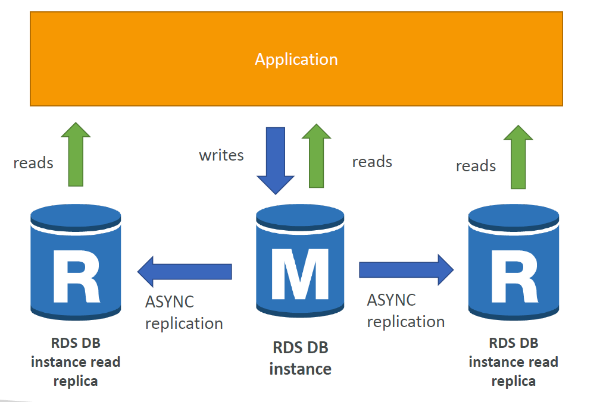
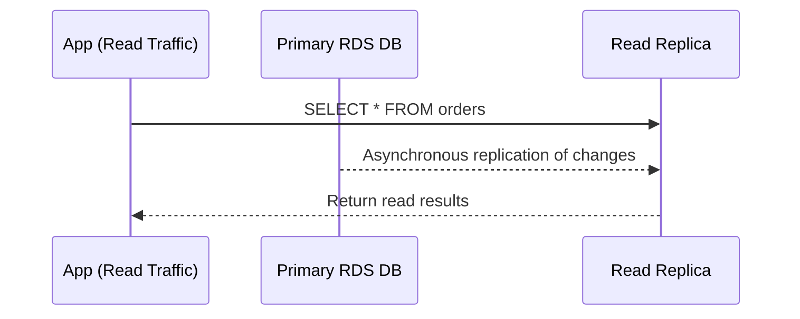
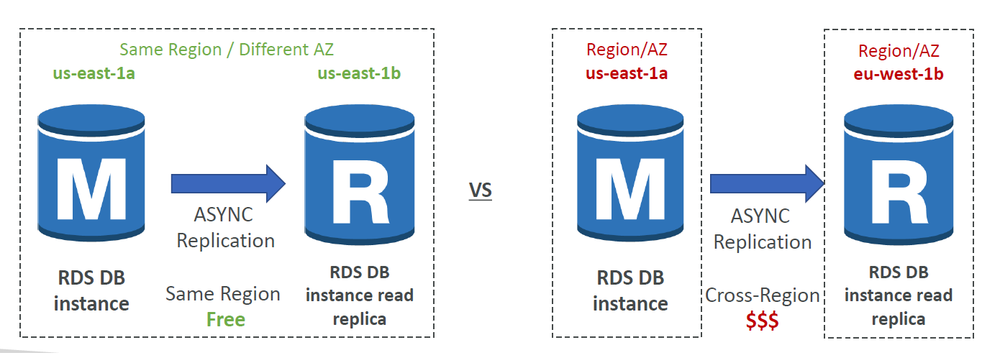

# 🧑‍🤝‍🧑 **Amazon RDS Read Replicas**

When your app is booming and your database is under read pressure, you don’t always need a bigger machine — you need **more readers**.

That’s where **Amazon RDS Read Replicas** come in.

---

## 🤔 **What Is a Read Replica?**

A **Read Replica** is a **read-only copy** of your RDS primary database. It receives updates through **asynchronous replication**, which means it’s **eventually consistent** with the primary DB.

> You can create up to **15 read replicas** per DB — across AZs or even across regions 🌎

---

<div style="text-align: center;">
  
</div>

---

## 🔍 **What Read Replicas Are Used For**

| ✅ Use Case                | 💡 Description                                                 |
| -------------------------- | -------------------------------------------------------------- |
| 📊 Reporting & Analytics   | Offload BI queries and dashboards from the primary DB          |
| 📈 Scaling Read-Heavy Apps | Spread read traffic across multiple replicas                   |
| 💥 Disaster Recovery       | Promote a replica in another AZ or Region if primary DB fails  |
| 🌍 Global Apps             | Place replicas in other AWS Regions for faster reads worldwide |

---

## 🧪 **Real-World Example:**

> You have a production MySQL DB. Your app works great but now you want to run analytics.

🎯 **Solution:**

- Create a **read replica**
- Point the reporting app to the replica
- Your **production DB stays unaffected** and happy

---

## ⚙️ **How Read Replicas Work – Step by Step**

<div align="center">



</div>

---

## 🛠️ **Creating a Read Replica**

### ✅ AWS Console

1. Go to **Amazon RDS**
2. Select your **primary DB**
3. Click **"Create read replica"**
4. Choose **AZ / Region / DB class**
5. Launch 🚀

### ✅ AWS CLI

```bash
aws rds create-db-instance-read-replica \
  --db-instance-identifier my-replica \
  --source-db-instance-identifier my-primary-db
```

---

## 🌍 **Where Can You Create Replicas?**

<div align="center">

| Type            | Supported? | Notes                                    |
| --------------- | ---------- | ---------------------------------------- |
| 🔁 Same AZ      | ✅         | Fastest, least network latency           |
| 🌐 Cross AZ     | ✅         | Higher availability, **small cost** ⚠️   |
| 🌎 Cross Region | ✅         | Good for DR and global read distribution |

---



</div>

---

> ⚠️ _Cross-AZ replication incurs a small **network cost**, but not within the **same region.**_

---

## 🚀 **Promoting a Read Replica to Primary**

You can **convert any read replica into a full standalone DB** — to replace a failed primary or to split workloads.

### 🧱 What Happens on Promotion?

| Before Promotion     | After Promotion        |
| -------------------- | ---------------------- |
| Read-Only            | Read + Write           |
| Receives replication | ❌ No more replication |
| Tied to primary      | ✅ Becomes independent |

### ✅ Promote with CLI

```bash
aws rds promote-read-replica \
  --db-instance-identifier my-replica
```

> 🔁 This **cannot be undone** — it's a one-way switch.

---

## 🌟 **Best Practices**

### 🧭 Scale Smart

| Goal                  | Strategy                                   |
| --------------------- | ------------------------------------------ |
| Reporting / Analytics | Route queries to read replica only         |
| DR / Failover         | Use cross-region replica + promote         |
| Heavy traffic reads   | Add up to **15 replicas** and load balance |
| Write operations      | Still go **only** to the primary DB        |

### 🧪 Application Tip

> You must **manually configure your app** to use the replica's endpoint for reads.
> It's not automatic — but it gives you **full control** 🔧

---

## ✅ Summary Table

| Feature                    | Description                                |
| -------------------------- | ------------------------------------------ |
| Max Replicas per DB        | `Up to 15`                                 |
| Sync Type                  | `Asynchronous` (**eventual consistency**)  |
| Write Allowed?             | ❌ No (unless promoted)                    |
| Regions Supported          | Same AZ / Cross AZ / Cross Region          |
| Network Cost (Same AZ)     | Free                                       |
| Network Cost (Cross AZ)    | Applies ⚠️                                 |
| Promotion Available?       | ✅ Yes (irreversible)                      |
| Application Update Needed? | ✅ Yes – update your **connection string** |
| Use For                    | Read scaling, DR, reporting, migrations    |

---

## 🏁 Final Takeaway

**Amazon RDS Read Replicas** help you:

- 🧠 Offload reads and keep your primary DB fast
- 🌎 Serve users globally with cross-region replicas
- 🛡️ Stay protected with easy disaster recovery
- 🔄 Promote replicas for independence or failover
