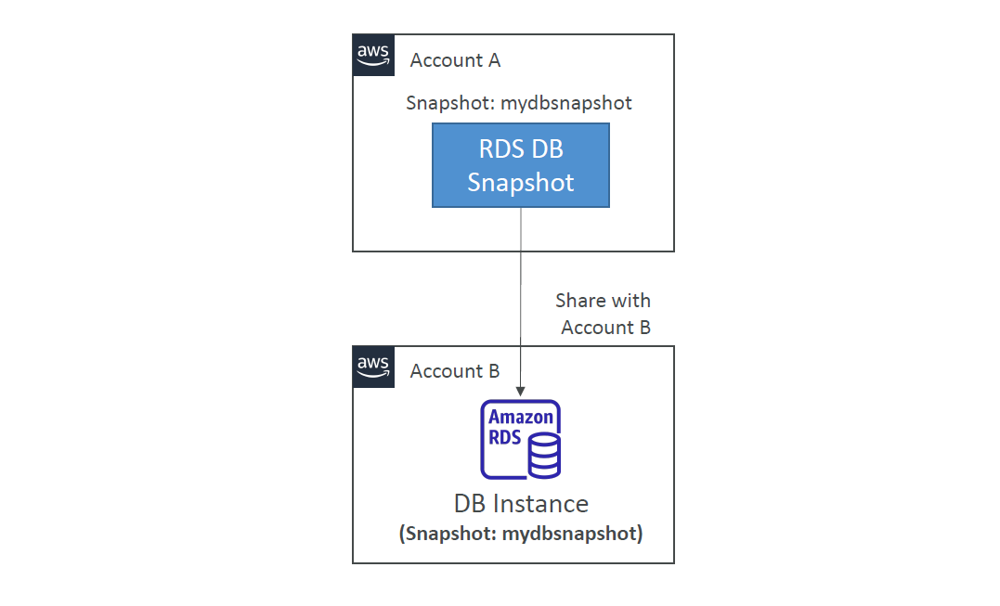
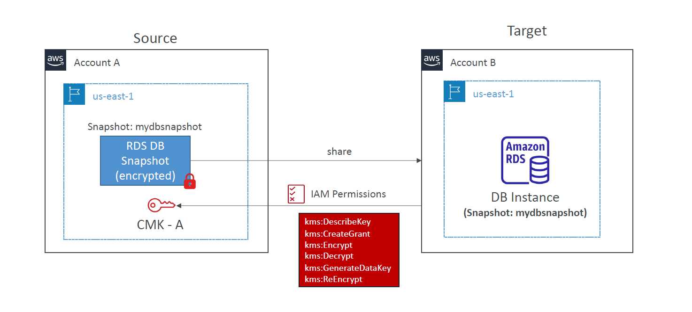

# 🔄 Amazon RDS Snapshots Sharing

> _Seamlessly share your database state across accounts – securely and flexibly._

---

<div align="center">
  
</div>

---

## 📚 What Is RDS Snapshot Sharing?

Amazon RDS allows you to take **manual snapshots** of your DB instances and **share them** with other AWS accounts. This is useful for:

- Cross-account collaboration
- DR/backup copy in another account
- Restoring databases for QA/test environments

---

## 🔐 Sharing Snapshot Types

| Snapshot Type         | Can Be Shared? | Notes                                  |
| --------------------- | -------------- | -------------------------------------- |
| ✅ Manual Snapshot    | ✅ Yes         | Share directly                         |
| ❌ Automated Snapshot | ❌ No          | Must **copy to manual snapshot** first |
| 🔐 Encrypted Snapshot | ✅ With KMS    | Share **KMS key + snapshot** together  |

---

## 📦 Sharing an Unencrypted Snapshot

1. Take a **manual snapshot** of your DB instance
2. Share the snapshot with a target AWS account
3. That account can **restore** the snapshot to create a new DB instance

💡 **IAM permissions required** to access and restore the shared snapshot.

---

## 🔐 Sharing an Encrypted Snapshot (with KMS)

If your snapshot is encrypted with a **customer-managed KMS key**, you must:

- ✅ Share the **snapshot**
- ✅ Share the **KMS key** with the target account
- ✅ Grant **required IAM permissions** on the key

---

<div align="center">
  
</div>

---

### 🔑 Required KMS Permissions

```json
{
  "Statement": [
    {
      "Effect": "Allow",
      "Principal": {
        "AWS": "arn:aws:iam::<account-b-id>:root"
      },
      "Action": [
        "kms:DescribeKey",
        "kms:CreateGrant",
        "kms:Encrypt",
        "kms:Decrypt",
        "kms:GenerateDataKey",
        "kms:ReEncrypt*"
      ],
      "Resource": "*"
    }
  ]
}
```

---

### 🧪 Example: Cross-Account Snapshot Sharing

#### 🎯 Goal

Share a **CMK-encrypted snapshot** (`mydbsnapshot`) from Account A to Account B.

#### ✅ Steps

1. 📦 **Account A**: Create manual snapshot of RDS DB
2. 🔐 **Account A**: Share snapshot + CMK key permissions with Account B
3. 📥 **Account B**: Access snapshot and restore it to a new RDS DB

---

<div align="center">
  
</div>

---

## 📌 Important Notes

- Encrypted snapshots must use **customer-managed CMKs**
- Cross-region copy creates a **new snapshot + CMK encryption** in the target region
- Use **resource sharing** carefully – your data is portable, but access must be tightly controlled

---

## 🛡️ Best Practices

- ✅ Always enable **encryption** on snapshots (KMS)
- ✅ Use **IAM condition keys** to control access by tag or resource
- 🔒 Never share production snapshots without redacting sensitive data
- 📖 Enable **CloudTrail** to monitor access and sharing activities

---

## 🔄 Restore Shared Snapshot in Account B

```bash
aws rds restore-db-instance-from-db-snapshot \
    --db-instance-identifier restore-db \
    --db-snapshot-identifier arn:aws:rds:us-east-1:<account-a-id>:snapshot:mydbsnapshot
```

---

## ✅ Summary

| ✅ Feature              | ✅ Support     |
| ----------------------- | -------------- |
| Manual Snapshot Sharing | ✅ Yes         |
| Automated Snapshot      | ❌ Copy First  |
| Encrypted Snapshot      | ✅ + KMS Share |
| Cross-Region Copy       | ✅ Supported   |
