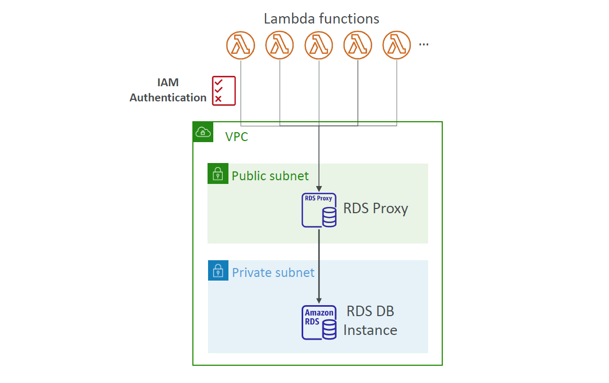
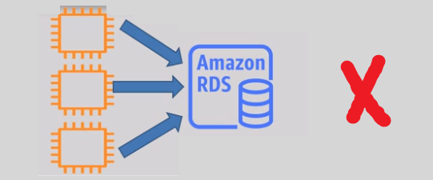
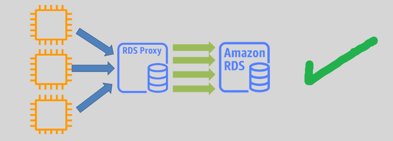

---
tags:
  - aws
  - aws/service
  - aws/domain/database
  - aws/topic/rds
aliases:
  - "Amazon RDS Proxy Secure & Scalable Database Access"
  - "Rds Proxy"
---

# **🔐 Amazon RDS Proxy – Secure & Scalable Database Access**

> Amazon **RDS Proxy** is a **fully managed, high-performance database proxy** that optimizes database connections for Amazon RDS.  
> It improves **scalability, resilience, and security** by **pooling and sharing connections**, reducing overhead and enhancing performance.

---

    

---

## **📌 What is Amazon RDS Proxy?**

Amazon **RDS Proxy** acts as a **middleware layer** between **your applications and RDS databases** (MySQL, PostgreSQL, and Aurora).

### **🛠️ Key Functions:**

- ✔ **Connection Pooling** – Reduces **new connection overhead** by reusing active database connections.
- ✔ **Automatic Failover** – **Minimizes downtime** by switching connections to a standby DB during failures.
- ✔ **IAM Authentication** – Secure database access via **AWS IAM** without sharing credentials.
- ✔ **Secrets Manager Integration** – Stores **database credentials securely**, reducing security risks.
- ✔ **Throttling & Connection Control** – Prevents **overloading** the database with excessive connections.

### **❌ Without RDS Proxy – Connection Overhead Issues**

> Without a connection proxy, each application maintains separate, direct connections to the database, leading to **high latency, increased resource usage, and performance bottlenecks**.

---

### **✅ With RDS Proxy – Optimized Database Connectivity**

> By using **Amazon RDS Proxy**, applications can share a **pooled connection** to the database, reducing **idle connections, resource wastage, and failover delays**.

---

## **🚀 Key Features of Amazon RDS Proxy**

### **🔄 1. Connection Pooling (Performance Boost)**

- **Reduces connection establishment latency** by reusing existing database connections.
- **Optimizes resource usage** by efficiently managing active and idle connections.

### **⚡ 2. Automatic Failover (High Availability)**

- Ensures **seamless failover** in **Multi-AZ deployments**, reducing downtime by **60% compared to traditional RDS failover**.
- Prevents **connection drops** when the primary instance switches to standby.

### **🔒 3. Secure Database Access (IAM + Secrets Manager)**

- Supports **IAM authentication**, allowing **secure access without hardcoded credentials**.
- Seamlessly integrates with **AWS Secrets Manager**, providing **automated password rotation**.

### **📊 4. Load Balancing & Connection Throttling**

- **Prevents overloading** by **throttling excessive connections**.
- Balances **database load** by efficiently distributing queries.

---

## **🏁 Conclusion – Why Use Amazon RDS Proxy?**

Amazon **RDS Proxy** enhances **performance, availability, and security** for **RDS databases**. Whether you're running **MySQL, PostgreSQL, or Aurora**, **RDS Proxy**:

- 🚀 **Minimizes connection overhead**
- ✅ **Ensures high availability**
- 🔒 **Secures credentials & IAM access**
- 📊 **Optimizes resource usage**

💡 **Use RDS Proxy to scale efficiently while reducing database connection costs!** 🔥
---

## Related Notes
- [[aws-services/8.database/rds/|Index]] - folder map
- [[aws-services/8.database/rds/5.1.rds-security|RDS Security]] - previous lesson
- [[aws-services/8.database/rds/5.3.rds-paramter-groups|RDS Parameter Groups Fine-Tuning Your Database]] - next lesson
- [[aws-services/2.security/1.1.iam/1.fundmmentals/1.2.iam|AWS Identity and Access Management IAM]] - mentions Iam

---
