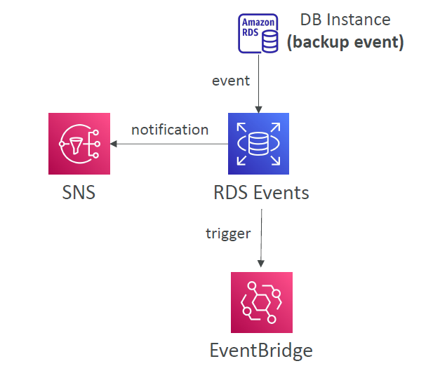
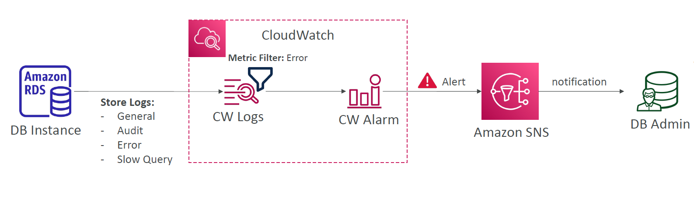
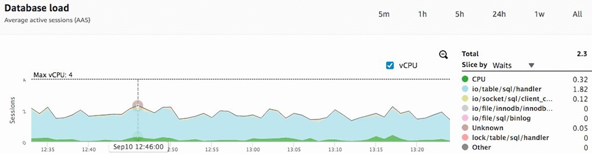
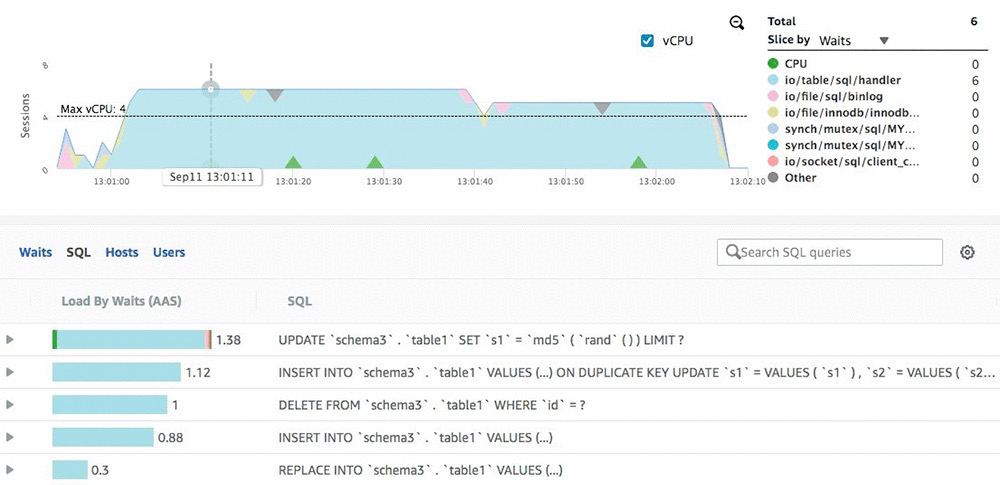
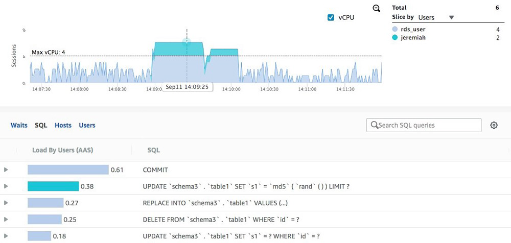

# 🩺 Amazon RDS Monitoring & Insights

> _Stay informed, alert, and ahead — monitor your RDS instances like a pro._

---

## 📣 RDS Events & Subscriptions

Amazon RDS generates **events** for various operations and lifecycle changes.

---

<div style="text-align: center;">
    
</div>

---

### 🔍 Key Use Cases

- Backups completed or failed
- DB instance failover
- Parameter group changes
- Security group updates
- Snapshot creation/deletion

---

### 🔔 Event Subscriptions

You can subscribe to RDS events using **SNS** or **EventBridge**

<div style="text-align: center;">
    
</div>

---

### 📬 Delivery Options

| Component      | Purpose                                          |
| -------------- | ------------------------------------------------ |
| 🔔 SNS         | Sends notifications (email/SMS/HTTP)             |
| 🔄 EventBridge | Triggers workflows like Lambda or Step Functions |

### ✅ Example

> When a backup completes, RDS sends an event that can:
>
> - Notify via SNS
> - Trigger a remediation flow via EventBridge

📌 _Useful for automation, compliance reporting, and incident alerting._

---

## 📑 RDS Database Log Files

RDS can capture key logs:

| Log Type      | Purpose                          |
| ------------- | -------------------------------- |
| 🧾 General    | Connect/disconnect, query info   |
| 🔍 Audit      | Security audits, access tracking |
| ❌ Error      | Engine-level errors, crashes     |
| 🐢 Slow Query | Identify long-running queries    |

You can export these to **CloudWatch Logs** for:

- 🚨 Alarms (via CW Alarms + SNS)
- 📊 Search and filtering
- 🔍 Troubleshooting errors

---

## 📊 RDS Metrics – CloudWatch

RDS provides **CloudWatch metrics from the hypervisor** (no agent needed):

| Metric Name              | Description                             |
| ------------------------ | --------------------------------------- |
| `DatabaseConnections`    | Number of DB connections                |
| `SwapUsage`              | Swap space in use                       |
| `ReadIOPS` / `WriteIOPS` | Read/write input/output per second      |
| `FreeStorageSpace`       | Remaining disk space                    |
| `DiskQueueDepth`         | # of operations waiting for disk access |

---

### 🔍 Enhanced Monitoring

Enable **Enhanced Monitoring** for granular, OS-level metrics via agent:

| 🔧 System-Level Metrics     | Examples                      |
| --------------------------- | ----------------------------- |
| 🧠 CPU usage per process    | Troubleshoot high-CPU threads |
| 🧮 Memory & swap usage      | Find memory leaks             |
| 💾 Disk I/O per file system | Detect I/O bottlenecks        |
| 📂 File system usage        | Monitor mount points          |

---

## 🧠 RDS Performance Insights

Performance Insights helps you **visualize load** & pinpoint DB slowdowns.

### 🧪 Analyze by

| Filter Type | What You Learn                             |
| ----------- | ------------------------------------------ |
| 🕰️ Waits    | Resource bottlenecks (CPU, I/O, locks)     |
| 📄 SQL      | High-load queries                          |
| 🧑 Users    | Which user causes the most load            |
| 💻 Hosts    | From where the heaviest queries are coming |

### 🕰️ **Find the Bottlenecks – Filter by Waits**

Want to know **why your DB is slow**?  
The **"Waits" view** shows which resource is holding your queries back — like:

- ⏳ CPU saturation
- 💾 Disk I/O overload
- 🔐 Lock contention (e.g., row/table locks)

<div align="center">

_"You'll instantly spot spikes and trends by wait type."_


</div>

---

### 📄 **Spot the Problem Queries – Filter by SQL**

See **which SQL statements** are dragging down performance.
No guesswork—Performance Insights shows:

- 🔢 Execution counts
- 🕒 Query durations
- 🔍 Most expensive SQL by load

<div align="center">

_"You can zoom in on time ranges and see exactly what your DB was doing."_


</div>

---

### 🧑‍💻 **Track Down Heavy Users – Filter by User**

Who’s using the most resources?

The **Users filter** breaks down the load per database user, helping you:

- 👤 Identify misbehaving apps or users
- 🛡️ Enforce user-specific resource policies
- 🔎 Troubleshoot rogue activity fast

<div align="center">
  
</div>

---

### 💻 **Trace Load Origins – Filter by Host**

Where is the traffic coming from?

With the **Hosts view**, you can:

- 🌐 Pinpoint client servers flooding your DB
- 📊 Correlate load spikes to app deployments
- 🛠️ Optimize resource-heavy applications

---

### 💡 Key Metric

- `DBLoad` = # of active sessions running on the DB engine

📸 Example:

```bash
Top Query:
SELECT * FROM orders WHERE status = 'PENDING';

Wait Time: io/file/sql/handler (Disk I/O bottleneck)
```

---

## 📝 Best Practices

- ✅ **Enable Performance Insights** (especially for Aurora, RDS MySQL/Postgres)
- ✅ Use **CloudWatch Dashboards** to monitor multiple instances in one place
- ✅ Set **alarms on FreeStorageSpace, ReadLatency, SwapUsage**, etc.
- ✅ **Export logs to CW Logs** + create **metric filters** for known error strings
- ✅ Use **EventBridge** to auto-respond to certain RDS events
